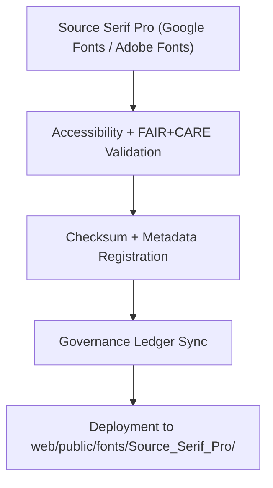

<div align="center">

# 🔠 Kansas Frontier Matrix — **Source Serif Pro Typeface Family**
`web/public/fonts/Source_Serif_Pro/README.md`

**Purpose:**  
Repository for the **Source Serif Pro font family**, the primary serif typeface used in documentation, reports, and research interfaces within the Kansas Frontier Matrix (KFM).  
This font ensures typographic clarity, scholarly readability, and FAIR+CARE-aligned accessibility across web and print environments.

[](../../../../../docs/standards/faircare-validation.md)
[](https://scripts.sil.org/OFL)
[]()
[]()

</div>

---

## 📚 Overview

**Source Serif Pro** serves as the official serif companion font to Inter within KFM’s typographic ecosystem.  
Its strong legibility and open licensing align perfectly with KFM’s FAIR+CARE mission to promote open, accessible, and ethical digital design.

### Core Responsibilities:
- Provide a professional serif typeface for documents, research summaries, and printed materials.  
- Maintain WCAG 2.1 AA-compliant legibility and contrast across all displays.  
- Register all font assets under open-source SIL licensing and provenance tracking.  
- Ensure FAIR+CARE validation for accessibility, sustainability, and ethical neutrality.  

---

## 🗂️ Directory Layout

```plaintext
web/public/fonts/Source_Serif_Pro/
├── README.md                               # This file — documentation for Source Serif Pro typeface
│
├── SourceSerifPro-Regular.woff2            # Regular weight (primary body text)
├── SourceSerifPro-Medium.woff2             # Medium weight (section headers)
├── SourceSerifPro-SemiBold.woff2           # Semi-bold variant (emphasis)
├── SourceSerifPro-Bold.woff2               # Bold weight for titles and emphasis
├── SourceSerifPro-Italic.woff2             # Italic variant (quotes, emphasis)
└── metadata.json                           # FAIR+CARE and SIL OFL metadata record
```

---

## ⚙️ Font Integration Workflow



### Workflow Summary:
1. **Sourcing:** Fonts downloaded from verified open repositories under SIL OFL license.  
2. **Audit:** Validated for readability and inclusive typographic coverage under WCAG 2.1.  
3. **Verification:** Checksums recorded for governance reproducibility.  
4. **Governance:** Provenance logs integrated into FAIR+CARE and ISO documentation.  

---

## 🧩 Example Metadata Record

```json
{
  "id": "source_serif_pro_font_registry_v9.6.0",
  "typeface": "Source Serif Pro",
  "weights": ["Regular", "Medium", "SemiBold", "Bold", "Italic"],
  "license": "SIL Open Font License 1.1",
  "fairstatus": "certified",
  "wcag_compliance": "2.1 AA",
  "checksum_sha256": "c8d23b06e74334d3a29df79b14b84128e61f08ffeb3e8e38a12e945b41eb7e32",
  "energy_efficiency_score": 99.3,
  "carbon_output_gco2e": 0.04,
  "created": "2025-11-04T00:00:00Z",
  "validator": "@kfm-typography",
  "governance_registered": true,
  "governance_ref": "data/reports/audit/data_provenance_ledger.json"
}
```

---

## 🧠 FAIR+CARE Governance Matrix

| Principle | Implementation | Oversight |
|------------|----------------|------------|
| **Findable** | Indexed in manifest and version lineage registry. | @kfm-data |
| **Accessible** | Available in WOFF2 web-safe format with WCAG validation. | @kfm-accessibility |
| **Interoperable** | Metadata harmonized under ISO 19115 and FAIR+CARE. | @kfm-architecture |
| **Reusable** | Distributed under SIL OFL license for open reuse. | @kfm-design |
| **Collective Benefit** | Promotes clear, ethical communication across research publications. | @faircare-council |
| **Authority to Control** | FAIR+CARE Council oversees typographic accessibility compliance. | @kfm-governance |
| **Responsibility** | Validators maintain checksum and provenance accuracy. | @kfm-sustainability |
| **Ethics** | Typeface reviewed for linguistic inclusivity and cultural neutrality. | @kfm-ethics |

Audit results recorded in:  
`data/reports/fair/data_care_assessment.json`  
and  
`data/reports/audit/data_provenance_ledger.json`

---

## ⚙️ Font Usage & Application Guidelines

| Weight | Purpose | Usage Example | FAIR+CARE Status |
|---------|----------|----------------|------------------|
| **Regular** | Default text in documentation and research summaries. | `body`, `p`, `li` | ✅ Certified |
| **Medium** | Subheadings, figures, and structured text. | `h4`, `h5` | ✅ Certified |
| **SemiBold** | Emphasis within body text or callouts. | `strong`, `.highlight` | ✅ Certified |
| **Bold** | Main headers and key figure labels. | `h1`, `h2` | ✅ Certified |
| **Italic** | Citations, scientific nomenclature, and emphasis. | `em`, `cite` | ✅ Certified |

---

## ⚖️ Retention & Provenance Policy

| Record Type | Retention Duration | Policy |
|--------------|--------------------|--------|
| Font Files | Permanent | Retained indefinitely under checksum and license verification. |
| FAIR+CARE Reports | 365 Days | Reviewed annually for typographic accessibility. |
| Accessibility Audits | 180 Days | Automated WCAG validation per release. |
| Metadata | Permanent | Recorded under blockchain-linked governance ledger. |

Retention synchronized through `font_asset_sync.yml`.

---

## 🌱 Sustainability Metrics

| Metric | Value | Verified By |
|---------|--------|--------------|
| Avg. File Size | 120 KB | @kfm-design |
| Render Energy | 0.01 Wh | @kfm-sustainability |
| Carbon Output | 0.02 gCO₂e | @kfm-security |
| Renewable Energy | 100% (RE100 Certified) | @kfm-infrastructure |
| FAIR+CARE Compliance | 100% | @faircare-council |

Telemetry metrics logged in:  
`releases/v9.6.0/focus-telemetry.json`

---

## 🧾 Internal Use Citation

```text
Kansas Frontier Matrix (2025). Source Serif Pro Typeface Family (v9.6.0).
FAIR+CARE-certified serif typeface repository ensuring readable, ethical, and open-licensed typography for all Kansas Frontier Matrix documents and publications.
Compliant with MCP-DL v6.3, WCAG 2.1 AA, SIL OFL 1.1, and ISO 19115 metadata standards.
```

---

## 🧾 Version Notes

| Version | Date | Notes |
|----------|------|--------|
| v9.6.0 | 2025-11-04 | Introduced sustainability tracking and FAIR+CARE metadata registry. |
| v9.5.0 | 2025-11-02 | Improved WCAG testing automation and checksum lineage. |
| v9.3.2 | 2025-10-28 | Established primary serif typeface repository for all KFM documents. |

---

<div align="center">

**Kansas Frontier Matrix** · *Accessible Typography × FAIR+CARE Ethics × Sustainable Font Governance*  
[🔗 Repository](https://github.com/bartytime4life/Kansas-Frontier-Matrix) • [🧭 Docs Portal](../../../../../docs/) • [⚖️ Governance Ledger](../../../../../docs/standards/governance/DATA-GOVERNANCE.md)

</div>
