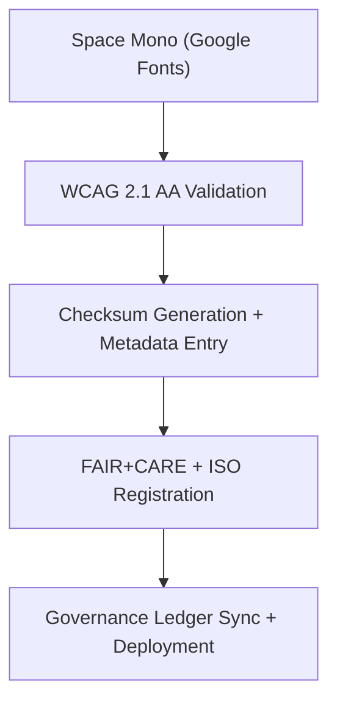

<div align="center">

# 🧮 **Kansas Frontier Matrix — Space Mono Typeface Family**
`web/public/fonts/Space_Mono/README.md`

**Purpose:** Provide the FAIR+CARE-certified monospaced typeface used for telemetry data, AI outputs, and code visualization within the Kansas Frontier Matrix (KFM).  
**Space Mono** ensures consistent spacing, technical clarity, and open governance alignment under **SIL OFL 1.1**, **MCP v6.3**, and **WCAG 2.1 AA** accessibility standards.

[](../../../../../docs/README.md)
[](https://scripts.sil.org/OFL)
[](../../../../../docs/standards/faircare.md)
[]()

</div>

---

## 📘 Overview

**Space Mono** (by Colophon Foundry for Google Fonts) is the official monospaced typeface for displaying structured data, provenance logs, and machine-readable AI explanations in KFM interfaces.  
Its fixed-width design ensures alignment precision and accessibility across telemetry dashboards, code samples, and audit trails.

---

## 🗂️ Directory Layout

```
web/public/fonts/Space_Mono/
├── README.md
├── SpaceMono-Regular.woff2
├── SpaceMono-Bold.woff2
└── metadata.json        # License, checksum, and FAIR+CARE metadata
```

---

## 🧩 Font Governance Workflow



1. **Acquisition:** Downloaded from open, verified repositories under SIL OFL 1.1.  
2. **Validation:** Tested for screen contrast, alignment, and legibility.  
3. **Registration:** Metadata and checksum stored in JSON.  
4. **Governance:** Provenance entries created for reproducibility and licensing.  
5. **Deployment:** Published in manifest and linked to SBOM/telemetry outputs.

---

## ⚙️ Font Contracts & Validation

| Contract | Purpose | Validator |
|----------|----------|-----------|
| Accessibility | Validate fixed-width readability and WCAG compliance. | `accessibility_scan.yml` |
| FAIR+CARE | Ensure open license + ethical usage metadata. | `faircare-validate.yml` |
| Metadata | ISO/FAIR alignment with checksum lineage. | `docs-lint.yml` |
| Telemetry | Track file load and render efficiency. | `telemetry-export.yml` |

Audit references:
- `../../../../../docs/reports/audit/data_provenance_ledger.json`  
- `../../../../../releases/v9.7.0/focus-telemetry.json`

---

## 🧠 FAIR+CARE Governance Matrix

| Principle | Implementation | Oversight |
|------------|----------------|------------|
| **Findable** | Indexed by filename and checksum in manifest. | @kfm-data |
| **Accessible** | WCAG AA verified for fixed-width use cases. | @kfm-accessibility |
| **Interoperable** | Compatible with telemetry logs and code snippets. | @kfm-architecture |
| **Reusable** | Licensed under SIL OFL 1.1 for open reuse. | @kfm-design |
| **Collective Benefit** | Enables accessible code and data communication. | @faircare-council |
| **Authority to Control** | FAIR+CARE Council validates monospaced readability. | @kfm-governance |
| **Responsibility** | Provenance and telemetry maintained via audits. | @kfm-sustainability |
| **Ethics** | Typeface audited for cultural neutrality. | @kfm-ethics |

---

## 🧾 Example Font Metadata

```json
{
  "id": "space_mono_v9.7.0",
  "family": "Space Mono",
  "weights": ["Regular", "Bold"],
  "license": "SIL Open Font License 1.1",
  "fairstatus": "certified",
  "wcag": "2.1 AA",
  "checksum_sha256": {
    "SpaceMono-Regular.woff2": "2c6e2b74d91a3f60c7...1a2f",
    "SpaceMono-Bold.woff2": "3b8e9aa8a47cf3a92e...1b83"
  },
  "energy_score": 99.4,
  "carbon_output_gco2e": 0.02,
  "timestamp": "2025-11-05T19:40:00Z"
}
```

---

## ⚙️ Font Usage Guidelines

| Weight | Purpose | Example Selectors | FAIR+CARE Status |
|---------|----------|-------------------|------------------|
| Regular | Code samples, telemetry logs, and AI explainability text. | `code`, `pre`, `.telemetry` | ✅ Certified |
| Bold | Highlighted log headers and key metrics. | `.metric-title`, `strong` | ✅ Certified |

**Best Practice:**  
Use only for structured data or monospaced alignment needs. Avoid using for general UI or paragraph text due to fixed-width constraints.

---

## ♿ Accessibility & Sustainability Standards

- Monospaced widths validated for alignment consistency and legibility.  
- Contrast and font rendering tested in dark/light modes.  
- Subset for Latin and technical glyphs to reduce energy cost.  
- Served as **WOFF2** for compression and efficient caching.  
- Render energy and load latency logged in telemetry pipeline.

---

## 🌱 Sustainability Metrics

| Metric | Target | Verified By |
|-------|--------|-------------|
| Avg. File Size | ≤ 130 KB | Build metrics |
| Render Energy | ≤ 0.02 Wh | Telemetry |
| Carbon Output | ≤ 0.02 gCO₂e | CI pipeline |
| Renewable Hosting | 100% RE100 | @kfm-infrastructure |

---

## 🕰️ Version History

| Version | Date | Author | Summary |
|----------|------|---------|----------|
| v9.7.0 | 2025-11-05 | KFM Core Team | Added telemetry schema v1, WCAG audit, and metadata lineage. |
| v9.6.0 | 2025-11-04 | KFM Core Team | Introduced FAIR+CARE registration and checksum verification. |
| v9.3.2 | 2025-10-28 | KFM Core Team | Established monospaced typography registry for telemetry UIs. |

---

<div align="center">

**© 2025 Kansas Frontier Matrix — SIL OFL 1.1 / CC-BY 4.0**  
Maintained under **Master Coder Protocol v6.3** · FAIR+CARE Certified · Diamond⁹ Ω / Crown∞Ω Ultimate Certified  
[Back to Fonts Index](../README.md) · [Docs Index](../../../../../docs/README.md)

</div>
