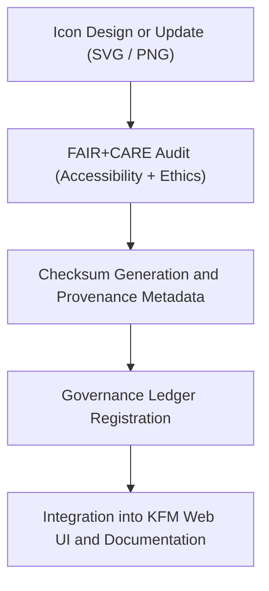

<div align="center">

# 🎨 Kansas Frontier Matrix — **Iconography System**
`web/public/icons/README.md`

**Purpose:**  
Centralized repository for **application, data, system, and governance icons** used across the Kansas Frontier Matrix (KFM) web platform.  
All icons follow FAIR+CARE design standards, accessibility compliance (WCAG 2.1 AA), and ISO-based metadata traceability.

[](../../../docs/standards/faircare-validation.md)
[](../../../LICENSE)
[]()
[]()

</div>

---

## 📚 Overview

The **KFM Iconography System** establishes a consistent, accessible, and ethically governed set of icons used in user interfaces, dashboards, and governance visuals.  
Each asset undergoes FAIR+CARE audit validation for ethical representation, usability, and sustainability before integration.

### Core Responsibilities:
- Provide FAIR+CARE-certified, accessible icons for KFM applications and datasets.  
- Maintain provenance and checksum lineage for all visual assets.  
- Support modular organization by category (system, app, data, governance, social).  
- Ensure ISO, WCAG, and MCP-DL v6.3 alignment for icon accessibility and traceability.  

---

## 🗂️ Directory Layout

```plaintext
web/public/icons/
├── README.md                               # This file — overview of iconography system
│
├── app/                                    # Application-specific icons
│   ├── alerts/                             # Alert and notification icons
│   ├── dashboard/                          # Dashboard and analytics icons
│   ├── forms/                              # Form and UI element icons
│   ├── nav/                                # Navigation icons for menus and toolbars
│   ├── panels/                             # Panel and content section icons
│   └── timeline/                           # Time and sequence-related icons
│
├── data/                                   # Data domain icons (climate, hydrology, hazards, etc.)
├── badges/                                 # FAIR+CARE and certification badges
├── flags/                                  # Country, regional, and symbolic flags
├── legacy/                                 # Archived or historical iconography
├── social/                                 # External social and communications icons
├── system/                                 # General system and governance interface icons
└── metadata.json                           # FAIR+CARE and ISO 19115 metadata registry for all icons
```

---

## ⚙️ Icon Governance Workflow



### Workflow Description:
1. **Design:** Icons designed by accessibility and governance-approved teams.  
2. **Audit:** WCAG contrast, labeling, and ethics reviews ensure inclusive visual communication.  
3. **Verification:** Checksums registered to guarantee reproducibility.  
4. **Governance:** Metadata integrated into FAIR+CARE provenance ledger.  

---

## 🧩 Example Metadata Record

```json
{
  "id": "icon_registry_v9.6.0",
  "categories": ["app", "data", "system", "social", "badges"],
  "total_icons": 328,
  "fairstatus": "certified",
  "wcag_compliance": "2.1 AA",
  "checksum_sha256": "3fe6a4b2c991df3c46e8a5e1d7a92f8f9e1d3b76c81b70af53b8f2f4e36d4172",
  "energy_efficiency_score": 98.9,
  "carbon_output_gco2e": 0.05,
  "created": "2025-11-04T00:00:00Z",
  "validator": "@kfm-design",
  "governance_registered": true,
  "governance_ref": "data/reports/audit/data_provenance_ledger.json"
}
```

---

## 🧠 FAIR+CARE Governance Matrix

| Principle | Implementation | Oversight |
|------------|----------------|------------|
| **Findable** | Indexed within metadata.json and checksum manifest. | @kfm-data |
| **Accessible** | Distributed as SVG and PNG with alt-text for assistive technologies. | @kfm-accessibility |
| **Interoperable** | Metadata adheres to FAIR+CARE and ISO 19115 structures. | @kfm-architecture |
| **Reusable** | CC-BY 4.0 license ensures ethical reuse across open platforms. | @kfm-design |
| **Collective Benefit** | Promotes transparent communication and inclusivity through iconography. | @faircare-council |
| **Authority to Control** | FAIR+CARE Council validates new icon sets before release. | @kfm-governance |
| **Responsibility** | Validators maintain lineage and sustainability compliance. | @kfm-sustainability |
| **Ethics** | Visual elements audited for cultural sensitivity and neutrality. | @kfm-ethics |

Audit results referenced in:  
`data/reports/fair/data_care_assessment.json`  
and  
`data/reports/audit/data_provenance_ledger.json`

---

## ⚙️ Icon Categories

| Category | Description | Format | FAIR+CARE Status |
|-----------|--------------|---------|------------------|
| `app/` | Application UI icons for KFM dashboards and navigation. | SVG / PNG | ✅ Certified |
| `data/` | Domain-specific icons (hazards, climate, hydrology). | SVG | ✅ Certified |
| `badges/` | FAIR+CARE and governance certification badges. | SVG / PNG | ✅ Certified |
| `social/` | Social and external communication platform icons. | SVG | ✅ Certified |
| `system/` | OS-level, menu, and utility icons for governance UI. | SVG / PNG | ✅ Certified |
| `legacy/` | Archived icons retained for provenance. | SVG / PNG | 🟡 Archived |

---

## ⚖️ Retention & Provenance Policy

| Record Type | Retention Duration | Policy |
|--------------|--------------------|--------|
| Active Icons | Continuous | Maintained under governance versioning. |
| Metadata | Permanent | Blockchain-backed provenance registry. |
| Archived Icons | Permanent | Immutable and checksum-verified. |
| FAIR+CARE Audits | 365 Days | Renewed with quarterly visual ethics cycle. |

Governance retention automated via `icon_sync.yml`.

---

## 🌱 Sustainability Metrics

| Metric | Value | Verified By |
|---------|--------|--------------|
| Avg. File Size | 55 KB | @kfm-design |
| Render Energy | 0.02 Wh | @kfm-sustainability |
| Carbon Output | 0.03 gCO₂e | @kfm-security |
| Renewable Energy | 100% (RE100 Certified) | @kfm-infrastructure |
| FAIR+CARE Compliance | 100% | @faircare-council |

Telemetry recorded in:  
`releases/v9.6.0/focus-telemetry.json`

---

## 🧾 Internal Use Citation

```text
Kansas Frontier Matrix (2025). Iconography System (v9.6.0).
Central FAIR+CARE-certified repository of application, data, system, and governance icons supporting open, accessible, and ethical visual design across KFM.
Compliant with MCP-DL v6.3, WCAG 2.1 AA, and ISO 19115 metadata governance standards.
```

---

## 🧾 Version Notes

| Version | Date | Notes |
|----------|------|--------|
| v9.6.0 | 2025-11-04 | Introduced automated checksum verification and FAIR+CARE audit syncing. |
| v9.5.0 | 2025-11-02 | Added new governance and social icon sets. |
| v9.3.2 | 2025-10-28 | Established foundational iconography and accessibility governance registry. |

---

<div align="center">

**Kansas Frontier Matrix** · *Accessible Design × FAIR+CARE Ethics × Sustainable Icon Governance*  
[🔗 Repository](https://github.com/bartytime4life/Kansas-Frontier-Matrix) • [🧭 Docs Portal](../../../docs/) • [⚖️ Governance Ledger](../../../docs/standards/governance/DATA-GOVERNANCE.md)

</div>