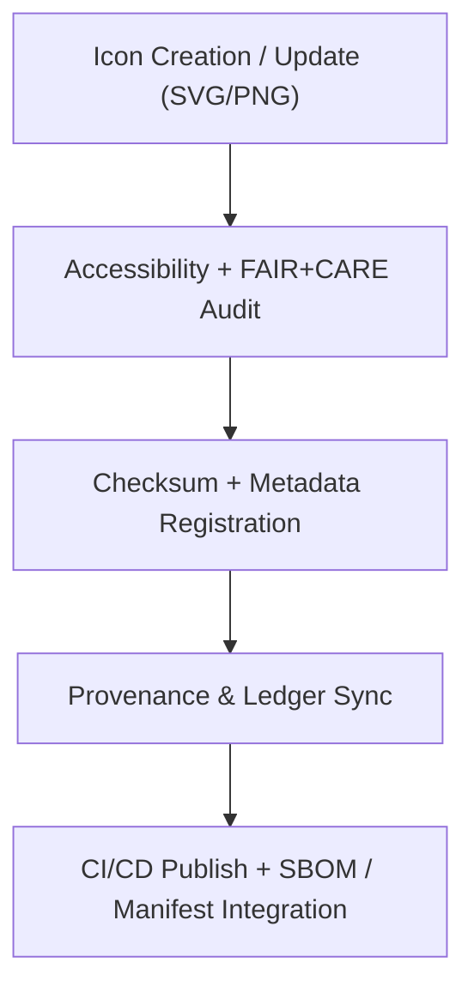

<div align="center">

# 🎨 **Kansas Frontier Matrix — Iconography System**
`web/public/icons/README.md`

**Purpose:** Define and govern the full icon library supporting the KFM web ecosystem.  
All icons are **FAIR+CARE-certified**, accessible (WCAG 2.1 AA), and metadata-verified under **ISO 19115** and **MCP v6.3**, ensuring ethical visual communication and sustainability.

[](../../../docs/README.md)
[](../../../LICENSE)
[](../../../docs/standards/faircare.md)
[]()

</div>

---

## 📘 Overview

The **KFM Iconography System** is the centralized design and governance hub for all icons used across applications, data dashboards, and FAIR+CARE governance modules.  
Each icon is version-controlled, metadata-linked, and subject to accessibility and ethics validation.

---

## 🗂️ Directory Layout

```
web/public/icons/
├── README.md
│
├── app/          # Application UI icons (alerts, nav, panels, timeline)
├── data/         # Data domain icons (climate, hydrology, hazards)
├── badges/       # FAIR+CARE + certification badges
├── flags/        # Cultural and geopolitical flags
├── legacy/       # Archived or retired icons
├── social/       # Social and external platform logos
├── system/       # Governance and OS-level interface icons
└── metadata.json # Registry of all icons + FAIR+CARE metadata
```

---

## 🧩 Icon Governance Workflow



1. **Creation:** Icons designed by KFM-certified designers under ethical guidelines.  
2. **Audit:** WCAG 2.1 contrast checks and inclusivity review.  
3. **Registration:** Hash, license, and metadata stored in JSON.  
4. **Governance:** Updates logged in provenance ledgers.  
5. **Publication:** CI/CD distributes validated icon sets across web modules.

---

## ⚙️ Validation Contracts

| Contract | Purpose | Validator |
|----------|----------|-----------|
| Accessibility | WCAG 2.1 AA contrast + alt-label validation | `accessibility_scan.yml` |
| FAIR+CARE | Ethics, inclusivity, and provenance validation | `faircare-validate.yml` |
| Metadata | ISO 19115 + SPDX schema validation | `docs-lint.yml` |
| Telemetry | File size, render energy, and carbon trace logging | `telemetry-export.yml` |

Artifacts recorded in:
- `../../../releases/v9.7.0/focus-telemetry.json`  
- `../../../docs/reports/audit/data_provenance_ledger.json`

---

## 🧠 FAIR+CARE Governance Matrix

| Principle | Implementation | Oversight |
|------------|----------------|------------|
| **Findable** | Indexed by checksum and category in metadata.json. | @kfm-data |
| **Accessible** | Alt-text and ARIA labels for all icons. | @kfm-accessibility |
| **Interoperable** | Follows ISO 19115 + FAIR+CARE metadata standards. | @kfm-architecture |
| **Reusable** | CC-BY 4.0 licensing ensures ethical reuse. | @kfm-design |
| **Collective Benefit** | Promotes open, inclusive, culturally sensitive visual language. | @faircare-council |
| **Authority to Control** | Council reviews new icons for ethics + cultural respect. | @kfm-governance |
| **Responsibility** | Validators maintain lineage and audit compliance. | @kfm-sustainability |
| **Ethics** | Icons screened for neutrality, avoiding stereotypes. | @kfm-ethics |

---

## 🧾 Example Metadata Record

```json
{
  "id": "icon_registry_v9.7.0",
  "categories": ["app", "data", "system", "social", "badges"],
  "total_icons": 356,
  "fairstatus": "certified",
  "wcag": "2.1 AA",
  "checksum_sha256": "3fe6a4b2c991df3c46e8a5e1d7a92f8f9e1d3b76c81b70af53b8f2f4e36d4172",
  "energy_score": 98.9,
  "carbon_output_gco2e": 0.05,
  "timestamp": "2025-11-05T19:45:00Z"
}
```

---

## ⚙️ Icon Categories

| Category | Description | FAIR+CARE Status |
|-----------|--------------|------------------|
| `app/` | Application UI icons (alerts, nav, timeline). | ✅ Certified |
| `data/` | Domain icons (hydrology, hazards, landcover). | ✅ Certified |
| `badges/` | FAIR+CARE badges and verification marks. | ✅ Certified |
| `social/` | Social and collaboration icons. | ✅ Certified |
| `system/` | OS and governance interface icons. | ✅ Certified |
| `legacy/` | Archived icons retained for provenance. | 🟡 Archived |

---

## ♿ Accessibility Standards

- Minimum **3:1** contrast for secondary icons; **4.5:1** for primary.  
- All icons include descriptive **`aria-label`** or `<title>` tags.  
- Color variations tested for **color-blind safety (WCAG 2.1 G183)**.  
- No text embedded within icon graphics (for screen reader compatibility).  

---

## 🌱 Sustainability Metrics

| Metric | Target | Verified By |
|-------|--------|-------------|
| Avg. File Size | ≤ 60 KB | CI metrics |
| Render Energy | ≤ 0.02 Wh | Telemetry |
| Carbon Output | ≤ 0.03 gCO₂e | CI telemetry |
| Renewable Hosting | 100% RE100 | @kfm-infrastructure |

---

## 🕰️ Version History

| Version | Date | Author | Summary |
|----------|------|---------|----------|
| v9.7.0 | 2025-11-05 | KFM Core Team | Upgraded & aligned: telemetry schema v1, metadata contracts, CI/CD integration. |
| v9.6.0 | 2025-11-04 | KFM Core Team | Introduced automated checksum + provenance registration. |
| v9.5.0 | 2025-11-02 | KFM Core Team | Added new governance + social icons. |
| v9.3.2 | 2025-10-28 | KFM Core Team | Established FAIR+CARE iconography registry. |

---

<div align="center">

**© 2025 Kansas Frontier Matrix — CC-BY 4.0**  
Maintained under **Master Coder Protocol v6.3** · FAIR+CARE Certified · Diamond⁹ Ω / Crown∞Ω Ultimate Certified  
[Back to Public Assets](../README.md) · [Docs Index](../../../docs/README.md)

</div>