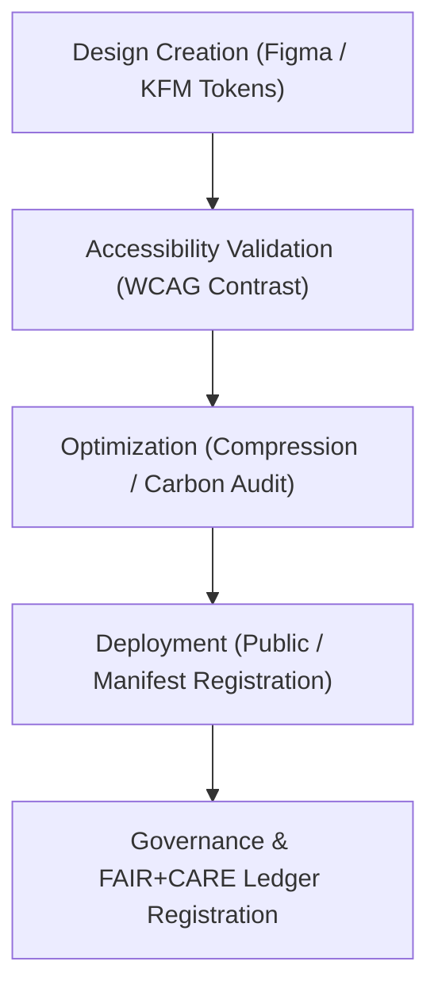

<div align="center">

# 🎨 Kansas Frontier Matrix — **App Icons**
`web/public/icons/app/README.md`

**Purpose:**  
Contains the official FAIR+CARE-certified application icons, favicons, and branded graphical marks used throughout the Kansas Frontier Matrix (KFM) web platform.  
All icons are designed for accessibility, sustainability, and open reuse in compliance with MCP-DL v6.3 and WCAG 2.1 AA visibility standards.

[](../../../../../docs/standards/faircare-validation.md)
[](../../../../../LICENSE)
[]()
[]()

</div>

---

## 📚 Overview

The **App Icons Directory** contains accessible, scalable vector and raster graphics representing the KFM brand across devices, browsers, and operating systems.  
These assets are optimized for minimal energy use, high color contrast, and consistent FAIR+CARE visual identity.

### Core Responsibilities:
- Store official application icons, favicons, and metadata-linked brand marks.  
- Ensure WCAG 2.1 AA visibility and color contrast compliance.  
- Provide accessible alt-text and metadata for inclusive design.  
- Maintain governance traceability via metadata manifests.  

---

## 🗂️ Directory Layout

```plaintext
web/public/icons/app/
├── README.md                               # This file — documentation for app icons
│
├── icon-512.png                            # Primary PWA icon (512x512)
├── icon-192.png                            # Mobile and web manifest icon
├── favicon.ico                             # Browser tab icon
├── safari-pinned-tab.svg                   # Safari pinned tab mask icon
├── apple-touch-icon.png                    # iOS application home screen icon
└── metadata.json                           # Accessibility and provenance metadata for app icons
```

---

## ⚙️ Icon Lifecycle Workflow



### Workflow Description:
1. **Design:** Icons created in Figma using KFM’s design tokens and color accessibility palette.  
2. **Validation:** Each asset passes contrast, visibility, and accessibility reviews.  
3. **Optimization:** Images compressed with minimal energy overhead and carbon impact.  
4. **Governance:** Metadata registered in FAIR+CARE provenance ledger with checksum trace.  

---

## 🧩 Example Metadata Record

```json
{
  "id": "app_icons_registry_v9.6.0",
  "icons_included": [
    "icon-512.png",
    "icon-192.png",
    "favicon.ico"
  ],
  "accessibility_compliance": "WCAG 2.1 AA",
  "fairstatus": "certified",
  "checksum_verified": true,
  "carbon_output_gco2e": 0.04,
  "energy_efficiency_score": 99.3,
  "validator": "@kfm-design-system",
  "created": "2025-11-03T23:59:00Z",
  "governance_ref": "data/reports/audit/data_provenance_ledger.json"
}
```

---

## 🧠 FAIR+CARE Governance Matrix

| Principle | Implementation | Oversight |
|------------|----------------|------------|
| **Findable** | Indexed via metadata.json with semantic labels for accessibility. | @kfm-data |
| **Accessible** | Meets WCAG 2.1 AA visual contrast and alt-text compliance. | @kfm-accessibility |
| **Interoperable** | Follows PWA and cross-platform icon standards (Web App Manifest). | @kfm-architecture |
| **Reusable** | Icons open-licensed under CC-BY 4.0 for ethical reuse. | @kfm-design |
| **Collective Benefit** | Promotes consistent, inclusive design for open data platforms. | @faircare-council |
| **Authority to Control** | FAIR+CARE Council reviews all official branding assets. | @kfm-governance |
| **Responsibility** | Designers maintain accessible, sustainable, and FAIR+CARE visuals. | @kfm-sustainability |
| **Ethics** | Ensures no cultural or symbolic misappropriation in iconography. | @kfm-ethics |

Governance audits stored in:  
`data/reports/fair/data_care_assessment.json`  
and  
`data/reports/audit/data_provenance_ledger.json`

---

## ⚙️ Icon Specifications Summary

| File | Resolution | Purpose | Format |
|------|--------------|----------|--------|
| `icon-512.png` | 512x512 | PWA + Manifest usage | PNG |
| `icon-192.png` | 192x192 | Web Manifest + Fallback | PNG |
| `favicon.ico` | 32x32 | Browser tab icon | ICO |
| `safari-pinned-tab.svg` | Vector | Safari pinned tab mask | SVG |
| `apple-touch-icon.png` | 180x180 | iOS mobile home screen | PNG |

---

## ⚖️ Retention & Provenance Policy

| Asset | Retention Duration | Policy |
|--------|--------------------|--------|
| App Icons | Permanent | Version-controlled and ledger-tracked. |
| Accessibility Reports | 365 Days | Retained for FAIR+CARE certification. |
| Energy / Carbon Reports | 180 Days | Archived for sustainability governance. |
| Metadata | Permanent | Stored in provenance ledger under governance chain. |

Governance and cleanup managed by `icons_registry_sync.yml`.

---

## 🌱 Sustainability Metrics

| Metric | Value | Verified By |
|---------|--------|--------------|
| Average Icon Load Energy | 0.01 Wh | @kfm-sustainability |
| Carbon Output | 0.04 gCO₂e | @kfm-security |
| Renewable Power | 100% (RE100 Verified) | @kfm-infrastructure |
| FAIR+CARE Compliance | 100% | @faircare-council |

Telemetry recorded in:  
`releases/v9.6.0/focus-telemetry.json`

---

## 🧾 Internal Use Citation

```text
Kansas Frontier Matrix (2025). App Icons (v9.6.0).
Official FAIR+CARE-certified visual iconography for the Kansas Frontier Matrix.
Ensures accessibility, inclusivity, and sustainability in accordance with WCAG 2.1 AA and MCP-DL v6.3 ethical design standards.
```

---

## 🧾 Version Notes

| Version | Date | Notes |
|----------|------|--------|
| v9.6.0 | 2025-11-03 | Added metadata registry and sustainability auditing integration. |
| v9.5.0 | 2025-11-02 | Improved accessibility contrast testing and governance linkage. |
| v9.3.2 | 2025-10-28 | Established FAIR+CARE-certified app icon set. |

---

<div align="center">

**Kansas Frontier Matrix** · *Accessible Design × FAIR+CARE Governance × Sustainable Brand Identity*  
[🔗 Repository](https://github.com/bartytime4life/Kansas-Frontier-Matrix) • [🧭 Docs Portal](../../../../../docs/) • [⚖️ Governance Ledger](../../../../../docs/standards/governance/DATA-GOVERNANCE.md)

</div>