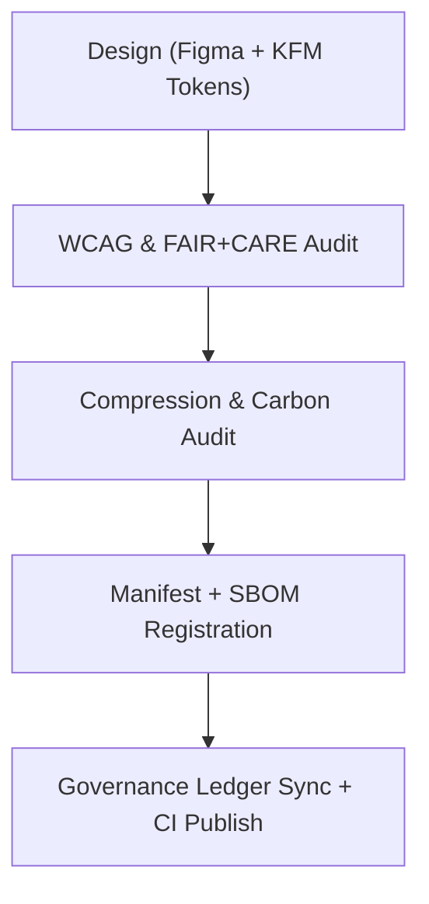

<div align="center">

# 🎨 **Kansas Frontier Matrix — App Icons**
`web/public/icons/app/README.md`

**Purpose:** Provide FAIR+CARE-certified, accessible, and sustainable app icons (PWA + brand marks) for the KFM platform.  
All icons are versioned, checksum-verified, and metadata-governed under **MCP v6.3** with **WCAG 2.1 AA** validation.

[](../../../../../docs/README.md)
[](../../../../../LICENSE)
[](../../../../../docs/standards/faircare.md)
[]()

</div>

---

## 📘 Overview

This directory contains official **application icons**, **favicons**, and **PWA assets** used across browsers and devices.  
Assets are optimized for low energy, high contrast, and reproducibility, with provenance linked to release telemetry and governance ledgers.

---

## 🗂️ Directory Layout

```
web/public/icons/app/
├── README.md
├── icon-512.png            # PWA icon (512×512)
├── icon-192.png            # Manifest icon (192×192)
├── favicon.ico             # Browser tab icon
├── safari-pinned-tab.svg   # Safari pinned tab mask
├── apple-touch-icon.png    # iOS home screen icon (180×180)
└── metadata.json           # CC-BY + checksum + FAIR+CARE metadata
```

---

## 🧩 Icon Lifecycle



1. **Design:** Generated with tokenized color palettes and accessible geometry.  
2. **Audit:** Contrast & inclusivity validated; alt text and titles authored.  
3. **Registration:** SHA-256 + license + purpose captured in JSON.  
4. **Publish:** Manifest + SBOM updated; ledgers reflect new or revised assets.

---

## ⚙️ Validation Contracts

| Contract | Purpose | Validator |
|----------|----------|-----------|
| Accessibility | Contrast, focus visibility, alt/title text | `accessibility_scan.yml` |
| FAIR+CARE | Inclusivity & provenance requirements | `faircare-validate.yml` |
| Telemetry | File size & energy impact metrics | `telemetry-export.yml` |
| Metadata | ISO 19115 + SPDX + manifest rules | CI schema checks |

Artifacts recorded in:
- `../../../../../releases/v9.7.0/focus-telemetry.json`
- `../../../../../docs/reports/audit/data_provenance_ledger.json`

---

## 🧠 FAIR+CARE Governance Matrix

| Principle | Implementation | Oversight |
|------------|----------------|------------|
| **Findable** | Icons indexed by role and checksum in metadata.json. | @kfm-data |
| **Accessible** | Meets WCAG AA for color/contrast; descriptive titles provided. | @kfm-accessibility |
| **Interoperable** | PWA manifest + ISO metadata alignment. | @kfm-architecture |
| **Reusable** | CC-BY 4.0 licensing for ethical reuse. | @kfm-design |
| **Collective Benefit** | Consistent identity for open-science tools. | @faircare-council |
| **Authority to Control** | Council reviews branding and inclusivity. | @kfm-governance |
| **Responsibility** | Designers track checksums and carbon metrics. | @kfm-sustainability |
| **Ethics** | Avoids cultural misappropriation; neutral symbolism. | @kfm-ethics |

---

## 🧾 Example Metadata

```json
{
  "id": "app_icons_v9.7.0",
  "icons": ["icon-512.png", "icon-192.png", "favicon.ico"],
  "wcag": "2.1 AA",
  "fairstatus": "certified",
  "checksum": {
    "icon-512.png": "9a1b...f3e",
    "icon-192.png": "c0db...42a"
  },
  "energy_score": 99.3,
  "timestamp": "2025-11-05T19:55:00Z"
}
```

---

## ⚙️ Icon Specifications

| File | Resolution | Purpose | Format |
|------|-----------:|---------|--------|
| `icon-512.png` | 512×512 | PWA + manifest | PNG |
| `icon-192.png` | 192×192 | Manifest + fallback | PNG |
| `favicon.ico` | 32×32 | Browser tab icon | ICO |
| `safari-pinned-tab.svg` | vector | Safari pinned tab | SVG |
| `apple-touch-icon.png` | 180×180 | iOS home screen | PNG |

---

## 🌱 Sustainability Targets

| Metric | Target | Verified By |
|-------|--------|-------------|
| Avg. File Size | ≤ 60 KB | Build metrics |
| Load Energy | ≤ 0.01 Wh | Telemetry |
| Carbon Output | ≤ 0.04 gCO₂e | CI telemetry |
| Renewable Hosting | 100% RE100 | Infrastructure audit |

---

## 🕰️ Version History

| Version | Date | Author | Summary |
|----------|------|---------|----------|
| v9.7.0 | 2025-11-05 | KFM Core Team | Upgraded & aligned: telemetry schema v1, manifest/SBOM mapping, governance logging. |
| v9.6.0 | 2025-11-03 | KFM Core Team | Added metadata registry + sustainability audit. |
| v9.5.0 | 2025-11-02 | KFM Core Team | Improved contrast testing and provenance trace. |
| v9.3.2 | 2025-10-28 | KFM Core Team | Established app icon set under CC-BY 4.0. |

---

<div align="center">

**© 2025 Kansas Frontier Matrix — CC-BY 4.0**  
Maintained under **Master Coder Protocol v6.3** · FAIR+CARE Certified · Diamond⁹ Ω / Crown∞Ω Ultimate Certified  
[Back to Iconography System](../README.md) · [Docs Index](../../../../../docs/README.md)

</div>