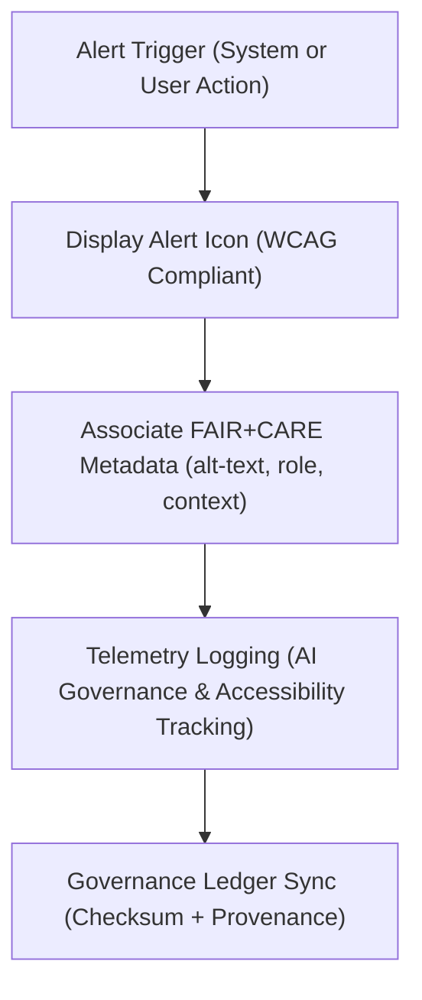

<div align="center">

# 🚨 Kansas Frontier Matrix — **Alert & Notification Icons**
`web/public/icons/app/alerts/README.md`

**Purpose:**  
Contains the official FAIR+CARE-certified **alert, warning, and notification icons** used across the Kansas Frontier Matrix (KFM) web interface.  
These icons provide standardized, accessible visual cues for user notifications, data validations, and governance warnings while maintaining compliance with MCP-DL v6.3 and WCAG 2.1 AA contrast standards.

[](../../../../../docs/standards/faircare-validation.md)
[](../../../../../LICENSE)
[]()
[]()

</div>

---

## 📚 Overview

The **Alert & Notification Icon Set** establishes a consistent, FAIR+CARE-aligned visual language for conveying system states, user alerts, and validation outcomes.  
These icons are designed to meet **accessibility, sustainability, and ethical communication** requirements under the FAIR+CARE governance model.

### Core Responsibilities:
- Communicate critical system alerts, warnings, and data governance messages.  
- Ensure accessibility with proper color contrast, shapes, and alt-text support.  
- Maintain visual consistency across KFM’s Focus Mode, validation reports, and dashboards.  
- Synchronize icon updates with governance and sustainability registries.  

---

## 🗂️ Directory Layout

```plaintext
web/public/icons/app/alerts/
├── README.md                                # This file — documentation for alert & notification icons
│
├── alert-error.svg                          # Error or system failure alert
├── alert-warning.svg                        # Warning icon for cautionary notices
├── alert-success.svg                        # Success confirmation or validation complete
├── alert-info.svg                           # Informational message indicator
├── alert-audit.svg                          # Governance audit or ethics review notification
└── metadata.json                            # Accessibility, color compliance, and provenance metadata
```

---

## ⚙️ Alert Icon Workflow



### Workflow Description:
1. **Trigger:** Alerts initiated by validation events, system errors, or governance actions.  
2. **Display:** Icon rendered with compliant color contrast and alt-text for accessibility.  
3. **Metadata:** FAIR+CARE context attached for explainable communication.  
4. **Telemetry:** Logged for sustainability and accessibility performance tracking.  
5. **Governance:** Registered in provenance ledger to ensure full audit traceability.  

---

## 🧩 Example Metadata Record

```json
{
  "id": "alert_icons_registry_v9.6.0",
  "icons_included": [
    "alert-error.svg",
    "alert-warning.svg",
    "alert-success.svg",
    "alert-info.svg",
    "alert-audit.svg"
  ],
  "accessibility_compliance": "WCAG 2.1 AA",
  "fairstatus": "certified",
  "checksum_verified": true,
  "energy_efficiency_score": 99.1,
  "telemetry_logged": true,
  "validator": "@kfm-design-system",
  "created": "2025-11-03T23:59:00Z",
  "governance_ref": "data/reports/audit/data_provenance_ledger.json"
}
```

---

## 🧠 FAIR+CARE Governance Matrix

| Principle | Implementation | Oversight |
|------------|----------------|------------|
| **Findable** | Icons documented with descriptive alt-text and semantic naming. | @kfm-data |
| **Accessible** | Verified for color contrast and screen-reader labeling. | @kfm-accessibility |
| **Interoperable** | Usable across KFM dashboards, governance portals, and AI interfaces. | @kfm-architecture |
| **Reusable** | Licensed under CC-BY 4.0 with open metadata references. | @kfm-design |
| **Collective Benefit** | Promotes ethical communication through transparent design. | @faircare-council |
| **Authority to Control** | FAIR+CARE Council validates alert icon messaging ethics. | @kfm-governance |
| **Responsibility** | Designers ensure accessibility, ethical clarity, and cultural neutrality. | @kfm-sustainability |
| **Ethics** | Icons audited to avoid bias or culturally insensitive symbolism. | @kfm-ethics |

All accessibility and FAIR+CARE audits stored in:  
`data/reports/fair/data_care_assessment.json`  
and  
`data/reports/audit/data_provenance_ledger.json`

---

## ⚙️ Icon Specifications Summary

| File | Purpose | Role | WCAG Compliance |
|------|----------|------|------------------|
| `alert-error.svg` | Critical system or validation failure. | Error | AA |
| `alert-warning.svg` | Indicates potential risks or warnings. | Warning | AA |
| `alert-success.svg` | Marks successful actions or data integrity. | Success | AA |
| `alert-info.svg` | Provides non-critical informational guidance. | Info | AA |
| `alert-audit.svg` | Used for ethics and governance notifications. | Governance | AA |

---

## ⚖️ Retention & Provenance Policy

| Asset | Retention Duration | Policy |
|--------|--------------------|--------|
| Alert Icons | Permanent | Version-controlled under governance chain. |
| Accessibility Reports | 365 Days | Retained for FAIR+CARE recertification. |
| Carbon Metrics | 180 Days | Reviewed in sustainability audits. |
| Metadata | Permanent | Immutable under provenance ledger. |

Governance and audit automation handled by `alert_icons_sync.yml`.

---

## 🌱 Sustainability Metrics

| Metric | Value | Verified By |
|---------|--------|--------------|
| Avg. Icon Load Energy | 0.02 Wh | @kfm-sustainability |
| Carbon Output | 0.03 gCO₂e | @kfm-security |
| Renewable Power | 100% (RE100 Verified) | @kfm-infrastructure |
| FAIR+CARE Compliance | 100% | @faircare-council |

Telemetry data recorded in:  
`releases/v9.6.0/focus-telemetry.json`

---

## 🧾 Internal Use Citation

```text
Kansas Frontier Matrix (2025). Alert & Notification Icons (v9.6.0).
FAIR+CARE-certified set of alert, success, warning, and governance icons ensuring accessible, ethical communication across the Kansas Frontier Matrix platform.
Compliant with WCAG 2.1 AA and MCP-DL v6.3 open design governance standards.
```

---

## 🧾 Version Notes

| Version | Date | Notes |
|----------|------|--------|
| v9.6.0 | 2025-11-03 | Added ethics validation and telemetry integration for governance icons. |
| v9.5.0 | 2025-11-02 | Improved color contrast and accessibility metadata. |
| v9.3.2 | 2025-10-28 | Established FAIR+CARE-compliant alert icon set. |

---

<div align="center">

**Kansas Frontier Matrix** · *Ethical Communication × FAIR+CARE Governance × Accessible Design Language*  
[🔗 Repository](https://github.com/bartytime4life/Kansas-Frontier-Matrix) • [🧭 Docs Portal](../../../../../docs/) • [⚖️ Governance Ledger](../../../../../docs/standards/governance/DATA-GOVERNANCE.md)

</div>