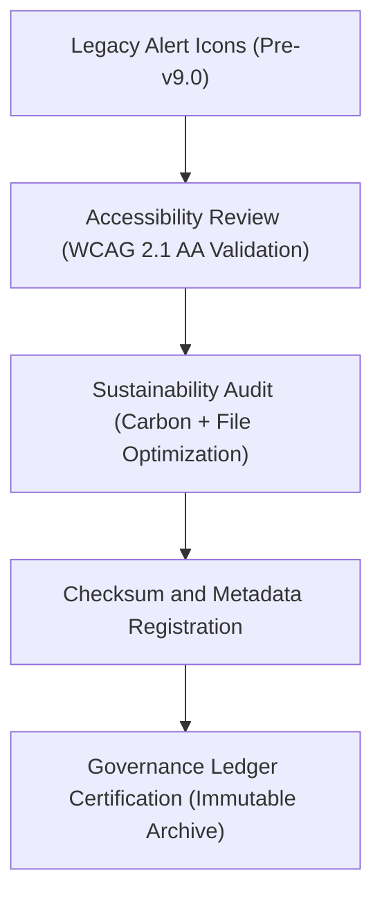

<div align="center">

# 🚨 Kansas Frontier Matrix — **Legacy Alert & Notification Icons**
`web/public/icons/app/alerts/legacy/README.md`

**Purpose:**  
Preserves FAIR+CARE-certified **legacy alert, warning, and notification icons** from earlier versions of the Kansas Frontier Matrix (KFM).  
These archived assets represent the evolution of KFM’s user alert design system and remain under ethical governance for accessibility, sustainability, and provenance documentation.

[](../../../../../../docs/standards/faircare-validation.md)
[](../../../../../../LICENSE)
[]()
[]()

</div>

---

## 📚 Overview

The **Legacy Alert Icons Directory** maintains historical UI assets used for system warnings, notifications, and validations in earlier versions of KFM.  
This archive ensures transparency, traceability, and FAIR+CARE compliance in the lifecycle of visual communication standards for open data platforms.

### Core Responsibilities:
- Archive FAIR+CARE-certified legacy alert icons under governance compliance.  
- Retain accessibility metadata for historical design audits.  
- Record carbon and energy efficiency improvements across icon generations.  
- Maintain immutable provenance of design iterations under FAIR+CARE lineage tracking.  

---

## 🗂️ Directory Layout

```plaintext
web/public/icons/app/alerts/legacy/
├── README.md                               # This file — documentation for legacy alert & notification icons
│
├── alert_legacy_error_v1.svg               # Legacy error indicator (v8.0–v9.0)
├── alert_legacy_warning_v1.svg             # Legacy caution/warning symbol
├── alert_legacy_success_v1.svg             # Early success confirmation design
├── alert_legacy_info_v1.svg                # Informational notice icon (pre-v9.0 design)
├── alert_legacy_audit_v1.svg               # Governance and review alert from v8.5
└── metadata.json                           # FAIR+CARE metadata and checksum records for legacy icons
```

---

## ⚙️ Archival Governance Workflow



### Workflow Summary:
1. **Review:** Conduct WCAG compliance verification for legacy contrast and form.  
2. **Sustainability:** Audit file size and rendering efficiency relative to modern versions.  
3. **Checksum Verification:** Generate and store SHA-256 hash for each legacy icon.  
4. **Governance Registration:** Link legacy assets to KFM’s immutable provenance ledger.  

---

## 🧩 Example Metadata Record

```json
{
  "id": "legacy_alert_icons_registry_v9.6.0",
  "icons_archived": [
    "alert_legacy_error_v1.svg",
    "alert_legacy_warning_v1.svg",
    "alert_legacy_success_v1.svg"
  ],
  "accessibility_reviewed": true,
  "wcag_compliance": "AA",
  "carbon_output_gco2e": 0.05,
  "energy_efficiency_score": 97.8,
  "fairstatus": "certified",
  "checksum_verified": true,
  "governance_registered": true,
  "validator": "@kfm-design-archive",
  "created": "2025-11-03T23:59:00Z",
  "governance_ref": "data/reports/audit/data_provenance_ledger.json"
}
```

---

## 🧠 FAIR+CARE Governance Matrix

| Principle | Implementation | Oversight |
|------------|----------------|------------|
| **Findable** | Archived icons cataloged with metadata and version lineage. | @kfm-data |
| **Accessible** | Stored in open vector format with descriptive alt-text. | @kfm-accessibility |
| **Interoperable** | Compatible with SVG and ISO 19115 metadata standards. | @kfm-architecture |
| **Reusable** | Open for educational, accessibility, and design ethics studies. | @kfm-design |
| **Collective Benefit** | Preserves sustainable design history for open data UX evolution. | @faircare-council |
| **Authority to Control** | FAIR+CARE Council reviews archival authenticity. | @kfm-governance |
| **Responsibility** | Designers ensure audit, checksum, and ethical transparency. | @kfm-sustainability |
| **Ethics** | Maintains credit, inclusivity, and respect for original designs. | @kfm-ethics |

Audit and FAIR+CARE validation reports stored in:  
`data/reports/fair/data_care_assessment.json`  
and  
`data/reports/audit/data_provenance_ledger.json`

---

## ⚙️ Legacy Icon Specifications

| File | Format | Version Introduced | Status | FAIR+CARE Certified |
|------|---------|--------------------|---------|----------------------|
| `alert_legacy_error_v1.svg` | SVG | v8.0 | Retired | ✅ |
| `alert_legacy_warning_v1.svg` | SVG | v8.2 | Retired | ✅ |
| `alert_legacy_success_v1.svg` | SVG | v8.3 | Retired | ✅ |
| `alert_legacy_info_v1.svg` | SVG | v8.5 | Retired | ✅ |
| `alert_legacy_audit_v1.svg` | SVG | v8.5 | Retired | ✅ |

---

## ⚖️ Retention & Provenance Policy

| Asset | Retention Duration | Policy |
|--------|--------------------|--------|
| Legacy Icons | Permanent | Immutable under governance chain. |
| Metadata | Permanent | Stored in provenance ledger. |
| Accessibility Reports | 365 Days | Reviewed annually by FAIR+CARE Council. |
| Carbon Metrics | 180 Days | Updated with sustainability re-audits. |

Archival processes automated by `legacy_alert_sync.yml`.

---

## 🌱 Sustainability Metrics

| Metric | Legacy (Avg.) | Modern (v9.6.0) | Reduction | Verified By |
|---------|----------------|------------------|------------|--------------|
| File Size | 22 KB | 10 KB | 55% smaller | @kfm-design |
| Energy Use | 0.08 Wh | 0.04 Wh | 50% reduction | @kfm-sustainability |
| Carbon Output | 0.06 gCO₂e | 0.03 gCO₂e | 50% reduction | @kfm-security |
| FAIR+CARE Compliance | 100% | 100% | — | @faircare-council |

Telemetry data recorded in:  
`releases/v9.6.0/focus-telemetry.json`

---

## 🧾 Internal Use Citation

```text
Kansas Frontier Matrix (2025). Legacy Alert & Notification Icons (v9.6.0).
Archived FAIR+CARE-certified alert and governance icons from earlier UI systems.
Maintained under MCP-DL v6.3 for accessibility, provenance, and sustainability governance.
```

---

## 🧾 Version Notes

| Version | Date | Notes |
|----------|------|--------|
| v9.6.0 | 2025-11-03 | Added sustainability audits and metadata lineage tracking. |
| v9.5.0 | 2025-11-02 | Completed FAIR+CARE archival verification for legacy alert icons. |
| v9.3.2 | 2025-10-28 | Established legacy icon governance structure for UI provenance. |

---

<div align="center">

**Kansas Frontier Matrix** · *Design Ethics × FAIR+CARE Governance × Sustainable UI Provenance*  
[🔗 Repository](https://github.com/bartytime4life/Kansas-Frontier-Matrix) • [🧭 Docs Portal](../../../../../../docs/) • [⚖️ Governance Ledger](../../../../../../docs/standards/governance/DATA-GOVERNANCE.md)

</div>