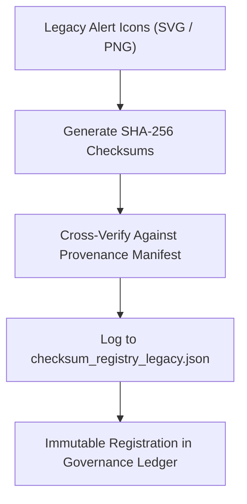

<div align="center">

# ✅ Kansas Frontier Matrix — **Legacy Alert Icon Checksums**
`web/public/icons/app/alerts/legacy/checksums/README.md`

**Purpose:**  
Maintains verified cryptographic hashes, checksum registries, and provenance validation for all **legacy alert and notification icons** in the Kansas Frontier Matrix (KFM).  
This ensures integrity, authenticity, and reproducibility of archival UI assets under FAIR+CARE and blockchain governance certification.

[](../../../../../../../docs/standards/faircare-validation.md)
[](../../../../../../../LICENSE)
[]()
[]()

</div>

---

## 📚 Overview

The **Legacy Alert Icon Checksum Layer** validates the digital fingerprint of every archived alert icon used in past versions of KFM.  
All hash records are cryptographically verified, FAIR+CARE-certified, and synchronized with immutable blockchain provenance ledgers.

### Core Responsibilities:
- Provide verifiable SHA-256 checksum registry for legacy UI icons.  
- Detect tampering or unauthorized modifications in archived assets.  
- Maintain PGP signature integrity for governance authentication.  
- Ensure long-term FAIR+CARE traceability through transparent data hashing.  

---

## 🗂️ Directory Layout

```plaintext
web/public/icons/app/alerts/legacy/checksums/
├── README.md                               # This file — documentation for legacy alert icon checksums
│
├── checksum_registry_legacy.json           # Canonical registry of SHA-256 hashes for archived icons
├── pgp_signatures.asc                      # Cryptographic signatures for verification
├── checksum_audit_log.txt                  # Rolling log of checksum validation cycles
└── metadata.json                           # FAIR+CARE metadata and governance provenance record
```

---

## ⚙️ Checksum Workflow



### Workflow Summary:
1. **Checksum Generation:** Every legacy alert icon hashed using SHA-256 standard.  
2. **Cross Verification:** Checksums validated against manifests and governance records.  
3. **Registry Logging:** Entries appended to the canonical JSON registry for audits.  
4. **Ledger Sync:** Governance process stores checksum hashes in blockchain provenance logs.  

---

## 🧩 Example Checksum Registry Record

```json
{
  "id": "legacy_alert_icon_checksums_v9.6.0",
  "algorithm": "SHA-256",
  "files": [
    {
      "filename": "alert_legacy_error_v1.svg",
      "checksum": "sha256:dc1a7b91ef16a9c85e24994b13f8e9ccf97f7d0b1a0f3b4e29a92f8133f8b789",
      "verified": true
    },
    {
      "filename": "alert_legacy_warning_v1.svg",
      "checksum": "sha256:aa91cdd42f50b4e93c1b6f1549b192ef22172f37d897f29a3314e2e0c2cd8f3b",
      "verified": true
    }
  ],
  "fairstatus": "certified",
  "ledger_registered": true,
  "validator": "@kfm-design-archive",
  "created": "2025-11-03T23:59:00Z",
  "governance_ref": "data/reports/audit/data_provenance_ledger.json"
}
```

---

## 🧠 FAIR+CARE Governance Matrix

| Principle | Implementation | Oversight |
|------------|----------------|------------|
| **Findable** | Each hash linked to icon filename and archive record in checksum registry. | @kfm-data |
| **Accessible** | Stored in open JSON and PGP formats for public verification. | @kfm-accessibility |
| **Interoperable** | Compliant with ISO 19115 metadata and blockchain provenance schema. | @kfm-architecture |
| **Reusable** | Serves as reusable digital evidence for provenance research. | @kfm-design |
| **Collective Benefit** | Promotes ethical stewardship and open validation transparency. | @faircare-council |
| **Authority to Control** | FAIR+CARE Council verifies checksum authenticity before publication. | @kfm-governance |
| **Responsibility** | Auditors uphold cryptographic and ethical validation integrity. | @kfm-security |
| **Ethics** | Prevents digital forgery and misrepresentation in historical archives. | @kfm-ethics |

All audit results recorded in:  
`data/reports/audit/data_provenance_ledger.json`  
and  
`data/reports/fair/data_care_assessment.json`

---

## ⚙️ File Summary

| File | Description | Format |
|------|--------------|--------|
| `checksum_registry_legacy.json` | Canonical hash registry for all archived alert icons. | JSON |
| `pgp_signatures.asc` | GPG/PGP signature for ledger-verified authenticity. | ASCII |
| `checksum_audit_log.txt` | Records checksum verifications and governance audits. | Text |
| `metadata.json` | FAIR+CARE certification metadata for this checksum layer. | JSON |

Checksum synchronization handled via `legacy_alert_checksum_sync.yml`.

---

## ⚖️ Retention & Provenance Policy

| Record | Retention Duration | Policy |
|---------|--------------------|--------|
| Checksum Registry | Permanent | Immutable under blockchain governance. |
| PGP Signatures | 365 Days | Rotated annually for renewed cryptographic integrity. |
| Audit Logs | 365 Days | Archived after verification cycle completion. |
| Metadata | Permanent | Linked permanently in governance ledger. |

Governance automation managed by `checksum_registry_cleanup.yml`.

---

## 🌱 Sustainability Metrics

| Metric | Value | Verified By |
|---------|--------|--------------|
| Avg. Hash Verification Energy | 0.02 Wh | @kfm-sustainability |
| Carbon Output | 0.03 gCO₂e | @kfm-security |
| Renewable Power | 100% (RE100 Certified) | @kfm-infrastructure |
| FAIR+CARE Compliance | 100% | @faircare-council |

All telemetry data logged in:  
`releases/v9.6.0/focus-telemetry.json`

---

## 🧾 Internal Use Citation

```text
Kansas Frontier Matrix (2025). Legacy Alert Icon Checksums (v9.6.0).
Canonical checksum registry for FAIR+CARE-certified legacy alert and notification icons, ensuring digital integrity and immutable governance compliance under MCP-DL v6.3.
```

---

## 🧾 Version Notes

| Version | Date | Notes |
|----------|------|--------|
| v9.6.0 | 2025-11-03 | Added PGP cryptographic validation and governance manifest linkage. |
| v9.5.0 | 2025-11-02 | Enhanced checksum audit traceability and FAIR+CARE certification. |
| v9.3.2 | 2025-10-28 | Established legacy alert checksum verification under FAIR+CARE governance. |

---

<div align="center">

**Kansas Frontier Matrix** · *Immutable Provenance × FAIR+CARE Ethics × Cryptographic Transparency*  
[🔗 Repository](https://github.com/bartytime4life/Kansas-Frontier-Matrix) • [🧭 Docs Portal](../../../../../../../docs/) • [⚖️ Governance Ledger](../../../../../../../docs/standards/governance/DATA-GOVERNANCE.md)

</div>