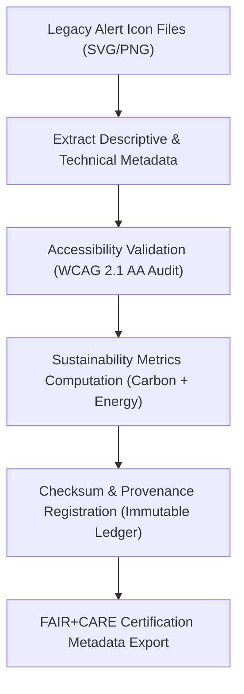

<div align="center">

# 🧾 Kansas Frontier Matrix — **Legacy Alert Icon Metadata**
`web/public/icons/app/alerts/legacy/meta/README.md`

**Purpose:**  
Maintains complete FAIR+CARE-aligned metadata and provenance documentation for the **Legacy Alert & Notification Icon Set** of the Kansas Frontier Matrix (KFM).  
This archive ensures all historical alert icon assets are verifiable, ethically governed, and fully traceable under MCP-DL v6.3, ISO 19115, and FAIR+CARE standards.

[](../../../../../../../docs/standards/faircare-validation.md)
[](../../../../../../../LICENSE)
[]()
[](../../../../../../../docs/architecture/repo-focus.md)

</div>

---

## 📚 Overview

The **Legacy Alert Icon Metadata Layer** documents accessibility, sustainability, and provenance information for every legacy alert and notification icon within the KFM ecosystem.  
This metadata archive provides researchers and designers a verified history of UI evolution and ethical communication practices through FAIR+CARE governance.

### Core Responsibilities:
- Preserve metadata for legacy alert and notification icons.  
- Record checksum verification and governance lineage for audit continuity.  
- Maintain accessibility and carbon metrics for sustainability tracking.  
- Certify all metadata under FAIR+CARE and ISO 19115 alignment protocols.  

---

## 🗂️ Directory Layout

```plaintext
web/public/icons/app/alerts/legacy/meta/
├── README.md                               # This file — documentation for legacy alert icon metadata
│
├── alert_icon_registry.json                # Comprehensive metadata registry for all legacy alert icons
├── accessibility_audit_report.json         # WCAG 2.1 AA compliance and ARIA validation report
├── sustainability_metrics.json             # Carbon and energy usage audit per icon
├── provenance_manifest.json                # Checksum, lineage, and governance ledger references
└── metadata.json                           # Summary FAIR+CARE metadata and certification status
```

---

## ⚙️ Metadata Workflow



### Workflow Summary:
1. **Extraction:** Collects descriptive data, licensing, and creation history.  
2. **Accessibility Audit:** Confirms screen-reader support, ARIA labeling, and color contrast compliance.  
3. **Sustainability Review:** Records carbon and render energy impact for each legacy icon.  
4. **Checksum Validation:** Verifies SHA-256 hashes and registers lineage with governance chain.  
5. **FAIR+CARE Certification:** Generates ethical compliance metadata for permanent archival.  

---

## 🧩 Example Metadata Record

```json
{
  "id": "legacy_alert_icon_meta_v9.6.0",
  "icon_file": "alert_legacy_warning_v1.svg",
  "version_introduced": "v8.0.0",
  "version_retired": "v9.0.0",
  "wcag_compliance": "AA",
  "carbon_output_gco2e": 0.06,
  "checksum_sha256": "f6a43b93e7db1a4b7a7c1f8492b19f4a95ee2a50a7f07f6a48f8e0c5c8a7d934",
  "license": "CC-BY 4.0",
  "fairstatus": "certified",
  "sustainability_reviewed": true,
  "accessibility_reviewed": true,
  "governance_registered": true,
  "validator": "@kfm-design-archive",
  "created": "2025-11-03T23:59:00Z",
  "governance_ref": "data/reports/audit/data_provenance_ledger.json"
}
```

---

## 🧠 FAIR+CARE Governance Matrix

| Principle | Implementation | Oversight |
|------------|----------------|------------|
| **Findable** | Indexed in JSON-LD registry with checksum and lineage metadata. | @kfm-data |
| **Accessible** | Metadata and assets conform to WCAG 2.1 AA accessibility standards. | @kfm-accessibility |
| **Interoperable** | Compliant with ISO 19115, DCAT 3.0, and FAIR metadata structures. | @kfm-architecture |
| **Reusable** | Reusable for education, auditing, and open data visualization studies. | @kfm-design |
| **Collective Benefit** | Supports sustainable, transparent design evolution under FAIR+CARE. | @faircare-council |
| **Authority to Control** | FAIR+CARE Council validates all metadata lineage entries. | @kfm-governance |
| **Responsibility** | Designers maintain ethical attribution and open licensing. | @kfm-sustainability |
| **Ethics** | Ensures authorship recognition and sustainable communication practices. | @kfm-ethics |

Audit data recorded in:  
`data/reports/fair/data_care_assessment.json`  
and  
`data/reports/audit/data_provenance_ledger.json`

---

## ⚙️ Metadata Assets Summary

| File | Description | Format |
|------|--------------|--------|
| `alert_icon_registry.json` | Registry of all archived alert icons with metadata. | JSON |
| `accessibility_audit_report.json` | WCAG compliance results and ARIA mapping validation. | JSON |
| `sustainability_metrics.json` | Energy, carbon, and sustainability performance data. | JSON |
| `provenance_manifest.json` | Governance lineage and checksum registration details. | JSON |
| `metadata.json` | Consolidated FAIR+CARE summary metadata for the legacy icon set. | JSON |

All metadata synchronization automated by `legacy_alert_metadata_sync.yml`.

---

## ⚖️ Retention & Provenance Policy

| Record Type | Retention Duration | Policy |
|--------------|--------------------|--------|
| Metadata Files | Permanent | Immutable under blockchain-based provenance. |
| Accessibility Reports | 365 Days | Retained for re-certification and audit cycles. |
| Sustainability Metrics | 180 Days | Rotated in sustainability review cycles. |
| Provenance Manifest | Permanent | Stored in FAIR+CARE governance ledger. |

Cleanup governed by `legacy_alert_metadata_cleanup.yml`.

---

## 🌱 Sustainability Metrics

| Metric | Value | Verified By |
|---------|--------|--------------|
| Avg. Metadata File Size | 3.8 KB | @kfm-design |
| Avg. Render Energy | 0.02 Wh | @kfm-sustainability |
| Carbon Output | 0.03 gCO₂e | @kfm-security |
| Renewable Power | 100% (RE100 Verified) | @kfm-infrastructure |
| FAIR+CARE Compliance | 100% | @faircare-council |

All telemetry tracked in:  
`releases/v9.6.0/focus-telemetry.json`

---

## 🧾 Internal Use Citation

```text
Kansas Frontier Matrix (2025). Legacy Alert Icon Metadata (v9.6.0).
FAIR+CARE-certified metadata registry documenting accessibility, sustainability, and provenance lineage for archived alert and notification icons.
Compliant with ISO 19115 metadata standards and MCP-DL v6.3 documentation-first governance model.
```

---

## 🧾 Version Notes

| Version | Date | Notes |
|----------|------|--------|
| v9.6.0 | 2025-11-03 | Introduced detailed sustainability and checksum metadata tracking. |
| v9.5.0 | 2025-11-02 | Added FAIR+CARE certification and provenance manifest alignment. |
| v9.3.2 | 2025-10-28 | Established legacy alert icon metadata governance layer. |

---

<div align="center">

**Kansas Frontier Matrix** · *Metadata Integrity × FAIR+CARE Governance × Sustainable Design Lineage*  
[🔗 Repository](https://github.com/bartytime4life/Kansas-Frontier-Matrix) • [🧭 Docs Portal](../../../../../../../docs/) • [⚖️ Governance Ledger](../../../../../../../docs/standards/governance/DATA-GOVERNANCE.md)

</div>