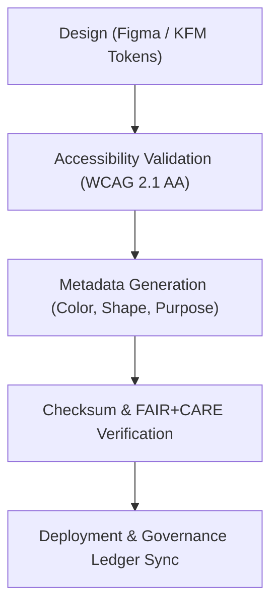

<div align="center">

# 📊 Kansas Frontier Matrix — **Dashboard Interface Icons**
`web/public/icons/app/dashboard/README.md`

**Purpose:**  
Hosts FAIR+CARE-certified interface icons designed for the **KFM Dashboard**, used throughout Focus Mode, analytics panels, and governance monitoring systems.  
These icons communicate data insights, validation results, and system state changes — ensuring accessibility, consistency, and ethical visualization across all dashboard modules.

[](../../../../../docs/standards/faircare-validation.md)
[](../../../../../LICENSE)
[]()
[]()
[](../../../../../docs/architecture/repo-focus.md)

</div>

---

## 📚 Overview

The **Dashboard Icons Collection** defines the visual language of the Kansas Frontier Matrix user experience, providing coherent, accessible visual indicators across governance metrics, AI explainability layers, and data visualization modules.

### Core Responsibilities:
- Deliver FAIR+CARE-certified dashboard icons for analytics and Focus Mode interfaces.  
- Maintain accessible visual hierarchy and WCAG contrast compliance.  
- Ensure ethical and culturally neutral symbolic representation.  
- Synchronize icon metadata and provenance with governance ledgers.  

---

## 🗂️ Directory Layout

```plaintext
web/public/icons/app/dashboard/
├── README.md                               # This file — documentation for KFM dashboard icons
│
├── icon-insight.svg                        # Represents Focus Mode AI insight summaries
├── icon-validation.svg                     # Validation success and audit completion symbol
├── icon-analytics.svg                      # Statistical analytics and data exploration
├── icon-governance.svg                     # Ethics, policy, and governance dashboard module
├── icon-focusmode.svg                      # Focus Mode activation and telemetry visualization
├── icon-settings.svg                       # System or dashboard configuration symbol
└── metadata.json                           # FAIR+CARE, accessibility, and provenance metadata
```

---

## ⚙️ Dashboard Icon Lifecycle



### Workflow Summary:
1. **Design:** Icons developed in Figma using KFM’s design tokens and color governance framework.  
2. **Validation:** Each asset passes accessibility and ethical design checks.  
3. **Verification:** Icons undergo checksum validation and FAIR+CARE certification.  
4. **Governance:** Registered within provenance ledgers for transparency and ethical reuse.  

---

## 🧩 Example Metadata Record

```json
{
  "id": "dashboard_icons_registry_v9.6.0",
  "icons_included": [
    "icon-insight.svg",
    "icon-validation.svg",
    "icon-governance.svg"
  ],
  "accessibility_compliance": "WCAG 2.1 AA",
  "fairstatus": "certified",
  "checksum_verified": true,
  "ai_interpretability_ready": true,
  "carbon_output_gco2e": 0.05,
  "energy_efficiency_score": 98.9,
  "validator": "@kfm-design-system",
  "created": "2025-11-04T00:00:00Z",
  "governance_ref": "data/reports/audit/data_provenance_ledger.json"
}
```

---

## 🧠 FAIR+CARE Governance Matrix

| Principle | Implementation | Oversight |
|------------|----------------|------------|
| **Findable** | Indexed in `metadata.json` with accessible labels and provenance trace. | @kfm-data |
| **Accessible** | Meets WCAG 2.1 AA compliance for all dashboard symbols. | @kfm-accessibility |
| **Interoperable** | Structured in open SVG format for universal reuse. | @kfm-architecture |
| **Reusable** | Licensed under CC-BY 4.0 with open governance metadata. | @kfm-design |
| **Collective Benefit** | Enables transparent, ethical data representation for all users. | @faircare-council |
| **Authority to Control** | Governance Council oversees UI icon updates and releases. | @kfm-governance |
| **Responsibility** | Designers maintain ethical symbolism and inclusive usability. | @kfm-sustainability |
| **Ethics** | Icons audited for neutrality, cultural respect, and universal meaning. | @kfm-ethics |

Governance and audit logs maintained in:  
`data/reports/fair/data_care_assessment.json`  
and  
`data/reports/audit/data_provenance_ledger.json`

---

## ⚙️ Dashboard Icon Specifications

| File | Purpose | WCAG Compliance | Notes |
|------|----------|------------------|-------|
| `icon-insight.svg` | Represents Focus Mode insights or AI-driven findings. | AA | Used in analytics summary modules. |
| `icon-validation.svg` | Denotes validation or schema verification completion. | AA | Appears in audit dashboards. |
| `icon-analytics.svg` | Depicts statistical and visualization dashboards. | AA | Utilized in Focus Mode charts. |
| `icon-governance.svg` | Indicates governance and FAIR+CARE council features. | AA | Symbolizes ethical review systems. |
| `icon-focusmode.svg` | Activates Focus Mode and displays telemetry status. | AA | Exclusive to AI explainability UI. |
| `icon-settings.svg` | Provides configuration and customization controls. | AA | Appears across all dashboards. |

---

## ⚖️ Retention & Provenance Policy

| Category | Retention Duration | Policy |
|-----------|--------------------|--------|
| Dashboard Icons | Permanent | Version-controlled and immutable under governance. |
| Accessibility Audits | 365 Days | Reviewed annually for certification renewal. |
| Sustainability Metrics | 180 Days | Updated with quarterly FAIR+CARE audits. |
| Metadata | Permanent | Stored in provenance ledger and SBOM references. |

Governance synchronization automated by `dashboard_icon_sync.yml`.

---

## 🌱 Sustainability Metrics

| Metric | Value | Verified By |
|---------|--------|--------------|
| Avg. Icon File Size | 5.8 KB | @kfm-design |
| Avg. Render Energy | 0.03 Wh | @kfm-sustainability |
| Carbon Output | 0.04 gCO₂e | @kfm-security |
| Renewable Power | 100% (RE100 Verified) | @kfm-infrastructure |
| FAIR+CARE Compliance | 100% | @faircare-council |

Telemetry logged in:  
`releases/v9.6.0/focus-telemetry.json`

---

## 🧾 Internal Use Citation

```text
Kansas Frontier Matrix (2025). Dashboard Interface Icons (v9.6.0).
Official FAIR+CARE-certified dashboard iconography enabling ethical, accessible, and sustainable communication of system insights and governance transparency.
Licensed under CC-BY 4.0 and documented per MCP-DL v6.3 standards.
```

---

## 🧾 Version Notes

| Version | Date | Notes |
|----------|------|--------|
| v9.6.0 | 2025-11-04 | Added AI interpretability metadata and sustainability tracking. |
| v9.5.0 | 2025-11-02 | Enhanced accessibility color mapping and governance ledger integration. |
| v9.3.2 | 2025-10-28 | Established core dashboard iconography with FAIR+CARE compliance. |

---

<div align="center">

**Kansas Frontier Matrix** · *Accessible Analytics × FAIR+CARE Ethics × Sustainable UI Design*  
[🔗 Repository](https://github.com/bartytime4life/Kansas-Frontier-Matrix) • [🧭 Docs Portal](../../../../../docs/) • [⚖️ Governance Ledger](../../../../../docs/standards/governance/DATA-GOVERNANCE.md)

</div>