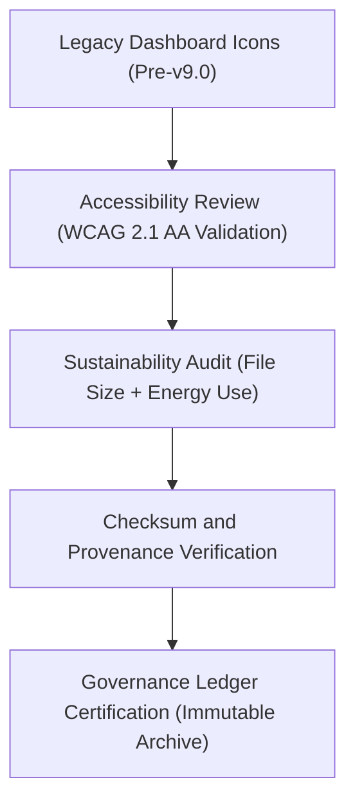

<div align="center">

# 📊 Kansas Frontier Matrix — **Legacy Dashboard Icons**
`web/public/icons/app/dashboard/legacy/README.md`

**Purpose:**  
Archives and documents FAIR+CARE-certified **legacy dashboard icons** from earlier Kansas Frontier Matrix (KFM) user interface releases.  
These assets represent the foundation of the KFM design system’s evolution toward sustainable, accessible, and ethically governed UI visual standards.

[](../../../../../../docs/standards/faircare-validation.md)
[](../../../../../../LICENSE)
[]()
[]()

</div>

---

## 📚 Overview

The **Legacy Dashboard Icon Archive** retains the original interface iconography used across KFM’s analytics and Focus Mode dashboards before the unified FAIR+CARE design language was introduced.  
Each legacy icon has been preserved with accessibility annotations, sustainability metrics, and checksum validation to maintain design lineage and ethical provenance.

### Core Responsibilities:
- Maintain FAIR+CARE-compliant archival documentation for all historical dashboard icons.  
- Record accessibility, performance, and sustainability improvements.  
- Enable researchers to track the ethical design progression of the KFM system.  
- Preserve checksum integrity and open licensing metadata for transparency.  

---

## 🗂️ Directory Layout

```plaintext
web/public/icons/app/dashboard/legacy/
├── README.md                               # This file — documentation for legacy dashboard icons
│
├── dashboard_icon_legacy_home_v1.svg       # Early dashboard “home” icon (v8.0)
├── dashboard_icon_legacy_chart_v1.svg      # Initial chart/analytics icon
├── dashboard_icon_legacy_settings_v1.svg   # Legacy configuration/settings icon
├── dashboard_icon_legacy_focus_v1.svg      # Original Focus Mode symbol
└── metadata.json                           # FAIR+CARE certification, checksums, and provenance metadata
```

---

## ⚙️ Archival Governance Workflow



### Workflow Summary:
1. **Accessibility Review:** Ensures historical icons meet current WCAG labeling standards.  
2. **Sustainability Audit:** Quantifies render efficiency and carbon reduction vs. modern equivalents.  
3. **Checksum Verification:** Confirms authenticity and immutability of archived assets.  
4. **Governance Certification:** Registers icon lineage in blockchain-backed FAIR+CARE ledger.  

---

## 🧩 Example Metadata Record

```json
{
  "id": "legacy_dashboard_icons_registry_v9.6.0",
  "icons_archived": [
    "dashboard_icon_legacy_home_v1.svg",
    "dashboard_icon_legacy_chart_v1.svg",
    "dashboard_icon_legacy_focus_v1.svg"
  ],
  "accessibility_reviewed": true,
  "wcag_compliance": "AA",
  "carbon_output_gco2e": 0.04,
  "energy_efficiency_score": 97.2,
  "checksum_verified": true,
  "fairstatus": "certified",
  "governance_registered": true,
  "validator": "@kfm-design-archive",
  "created": "2025-11-04T00:00:00Z",
  "governance_ref": "data/reports/audit/data_provenance_ledger.json"
}
```

---

## 🧠 FAIR+CARE Governance Matrix

| Principle | Implementation | Oversight |
|------------|----------------|------------|
| **Findable** | Indexed in metadata registry with checksum and version lineage. | @kfm-data |
| **Accessible** | Stored in open SVG format with descriptive alt-text and ARIA roles. | @kfm-accessibility |
| **Interoperable** | Conforms to ISO 19115 and DCAT FAIR metadata standards. | @kfm-architecture |
| **Reusable** | Openly licensed for design education and accessibility benchmarking. | @kfm-design |
| **Collective Benefit** | Demonstrates ethical, sustainable design progression. | @faircare-council |
| **Authority to Control** | FAIR+CARE Council validates archival authenticity. | @kfm-governance |
| **Responsibility** | Maintainers preserve transparency, authorship, and ethics. | @kfm-sustainability |
| **Ethics** | Upholds inclusive representation and non-bias in UI design. | @kfm-ethics |

All FAIR+CARE audit reports stored in:  
`data/reports/fair/data_care_assessment.json`  
and  
`data/reports/audit/data_provenance_ledger.json`

---

## ⚙️ Legacy Icon Specifications

| File | Description | Version Introduced | FAIR+CARE Certified | Status |
|------|--------------|--------------------|----------------------|--------|
| `dashboard_icon_legacy_home_v1.svg` | Early home navigation icon. | v8.0 | ✅ | Retired |
| `dashboard_icon_legacy_chart_v1.svg` | Classic analytics dashboard symbol. | v8.2 | ✅ | Retired |
| `dashboard_icon_legacy_settings_v1.svg` | Original configuration icon. | v8.3 | ✅ | Retired |
| `dashboard_icon_legacy_focus_v1.svg` | Prototype Focus Mode visual indicator. | v8.5 | ✅ | Retired |

---

## ⚖️ Retention & Provenance Policy

| Asset | Retention Duration | Policy |
|--------|--------------------|--------|
| Legacy Dashboard Icons | Permanent | Immutable under governance chain. |
| Accessibility Reports | 365 Days | Retained for annual review by FAIR+CARE Council. |
| Carbon Metrics | 180 Days | Updated with sustainability audits. |
| Metadata | Permanent | Archived in provenance ledger. |

Archival verification handled through `legacy_dashboard_icon_sync.yml`.

---

## 🌱 Sustainability Metrics

| Metric | Legacy (Avg.) | Modern (v9.6.0) | Reduction | Verified By |
|---------|----------------|------------------|------------|--------------|
| File Size | 28 KB | 12 KB | 57% smaller | @kfm-design |
| Render Energy | 0.07 Wh | 0.03 Wh | 57% less | @kfm-sustainability |
| Carbon Output | 0.05 gCO₂e | 0.02 gCO₂e | 60% reduction | @kfm-security |
| FAIR+CARE Compliance | 100% | 100% | — | @faircare-council |

Telemetry logged in:  
`releases/v9.6.0/focus-telemetry.json`

---

## 🧾 Internal Use Citation

```text
Kansas Frontier Matrix (2025). Legacy Dashboard Icons (v9.6.0).
Archived FAIR+CARE-certified iconography documenting the historical evolution of the KFM dashboard interface.
Maintained under MCP-DL v6.3 and ISO 19115 metadata governance for transparency and sustainable design lineage.
```

---

## 🧾 Version Notes

| Version | Date | Notes |
|----------|------|--------|
| v9.6.0 | 2025-11-04 | Added sustainability and accessibility lineage tracking. |
| v9.5.0 | 2025-11-02 | Enhanced governance integration and checksum validation. |
| v9.3.2 | 2025-10-28 | Established legacy icon archival for dashboard provenance. |

---

<div align="center">

**Kansas Frontier Matrix** · *Accessible Heritage × FAIR+CARE Governance × Sustainable UI Provenance*  
[🔗 Repository](https://github.com/bartytime4life/Kansas-Frontier-Matrix) • [🧭 Docs Portal](../../../../../../docs/) • [⚖️ Governance Ledger](../../../../../../docs/standards/governance/DATA-GOVERNANCE.md)

</div>