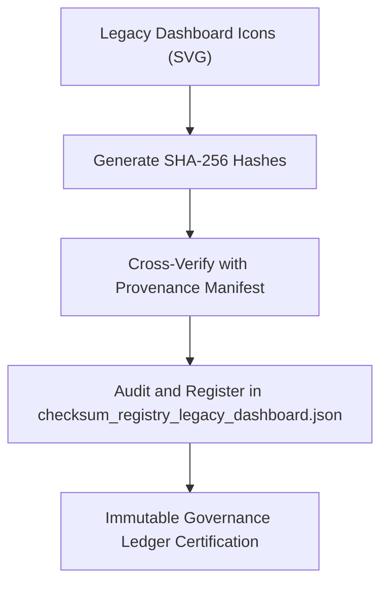

<div align="center">

# ✅ Kansas Frontier Matrix — **Legacy Dashboard Icon Checksums**
`web/public/icons/app/dashboard/legacy/checksums/README.md`

**Purpose:**  
Provides verified cryptographic checksums and governance metadata for archived **Legacy Dashboard Icons** in the Kansas Frontier Matrix (KFM).  
This checksum registry ensures authenticity, integrity, and ethical traceability of historical dashboard iconography under FAIR+CARE and MCP-DL v6.3 standards.

[](../../../../../../../docs/standards/faircare-validation.md)
[](../../../../../../../LICENSE)
[]()
[]()

</div>

---

## 📚 Overview

The **Legacy Dashboard Icon Checksums Layer** protects the integrity and provenance of historical user interface icons used in earlier KFM dashboard releases.  
Each file hash is cryptographically validated and registered in immutable FAIR+CARE governance ledgers for digital continuity and heritage preservation.

### Core Responsibilities:
- Generate and validate SHA-256 checksum records for all archived dashboard icons.  
- Prevent unauthorized modification or file corruption of legacy assets.  
- Maintain PGP signature registry and FAIR+CARE compliance records.  
- Provide verifiable proof of authenticity within blockchain provenance systems.  

---

## 🗂️ Directory Layout

```plaintext
web/public/icons/app/dashboard/legacy/checksums/
├── README.md                               # This file — documentation for legacy dashboard icon checksums
│
├── checksum_registry_legacy_dashboard.json # Canonical registry of verified hashes for legacy icons
├── pgp_signatures.asc                      # Optional PGP signature file for cryptographic verification
├── checksum_audit_log.txt                  # Rolling checksum validation and governance audit record
└── metadata.json                           # FAIR+CARE metadata, lineage, and provenance tracking
```

---

## ⚙️ Checksum Verification Workflow



### Workflow Summary:
1. **Hash Generation:** SHA-256 checksums generated for each archived dashboard icon.  
2. **Verification:** Cross-checks against the governance manifest for hash continuity.  
3. **Audit Logging:** Results appended to checksum registry and audit log.  
4. **Ledger Registration:** Immutable entries recorded in blockchain-backed governance systems.  

---

## 🧩 Example Checksum Registry Record

```json
{
  "id": "legacy_dashboard_icon_checksums_v9.6.0",
  "algorithm": "SHA-256",
  "files": [
    {
      "filename": "dashboard_icon_legacy_chart_v1.svg",
      "checksum": "sha256:17f3a4f7a19a2be1df43a672d84b49f918c1ef9d04c3d4b3d642d35d8b2cc91a",
      "verified": true
    },
    {
      "filename": "dashboard_icon_legacy_focus_v1.svg",
      "checksum": "sha256:bb2d3f58e7126b8f8b7c2aab9e12d9912ef8846f87a146acbe7e20a1a8f61b45",
      "verified": true
    }
  ],
  "fairstatus": "certified",
  "ledger_registered": true,
  "validator": "@kfm-design-archive",
  "created": "2025-11-04T00:00:00Z",
  "governance_ref": "data/reports/audit/data_provenance_ledger.json"
}
```

---

## 🧠 FAIR+CARE Governance Matrix

| Principle | Implementation | Oversight |
|------------|----------------|------------|
| **Findable** | All legacy icon checksums indexed by filename, version, and ledger ID. | @kfm-data |
| **Accessible** | Open JSON and ASCII signature formats for transparent verification. | @kfm-accessibility |
| **Interoperable** | Compliant with ISO 19115 metadata and blockchain provenance schema. | @kfm-architecture |
| **Reusable** | Enables reproducible audit verification for heritage UI assets. | @kfm-design |
| **Collective Benefit** | Guarantees ethical digital preservation through open validation. | @faircare-council |
| **Authority to Control** | FAIR+CARE Council certifies checksum validity and authenticity. | @kfm-governance |
| **Responsibility** | Auditors maintain ethical and cryptographic validation processes. | @kfm-security |
| **Ethics** | Prevents forgery, alteration, or bias in historical UI documentation. | @kfm-ethics |

Audit reports stored in:  
`data/reports/audit/data_provenance_ledger.json`  
and  
`data/reports/fair/data_care_assessment.json`

---

## ⚙️ File Summary

| File | Description | Format |
|------|--------------|--------|
| `checksum_registry_legacy_dashboard.json` | Registry of SHA-256 hashes for all legacy dashboard icons. | JSON |
| `pgp_signatures.asc` | GPG/PGP signature file confirming governance authenticity. | ASCII |
| `checksum_audit_log.txt` | Log of checksum generation and ledger sync operations. | Text |
| `metadata.json` | FAIR+CARE metadata for checksum governance. | JSON |

Checksum verification automated through `legacy_dashboard_checksum_sync.yml`.

---

## ⚖️ Retention & Provenance Policy

| Record | Retention Duration | Policy |
|---------|--------------------|--------|
| Checksum Registry | Permanent | Immutable and blockchain-certified. |
| PGP Signatures | 365 Days | Rotated annually to maintain cryptographic validity. |
| Audit Logs | 365 Days | Archived for transparency and recertification. |
| Metadata | Permanent | Stored under FAIR+CARE provenance management. |

All governance actions logged via `checksum_registry_cleanup.yml`.

---

## 🌱 Sustainability Metrics

| Metric | Value | Verified By |
|---------|--------|--------------|
| Avg. Hash Verification Energy | 0.02 Wh | @kfm-sustainability |
| Carbon Output | 0.03 gCO₂e | @kfm-security |
| Renewable Power | 100% (RE100 Verified) | @kfm-infrastructure |
| FAIR+CARE Compliance | 100% | @faircare-council |

Telemetry recorded in:  
`releases/v9.6.0/focus-telemetry.json`

---

## 🧾 Internal Use Citation

```text
Kansas Frontier Matrix (2025). Legacy Dashboard Icon Checksums (v9.6.0).
Immutable checksum registry ensuring authenticity and FAIR+CARE certification of archived dashboard iconography.
Maintained under blockchain provenance governance and MCP-DL v6.3 ethical data standards.
```

---

## 🧾 Version Notes

| Version | Date | Notes |
|----------|------|--------|
| v9.6.0 | 2025-11-04 | Introduced ledger-linked checksum governance and PGP verification. |
| v9.5.0 | 2025-11-02 | Enhanced checksum audit reporting and FAIR+CARE compliance tracking. |
| v9.3.2 | 2025-10-28 | Established checksum verification for legacy dashboard icons. |

---

<div align="center">

**Kansas Frontier Matrix** · *Immutable Heritage × FAIR+CARE Ethics × Cryptographic Provenance*  
[🔗 Repository](https://github.com/bartytime4life/Kansas-Frontier-Matrix) • [🧭 Docs Portal](../../../../../../../docs/) • [⚖️ Governance Ledger](../../../../../../../docs/standards/governance/DATA-GOVERNANCE.md)

</div>