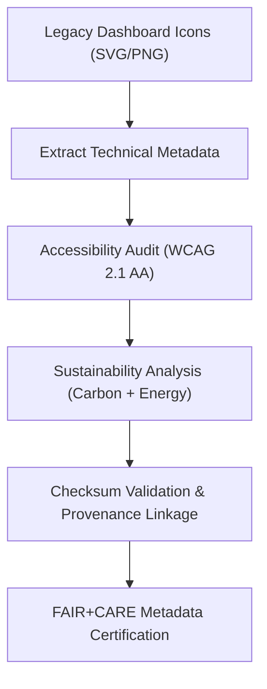

<div align="center">

# 🧾 Kansas Frontier Matrix — **Legacy Dashboard Icon Metadata**
`web/public/icons/app/dashboard/legacy/meta/README.md`

**Purpose:**  
Maintains comprehensive FAIR+CARE-certified metadata records for **archived dashboard icons** in the Kansas Frontier Matrix (KFM).  
This repository documents accessibility, sustainability, and provenance lineage for all legacy dashboard design assets under MCP-DL v6.3 and ISO 19115 governance standards.

[](../../../../../../../docs/standards/faircare-validation.md)
[](../../../../../../../LICENSE)
[]()
[]()

</div>

---

## 📚 Overview

The **Legacy Dashboard Icon Metadata Layer** provides structured documentation for KFM’s historical dashboard iconography.  
Each metadata record captures descriptive information, accessibility validation, carbon performance, and provenance registration for sustainable UI heritage preservation.

### Core Responsibilities:
- Archive descriptive and technical metadata for legacy dashboard icons.  
- Ensure accessibility and color governance compliance for all assets.  
- Record carbon impact, file efficiency, and provenance lineage.  
- Certify metadata under FAIR+CARE and ISO metadata frameworks.  

---

## 🗂️ Directory Layout

```plaintext
web/public/icons/app/dashboard/legacy/meta/
├── README.md                               # This file — documentation for legacy dashboard icon metadata
│
├── dashboard_icon_registry.json            # Canonical metadata registry for archived dashboard icons
├── accessibility_audit_report.json         # WCAG 2.1 AA and ARIA compliance validation
├── sustainability_metrics.json             # Energy and carbon audit data for legacy UI assets
├── provenance_manifest.json                # Provenance and checksum lineage metadata
└── metadata.json                           # FAIR+CARE summary metadata for this layer
```

---

## ⚙️ Metadata Lifecycle



### Workflow Summary:
1. **Metadata Extraction:** Pulls descriptive, accessibility, and governance information from each icon.  
2. **Audit Review:** Validates icons for WCAG and FAIR+CARE accessibility ethics.  
3. **Sustainability Analysis:** Computes energy and carbon efficiency for legacy icons.  
4. **Checksum Registration:** Associates hashes and lineage with governance chain.  
5. **Certification:** Confirms FAIR+CARE metadata alignment and archival compliance.  

---

## 🧩 Example Metadata Record

```json
{
  "id": "legacy_dashboard_icon_meta_v9.6.0",
  "icon_file": "dashboard_icon_legacy_chart_v1.svg",
  "version_introduced": "v8.2.0",
  "version_retired": "v9.0.0",
  "wcag_compliance": "AA",
  "carbon_output_gco2e": 0.05,
  "checksum_sha256": "a7b1c0e5b49c7fa0eac86a1df1dfb83c98fbc8a1d94f2a77bcbf9a0a7f4b5a21",
  "license": "CC-BY 4.0",
  "accessibility_reviewed": true,
  "sustainability_reviewed": true,
  "governance_registered": true,
  "fairstatus": "certified",
  "validator": "@kfm-design-archive",
  "created": "2025-11-04T00:00:00Z",
  "governance_ref": "data/reports/audit/data_provenance_ledger.json"
}
```

---

## 🧠 FAIR+CARE Governance Matrix

| Principle | Implementation | Oversight |
|------------|----------------|------------|
| **Findable** | Indexed with global metadata identifiers and checksum lineage. | @kfm-data |
| **Accessible** | Open JSON metadata compliant with FAIR+CARE and WCAG 2.1. | @kfm-accessibility |
| **Interoperable** | Conforms to ISO 19115 and DCAT 3.0 metadata structures. | @kfm-architecture |
| **Reusable** | Fully open-licensed and portable across UI frameworks. | @kfm-design |
| **Collective Benefit** | Supports ethical digital heritage preservation. | @faircare-council |
| **Authority to Control** | FAIR+CARE Council governs metadata certification lifecycle. | @kfm-governance |
| **Responsibility** | Designers maintain ethical, transparent documentation. | @kfm-sustainability |
| **Ethics** | Respects inclusivity, authorship, and open reuse ethics. | @kfm-ethics |

FAIR+CARE validation results stored in:  
`data/reports/fair/data_care_assessment.json`  
and  
`data/reports/audit/data_provenance_ledger.json`

---

## ⚙️ Metadata Asset Summary

| File | Description | Format |
|------|--------------|--------|
| `dashboard_icon_registry.json` | Registry of all archived dashboard icons and metadata. | JSON |
| `accessibility_audit_report.json` | WCAG compliance and ARIA validation results. | JSON |
| `sustainability_metrics.json` | Records of energy use and carbon footprint for UI icons. | JSON |
| `provenance_manifest.json` | Links legacy icons to checksums and governance lineage. | JSON |
| `metadata.json` | FAIR+CARE summary metadata record for archival layer. | JSON |

Metadata synchronization handled by `legacy_dashboard_metadata_sync.yml`.

---

## ⚖️ Retention & Provenance Policy

| Record Type | Retention Duration | Policy |
|--------------|--------------------|--------|
| Metadata Registry | Permanent | Immutable under governance ledger. |
| Accessibility Reports | 365 Days | Reviewed annually for certification renewal. |
| Sustainability Metrics | 180 Days | Updated during each sustainability cycle. |
| Provenance Manifest | Permanent | Maintained in blockchain governance system. |

Cleanup tasks managed via `legacy_dashboard_metadata_cleanup.yml`.

---

## 🌱 Sustainability Metrics

| Metric | Value | Verified By |
|---------|--------|--------------|
| Avg. Metadata File Size | 3.4 KB | @kfm-design |
| Avg. Render Energy | 0.02 Wh | @kfm-sustainability |
| Carbon Output | 0.03 gCO₂e | @kfm-security |
| Renewable Power | 100% (RE100 Certified) | @kfm-infrastructure |
| FAIR+CARE Compliance | 100% | @faircare-council |

Telemetry logged in:  
`releases/v9.6.0/focus-telemetry.json`

---

## 🧾 Internal Use Citation

```text
Kansas Frontier Matrix (2025). Legacy Dashboard Icon Metadata (v9.6.0).
FAIR+CARE-certified metadata registry preserving accessibility, sustainability, and governance lineage for archived dashboard icons.
Compliant with MCP-DL v6.3 and ISO 19115 metadata standards for digital provenance integrity.
```

---

## 🧾 Version Notes

| Version | Date | Notes |
|----------|------|--------|
| v9.6.0 | 2025-11-04 | Added carbon metrics, checksum linkage, and FAIR+CARE certification registry. |
| v9.5.0 | 2025-11-02 | Expanded metadata alignment to include provenance manifest and WCAG 2.1 audit. |
| v9.3.2 | 2025-10-28 | Established baseline legacy dashboard metadata documentation. |

---

<div align="center">

**Kansas Frontier Matrix** · *Metadata Provenance × FAIR+CARE Ethics × Sustainable Archival Design*  
[🔗 Repository](https://github.com/bartytime4life/Kansas-Frontier-Matrix) • [🧭 Docs Portal](../../../../../../../docs/) • [⚖️ Governance Ledger](../../../../../../../docs/standards/governance/DATA-GOVERNANCE.md)

</div>