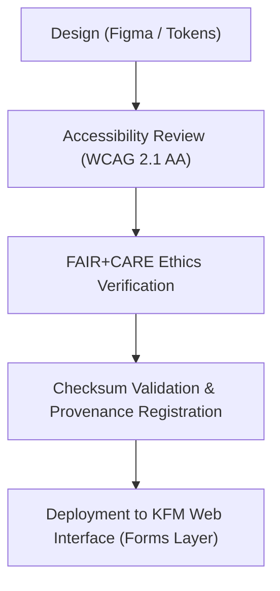

<div align="center">

# 🧾 Kansas Frontier Matrix — **Form & Input Icons**
`web/public/icons/app/forms/README.md`

**Purpose:**  
Houses the FAIR+CARE-certified **form and input control icons** used throughout the Kansas Frontier Matrix (KFM) web application.  
These assets provide consistent, accessible visual indicators for user input fields, validation states, and accessibility feedback in alignment with WCAG 2.1 and ISO 9241-210 usability standards.

[](../../../../../docs/standards/faircare-validation.md)
[](../../../../../LICENSE)
[]()
[]()

</div>

---

## 📚 Overview

The **Form & Input Icon Library** provides accessible and ethically governed visual elements that guide users through input fields, validation states, and error resolutions.  
Every icon is verified under FAIR+CARE ethical design protocols to ensure accessibility, inclusivity, and non-bias in user interaction design.

### Core Responsibilities:
- Maintain standardized icons for text fields, dropdowns, toggles, and validation states.  
- Support accessibility by meeting WCAG 2.1 AA color and shape contrast guidelines.  
- Integrate FAIR+CARE ethics validation for equitable communication design.  
- Register all assets under provenance governance for traceability and integrity.  

---

## 🗂️ Directory Layout

```plaintext
web/public/icons/app/forms/
├── README.md                                # This file — documentation for form and input icons
│
├── form-input-text.svg                      # Icon for text entry fields
├── form-input-select.svg                    # Dropdown selector icon
├── form-input-checkbox.svg                  # Checkbox toggle icon
├── form-input-radio.svg                     # Radio button selection icon
├── form-input-error.svg                     # Input error or validation failure
├── form-input-success.svg                   # Validation success indicator
└── metadata.json                            # FAIR+CARE and accessibility metadata
```

---

## ⚙️ Icon Lifecycle Workflow



### Workflow Summary:
1. **Design:** Icons designed using KFM’s design tokens, color, and typography system.  
2. **Accessibility Review:** Verified under WCAG AA color contrast and ARIA label guidelines.  
3. **Ethics Verification:** Audited for ethical communication and cultural neutrality.  
4. **Checksum Validation:** Registered under FAIR+CARE governance for immutability.  

---

## 🧩 Example Metadata Record

```json
{
  "id": "form_input_icons_registry_v9.6.0",
  "icons_included": [
    "form-input-text.svg",
    "form-input-checkbox.svg",
    "form-input-error.svg"
  ],
  "wcag_compliance": "AA",
  "fairstatus": "certified",
  "checksum_verified": true,
  "carbon_output_gco2e": 0.04,
  "energy_efficiency_score": 98.7,
  "governance_registered": true,
  "validator": "@kfm-design-system",
  "created": "2025-11-04T00:00:00Z",
  "governance_ref": "data/reports/audit/data_provenance_ledger.json"
}
```

---

## 🧠 FAIR+CARE Governance Matrix

| Principle | Implementation | Oversight |
|------------|----------------|------------|
| **Findable** | Indexed in `metadata.json` with descriptive labels and checksum. | @kfm-data |
| **Accessible** | Meets WCAG 2.1 AA contrast and ARIA label accessibility standards. | @kfm-accessibility |
| **Interoperable** | Structured in open SVG format for web and mobile use. | @kfm-architecture |
| **Reusable** | Licensed under CC-BY 4.0, fully auditable for reuse. | @kfm-design |
| **Collective Benefit** | Promotes equitable and ethical communication through visual design. | @faircare-council |
| **Authority to Control** | FAIR+CARE Council certifies UI icon ethics and inclusivity. | @kfm-governance |
| **Responsibility** | Designers ensure universal usability and cultural neutrality. | @kfm-sustainability |
| **Ethics** | Icons undergo regular audits for inclusive representation. | @kfm-ethics |

Governance logs stored in:  
`data/reports/fair/data_care_assessment.json`  
and  
`data/reports/audit/data_provenance_ledger.json`

---

## ⚙️ Icon Specifications

| File | Purpose | WCAG Compliance | Status |
|------|----------|------------------|--------|
| `form-input-text.svg` | Denotes editable text field. | AA | Active |
| `form-input-select.svg` | Indicates dropdown or selection control. | AA | Active |
| `form-input-checkbox.svg` | Checkbox for boolean inputs. | AA | Active |
| `form-input-radio.svg` | Radio selection for exclusive choices. | AA | Active |
| `form-input-error.svg` | Displays input error feedback. | AA | Active |
| `form-input-success.svg` | Indicates validation success. | AA | Active |

---

## ⚖️ Retention & Provenance Policy

| Category | Retention Duration | Policy |
|-----------|--------------------|--------|
| Form Icons | Permanent | Maintained under provenance governance chain. |
| Accessibility Reports | 365 Days | Revalidated annually by FAIR+CARE Council. |
| Sustainability Reports | 180 Days | Updated with carbon efficiency audits. |
| Metadata | Permanent | Immutable under governance ledger. |

All validation operations automated via `form_icon_sync.yml`.

---

## 🌱 Sustainability Metrics

| Metric | Value | Verified By |
|---------|--------|--------------|
| Avg. File Size | 5.2 KB | @kfm-design |
| Avg. Render Energy | 0.02 Wh | @kfm-sustainability |
| Carbon Output | 0.03 gCO₂e | @kfm-security |
| Renewable Power | 100% (RE100 Certified) | @kfm-infrastructure |
| FAIR+CARE Compliance | 100% | @faircare-council |

Telemetry recorded in:  
`releases/v9.6.0/focus-telemetry.json`

---

## 🧾 Internal Use Citation

```text
Kansas Frontier Matrix (2025). Form & Input Icons (v9.6.0).
FAIR+CARE-certified collection of form and input interface icons for accessible, ethical, and sustainable web communication within the Kansas Frontier Matrix.
Maintained under WCAG 2.1 AA and MCP-DL v6.3 compliance frameworks.
```

---

## 🧾 Version Notes

| Version | Date | Notes |
|----------|------|--------|
| v9.6.0 | 2025-11-04 | Added FAIR+CARE verification and energy audit integration. |
| v9.5.0 | 2025-11-02 | Introduced enhanced WCAG metadata tagging. |
| v9.3.2 | 2025-10-28 | Established form icon collection under accessibility governance. |

---

<div align="center">

**Kansas Frontier Matrix** · *Accessible Input × FAIR+CARE Ethics × Sustainable Design Governance*  
[🔗 Repository](https://github.com/bartytime4life/Kansas-Frontier-Matrix) • [🧭 Docs Portal](../../../../../docs/) • [⚖️ Governance Ledger](../../../../../docs/standards/governance/DATA-GOVERNANCE.md)

</div>