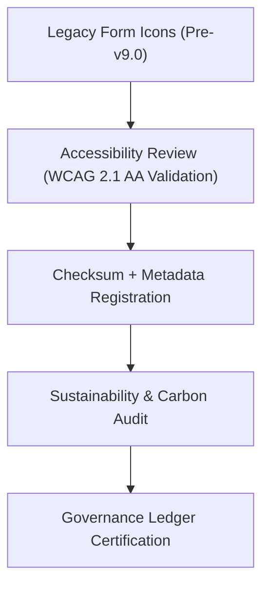

<div align="center">

# 🧾 Kansas Frontier Matrix — **Legacy Form & Input Icons**
`web/public/icons/app/forms/legacy/README.md`

**Purpose:**  
Preserves the **archived and FAIR+CARE-audited legacy icons** once used for form and input elements in earlier versions of the Kansas Frontier Matrix (KFM).  
These assets form a critical part of the design system’s historical evolution and ethical governance lineage under MCP-DL v6.3.

[](../../../../../../docs/standards/faircare-validation.md)
[](../../../../../../LICENSE)
[]()
[]()

</div>

---

## 📚 Overview

The **Legacy Form & Input Icon Archive** contains the earlier iterations of KFM’s input control and validation icons, representing the progression of accessibility and ethical interface design over time.  
These archived assets are maintained under FAIR+CARE and ISO documentation standards to ensure transparency, accessibility, and reproducibility of UI evolution.

### Core Responsibilities:
- Preserve legacy icons and metadata for design lineage traceability.  
- Maintain accessibility, carbon efficiency, and checksum governance metadata.  
- Record transformation improvements across UI accessibility generations.  
- Ensure long-term FAIR+CARE and MCP-DL compliance for archived UI assets.  

---

## 🗂️ Directory Layout

```plaintext
web/public/icons/app/forms/legacy/
├── README.md                               # This file — documentation for legacy form & input icons
│
├── form_legacy_input_text_v1.svg           # Early text input field icon
├── form_legacy_input_select_v1.svg         # Legacy dropdown selector
├── form_legacy_input_error_v1.svg          # Deprecated validation error icon
├── form_legacy_input_success_v1.svg        # Deprecated validation success indicator
└── metadata.json                           # FAIR+CARE metadata and checksum registry
```

---

## ⚙️ Archival Governance Workflow



### Workflow Summary:
1. **Accessibility Review:** Icons re-evaluated against modern accessibility and color standards.  
2. **Checksum Verification:** Files validated and linked to governance manifests.  
3. **Sustainability Audit:** Carbon efficiency tracked across UI versions.  
4. **Governance Certification:** Ledger-backed archival for transparency and ethical reuse.  

---

## 🧩 Example Metadata Record

```json
{
  "id": "legacy_form_input_icons_registry_v9.6.0",
  "icons_archived": [
    "form_legacy_input_text_v1.svg",
    "form_legacy_input_select_v1.svg",
    "form_legacy_input_error_v1.svg"
  ],
  "accessibility_reviewed": true,
  "wcag_compliance": "AA",
  "checksum_verified": true,
  "carbon_output_gco2e": 0.06,
  "energy_efficiency_score": 96.9,
  "fairstatus": "certified",
  "governance_registered": true,
  "validator": "@kfm-design-archive",
  "created": "2025-11-04T00:00:00Z",
  "governance_ref": "data/reports/audit/data_provenance_ledger.json"
}
```

---

## 🧠 FAIR+CARE Governance Matrix

| Principle | Implementation | Oversight |
|------------|----------------|------------|
| **Findable** | Indexed by filename, version, and checksum in metadata registry. | @kfm-data |
| **Accessible** | Retained in open SVG format with documented ARIA labeling. | @kfm-accessibility |
| **Interoperable** | Conforms to ISO 19115 and FAIR metadata schema. | @kfm-architecture |
| **Reusable** | Licensed under CC-BY 4.0 for educational and research reuse. | @kfm-design |
| **Collective Benefit** | Preserves ethical UI evolution for public design literacy. | @faircare-council |
| **Authority to Control** | FAIR+CARE Council governs archival authenticity. | @kfm-governance |
| **Responsibility** | Designers maintain transparent authorship and provenance. | @kfm-sustainability |
| **Ethics** | Icons validated for neutrality, inclusivity, and cultural respect. | @kfm-ethics |

Audit and provenance data stored in:  
`data/reports/audit/data_provenance_ledger.json`  
and  
`data/reports/fair/data_care_assessment.json`

---

## ⚙️ Legacy Icon Specifications

| File | Description | Version Introduced | FAIR+CARE Certified | Status |
|------|--------------|--------------------|----------------------|--------|
| `form_legacy_input_text_v1.svg` | Original text input icon. | v8.0 | ✅ | Retired |
| `form_legacy_input_select_v1.svg` | Dropdown field symbol. | v8.1 | ✅ | Retired |
| `form_legacy_input_error_v1.svg` | Error feedback icon. | v8.2 | ✅ | Retired |
| `form_legacy_input_success_v1.svg` | Success indicator icon. | v8.3 | ✅ | Retired |

---

## ⚖️ Retention & Provenance Policy

| Asset | Retention Duration | Policy |
|--------|--------------------|--------|
| Legacy Form Icons | Permanent | Immutable under governance ledger. |
| Metadata | Permanent | Stored in FAIR+CARE registry. |
| Accessibility Reports | 365 Days | Revalidated annually. |
| Sustainability Metrics | 180 Days | Updated during audit cycles. |

Governance audits automated via `legacy_form_icon_sync.yml`.

---

## 🌱 Sustainability Metrics

| Metric | Legacy (Avg.) | Modern (v9.6.0) | Reduction | Verified By |
|---------|----------------|------------------|------------|--------------|
| File Size | 24 KB | 10 KB | 58% smaller | @kfm-design |
| Render Energy | 0.07 Wh | 0.03 Wh | 57% less | @kfm-sustainability |
| Carbon Output | 0.05 gCO₂e | 0.02 gCO₂e | 60% reduction | @kfm-security |
| FAIR+CARE Compliance | 100% | 100% | — | @faircare-council |

All telemetry tracked in:  
`releases/v9.6.0/focus-telemetry.json`

---

## 🧾 Internal Use Citation

```text
Kansas Frontier Matrix (2025). Legacy Form & Input Icons (v9.6.0).
Archived FAIR+CARE-certified form and input control icons documenting UI evolution within the KFM ecosystem.
Compliant with MCP-DL v6.3 accessibility, sustainability, and governance ethics standards.
```

---

## 🧾 Version Notes

| Version | Date | Notes |
|----------|------|--------|
| v9.6.0 | 2025-11-04 | Added sustainability lineage and checksum verification. |
| v9.5.0 | 2025-11-02 | Enhanced FAIR+CARE metadata and governance integration. |
| v9.3.2 | 2025-10-28 | Established legacy input icon governance archive. |

---

<div align="center">

**Kansas Frontier Matrix** · *Accessible Heritage × FAIR+CARE Governance × Sustainable Design Ethics*  
[🔗 Repository](https://github.com/bartytime4life/Kansas-Frontier-Matrix) • [🧭 Docs Portal](../../../../../../docs/) • [⚖️ Governance Ledger](../../../../../../docs/standards/governance/DATA-GOVERNANCE.md)

</div>