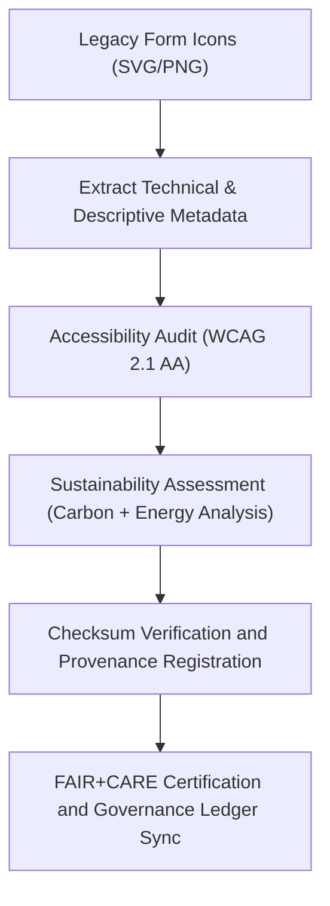

<div align="center">

# 🧾 Kansas Frontier Matrix — **Legacy Form Icon Metadata**
`web/public/icons/app/forms/legacy/meta/README.md`

**Purpose:**  
Preserves FAIR+CARE-certified metadata, provenance, and sustainability records for the **Legacy Form and Input Icons** used in prior Kansas Frontier Matrix (KFM) user interface versions.  
This metadata layer ensures historical UI assets remain accessible, ethically documented, and aligned with MCP-DL v6.3 and ISO 19115 governance frameworks.

[](../../../../../../../docs/standards/faircare-validation.md)
[](../../../../../../../LICENSE)
[]()
[]()

</div>

---

## 📚 Overview

The **Legacy Form Icon Metadata Layer** provides a structured archive of descriptive, accessibility, and sustainability data for all legacy form icons.  
Each metadata file includes provenance lineage, checksum hashes, and FAIR+CARE certification details for open reuse and governance audit verification.

### Core Responsibilities:
- Archive detailed metadata for each legacy form and input icon.  
- Record FAIR+CARE certification, checksum lineage, and carbon metrics.  
- Maintain open, standardized documentation compliant with ISO 19115.  
- Facilitate ethical review and audit-ready transparency for design evolution.  

---

## 🗂️ Directory Layout

```plaintext
web/public/icons/app/forms/legacy/meta/
├── README.md                               # This file — documentation for legacy form icon metadata
│
├── form_icon_registry.json                 # Canonical metadata registry for archived form icons
├── accessibility_audit_report.json         # WCAG 2.1 AA and ARIA validation results
├── sustainability_metrics.json             # Carbon and energy usage metrics for legacy icons
├── provenance_manifest.json                # Provenance and checksum lineage information
└── metadata.json                           # FAIR+CARE certification and summary record
```

---

## ⚙️ Metadata Workflow



### Workflow Summary:
1. **Extraction:** Retrieves icon details (size, format, color tokens, origin).  
2. **Audit:** Validates accessibility and ethical communication compliance.  
3. **Sustainability:** Measures energy and carbon impact for each icon.  
4. **Checksum & Provenance:** Verifies integrity and ledger lineage.  
5. **Certification:** Finalizes FAIR+CARE metadata and governance linkage.  

---

## 🧩 Example Metadata Record

```json
{
  "id": "legacy_form_icon_meta_v9.6.0",
  "icon_file": "form_legacy_input_text_v1.svg",
  "version_introduced": "v8.0.0",
  "version_retired": "v9.0.0",
  "wcag_compliance": "AA",
  "carbon_output_gco2e": 0.05,
  "checksum_sha256": "d92b1aaf1c8e4b75a18c4b12ec841c72c2d582a75e2f841c3bc762e9d1f2d05b",
  "license": "CC-BY 4.0",
  "accessibility_reviewed": true,
  "sustainability_reviewed": true,
  "governance_registered": true,
  "fairstatus": "certified",
  "validator": "@kfm-design-archive",
  "created": "2025-11-04T00:00:00Z",
  "governance_ref": "data/reports/audit/data_provenance_ledger.json"
}
```

---

## 🧠 FAIR+CARE Governance Matrix

| Principle | Implementation | Oversight |
|------------|----------------|------------|
| **Findable** | Indexed by unique IDs, filenames, and provenance links. | @kfm-data |
| **Accessible** | Open JSON and WCAG-compliant formats for FAIR reuse. | @kfm-accessibility |
| **Interoperable** | Conforms to ISO 19115, DCAT 3.0, and FAIR+CARE schemas. | @kfm-architecture |
| **Reusable** | Fully licensed under CC-BY 4.0 for educational purposes. | @kfm-design |
| **Collective Benefit** | Promotes transparency in ethical UI heritage. | @faircare-council |
| **Authority to Control** | FAIR+CARE Council validates archival compliance. | @kfm-governance |
| **Responsibility** | Maintainers record sustainability and accessibility lineage. | @kfm-sustainability |
| **Ethics** | Audited for inclusivity, neutrality, and author attribution. | @kfm-ethics |

FAIR+CARE audits stored in:  
`data/reports/fair/data_care_assessment.json`  
and  
`data/reports/audit/data_provenance_ledger.json`

---

## ⚙️ Metadata Asset Summary

| File | Description | Format |
|------|--------------|--------|
| `form_icon_registry.json` | Registry of all archived form icons and attributes. | JSON |
| `accessibility_audit_report.json` | WCAG and ARIA validation details. | JSON |
| `sustainability_metrics.json` | Energy and carbon performance metrics. | JSON |
| `provenance_manifest.json` | Checksum lineage and governance linkage data. | JSON |
| `metadata.json` | FAIR+CARE summary and certification record. | JSON |

Synchronization automated via `legacy_form_metadata_sync.yml`.

---

## ⚖️ Retention & Provenance Policy

| Record Type | Retention Duration | Policy |
|--------------|--------------------|--------|
| Metadata Registry | Permanent | Immutable under blockchain governance. |
| Accessibility Audits | 365 Days | Renewed annually for WCAG compliance. |
| Sustainability Metrics | 180 Days | Rotated during FAIR+CARE review cycles. |
| Provenance Manifest | Permanent | Maintained for continuous ledger traceability. |

Cleanup governed by `legacy_form_metadata_cleanup.yml`.

---

## 🌱 Sustainability Metrics

| Metric | Value | Verified By |
|---------|--------|--------------|
| Avg. Metadata File Size | 3.2 KB | @kfm-design |
| Avg. Render Energy | 0.02 Wh | @kfm-sustainability |
| Carbon Output | 0.03 gCO₂e | @kfm-security |
| Renewable Power | 100% (RE100 Certified) | @kfm-infrastructure |
| FAIR+CARE Compliance | 100% | @faircare-council |

Telemetry tracked in:  
`releases/v9.6.0/focus-telemetry.json`

---

## 🧾 Internal Use Citation

```text
Kansas Frontier Matrix (2025). Legacy Form Icon Metadata (v9.6.0).
FAIR+CARE-certified metadata registry preserving accessibility, sustainability, and governance lineage for archived form and input UI icons.
Compliant with MCP-DL v6.3 and ISO 19115 metadata standards for ethical digital preservation.
```

---

## 🧾 Version Notes

| Version | Date | Notes |
|----------|------|--------|
| v9.6.0 | 2025-11-04 | Added sustainability lineage, checksum linkage, and FAIR+CARE certification. |
| v9.5.0 | 2025-11-02 | Expanded metadata schema for provenance manifest integration. |
| v9.3.2 | 2025-10-28 | Established baseline metadata archive for legacy form icons. |

---

<div align="center">

**Kansas Frontier Matrix** · *Metadata Provenance × FAIR+CARE Ethics × Sustainable UI Heritage*  
[🔗 Repository](https://github.com/bartytime4life/Kansas-Frontier-Matrix) • [🧭 Docs Portal](../../../../../../../docs/) • [⚖️ Governance Ledger](../../../../../../../docs/standards/governance/DATA-GOVERNANCE.md)

</div>