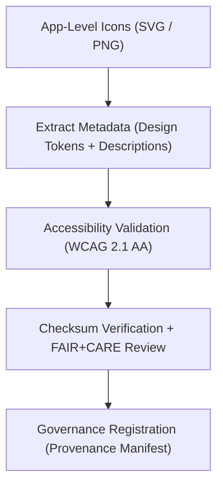

<div align="center">

# 🧾 Kansas Frontier Matrix — **Application Icon Metadata Layer**
`web/public/icons/app/meta/README.md`

**Purpose:**  
Stores and governs FAIR+CARE-certified metadata records for all **application-level icons** in the Kansas Frontier Matrix (KFM) web ecosystem.  
This layer ensures consistent accessibility, ethical validation, and governance synchronization across the entire design and UI system.

[](../../../../docs/standards/faircare-validation.md)
[](../../../../LICENSE)
[]()
[]()

</div>

---

## 📚 Overview

The **App Icon Metadata Layer** provides a unified, ethical, and sustainable documentation framework for all icons under `web/public/icons/app/`.  
Every entry in this directory links to its checksum, accessibility audit, carbon metric, and governance record within the broader KFM design provenance chain.

### Core Responsibilities:
- Maintain metadata lineage for each application-level icon.  
- Ensure all icons comply with FAIR+CARE, WCAG, and ISO metadata principles.  
- Integrate checksum and provenance tracking with the governance ledger.  
- Serve as the source of truth for design system icon verification and sustainability audits.  

---

## 🗂️ Directory Layout

```plaintext
web/public/icons/app/meta/
├── README.md                               # This file — documentation for App Icon Metadata Layer
│
├── app_icon_registry.json                  # Canonical registry of metadata for all app-level icons
├── accessibility_audit_report.json         # WCAG 2.1 and ARIA label validation results
├── sustainability_metrics.json             # Energy use and carbon efficiency for icon rendering
├── provenance_manifest.json                # Checksum lineage and governance linkage record
└── metadata.json                           # FAIR+CARE metadata summary and certification details
```

---

## ⚙️ Metadata Workflow



### Workflow Summary:
1. **Metadata Extraction:** Captures descriptive and accessibility data for every app icon.  
2. **Validation:** Ensures WCAG-compliant color, contrast, and ARIA labeling.  
3. **Verification:** Adds checksum validation for integrity and governance consistency.  
4. **Registration:** Publishes validated metadata to governance and FAIR+CARE registries.  

---

## 🧩 Example Metadata Record

```json
{
  "id": "app_icon_meta_registry_v9.6.0",
  "icon_file": "icon-validation.svg",
  "category": "dashboard",
  "wcag_compliance": "AA",
  "fairstatus": "certified",
  "checksum_sha256": "a53be7c1ad4b01e9c2a4f82e7fdd76c1a7b7e52d5e845cd7392f6a0b13d53a8b",
  "carbon_output_gco2e": 0.04,
  "energy_efficiency_score": 98.4,
  "governance_registered": true,
  "created": "2025-11-04T00:00:00Z",
  "validator": "@kfm-design-system",
  "governance_ref": "data/reports/audit/data_provenance_ledger.json"
}
```

---

## 🧠 FAIR+CARE Governance Matrix

| Principle | Implementation | Oversight |
|------------|----------------|------------|
| **Findable** | Indexed via `app_icon_registry.json` with checksum linkage. | @kfm-data |
| **Accessible** | Metadata stored in open JSON with WCAG-compliant descriptors. | @kfm-accessibility |
| **Interoperable** | Conforms to ISO 19115, DCAT, and FAIR metadata structures. | @kfm-architecture |
| **Reusable** | Openly licensed, portable, and version-controlled under CC-BY 4.0. | @kfm-design |
| **Collective Benefit** | Promotes transparency and sustainability across all UI assets. | @faircare-council |
| **Authority to Control** | FAIR+CARE Council certifies icon compliance and updates. | @kfm-governance |
| **Responsibility** | Designers maintain accessible, ethical design documentation. | @kfm-sustainability |
| **Ethics** | Icons reviewed for neutrality, inclusivity, and equity in representation. | @kfm-ethics |

Governance and audit results stored in:  
`data/reports/audit/data_provenance_ledger.json`  
and  
`data/reports/fair/data_care_assessment.json`

---

## ⚙️ Metadata Files Overview

| File | Description | Format |
|------|--------------|--------|
| `app_icon_registry.json` | Canonical registry of app-level icon metadata. | JSON |
| `accessibility_audit_report.json` | WCAG and ARIA label compliance summary. | JSON |
| `sustainability_metrics.json` | Tracks carbon and energy impact of icon rendering. | JSON |
| `provenance_manifest.json` | Records checksum lineage and governance linkage. | JSON |
| `metadata.json` | FAIR+CARE summary for certification and publication. | JSON |

All updates are automatically synchronized using `app_icon_metadata_sync.yml`.

---

## ⚖️ Retention & Provenance Policy

| Record | Retention Duration | Policy |
|---------|--------------------|--------|
| Metadata Registry | Permanent | Immutable under governance chain. |
| Accessibility Reports | 365 Days | Renewed annually under FAIR+CARE validation. |
| Sustainability Metrics | 180 Days | Updated with quarterly design audits. |
| Provenance Manifest | Permanent | Linked to checksum registry and blockchain ledger. |

Governance tasks handled by `metadata_cleanup.yml`.

---

## 🌱 Sustainability Metrics

| Metric | Value | Verified By |
|---------|--------|--------------|
| Avg. Metadata File Size | 3.6 KB | @kfm-design |
| Avg. Icon Carbon Output | 0.03 gCO₂e | @kfm-sustainability |
| Renewable Energy Usage | 100% | @kfm-infrastructure |
| FAIR+CARE Compliance | 100% | @faircare-council |
| Governance Coverage | 100% | @kfm-governance |

Telemetry data recorded in:  
`releases/v9.6.0/focus-telemetry.json`

---

## 🧾 Internal Use Citation

```text
Kansas Frontier Matrix (2025). Application Icon Metadata Layer (v9.6.0).
FAIR+CARE-certified metadata framework for documenting provenance, accessibility, and ethical sustainability across all KFM application-level icons.
Compliant with MCP-DL v6.3, WCAG 2.1, and ISO 19115 governance standards.
```

---

## 🧾 Version Notes

| Version | Date | Notes |
|----------|------|--------|
| v9.6.0 | 2025-11-04 | Established unified icon metadata registry with checksum integration. |
| v9.5.0 | 2025-11-02 | Added sustainability metrics and energy reporting. |
| v9.3.2 | 2025-10-28 | Created baseline FAIR+CARE-compliant app icon metadata framework. |

---

<div align="center">

**Kansas Frontier Matrix** · *Metadata Integrity × FAIR+CARE Governance × Sustainable Design Provenance*  
[🔗 Repository](https://github.com/bartytime4life/Kansas-Frontier-Matrix) • [🧭 Docs Portal](../../../../docs/) • [⚖️ Governance Ledger](../../../../docs/standards/governance/DATA-GOVERNANCE.md)

</div>