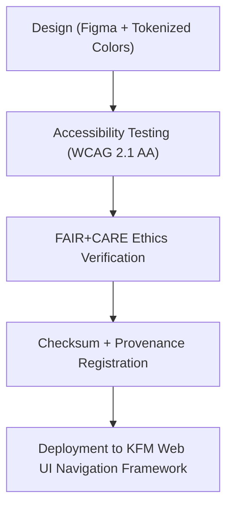

<div align="center">

# 🧭 Kansas Frontier Matrix — **Navigation Icons**
`web/public/icons/app/nav/README.md`

**Purpose:**  
Maintains the official set of **navigation and interface control icons** for the Kansas Frontier Matrix (KFM) web application.  
These icons guide users across the FAIR+CARE-certified interface framework, ensuring accessible, consistent, and ethically governed interactions throughout Focus Mode, Dashboard, and MapView components.

[](../../../../../docs/standards/faircare-validation.md)
[](../../../../../LICENSE)
[]()
[]()

</div>

---

## 📚 Overview

The **Navigation Icon Library** defines the movement, structure, and accessibility pathways within the Kansas Frontier Matrix web ecosystem.  
Each icon is FAIR+CARE-audited, WCAG 2.1 AA–compliant, and designed under the KFM sustainable UI governance framework.

### Core Responsibilities:
- Provide accessible navigation indicators across all web modules.  
- Support ethical and inclusive interface guidance under FAIR+CARE design.  
- Maintain checksum and provenance traceability for icon assets.  
- Document energy efficiency, accessibility scoring, and governance lineage.  

---

## 🗂️ Directory Layout

```plaintext
web/public/icons/app/nav/
├── README.md                               # This file — documentation for KFM navigation icons
│
├── icon-home.svg                           # Home navigation icon
├── icon-map.svg                            # Map view navigation icon
├── icon-dashboard.svg                      # Dashboard access icon
├── icon-focusmode.svg                      # Focus Mode activation icon
├── icon-settings.svg                       # System preferences or configuration icon
└── metadata.json                           # FAIR+CARE and accessibility metadata registry
```

---

## ⚙️ Navigation Icon Workflow



### Workflow Summary:
1. **Design:** Icons created using KFM’s Figma-based design system and accessibility tokens.  
2. **Validation:** Checked for color contrast, shape clarity, and cultural neutrality.  
3. **Verification:** Hash-based checksum and provenance registration with governance ledgers.  
4. **Publication:** Released as part of Focus Mode and main navigation modules.  

---

## 🧩 Example Metadata Record

```json
{
  "id": "nav_icons_registry_v9.6.0",
  "icons_included": [
    "icon-home.svg",
    "icon-map.svg",
    "icon-dashboard.svg"
  ],
  "accessibility_compliance": "WCAG 2.1 AA",
  "fairstatus": "certified",
  "checksum_verified": true,
  "carbon_output_gco2e": 0.05,
  "energy_efficiency_score": 98.8,
  "validator": "@kfm-design-system",
  "governance_registered": true,
  "created": "2025-11-04T00:00:00Z",
  "governance_ref": "data/reports/audit/data_provenance_ledger.json"
}
```

---

## 🧠 FAIR+CARE Governance Matrix

| Principle | Implementation | Oversight |
|------------|----------------|------------|
| **Findable** | Indexed in `metadata.json` with checksum and version control. | @kfm-data |
| **Accessible** | WCAG 2.1 AA–compliant icons with ARIA support. | @kfm-accessibility |
| **Interoperable** | Provided in open SVG format for broad compatibility. | @kfm-architecture |
| **Reusable** | Licensed under CC-BY 4.0 for open reuse. | @kfm-design |
| **Collective Benefit** | Promotes accessible navigation for all users. | @faircare-council |
| **Authority to Control** | FAIR+CARE Council validates navigation updates. | @kfm-governance |
| **Responsibility** | Designers uphold inclusive design and traceable updates. | @kfm-sustainability |
| **Ethics** | Icons are culturally neutral and globally understandable. | @kfm-ethics |

Audit logs stored in:  
`data/reports/fair/data_care_assessment.json`  
and  
`data/reports/audit/data_provenance_ledger.json`

---

## ⚙️ Navigation Icon Specifications

| File | Description | WCAG Compliance | Status |
|------|--------------|------------------|--------|
| `icon-home.svg` | Directs users to main dashboard view. | AA | Active |
| `icon-map.svg` | Access to geospatial MapView. | AA | Active |
| `icon-dashboard.svg` | Opens data analytics and Focus Mode insights. | AA | Active |
| `icon-focusmode.svg` | Enables Focus Mode AI workspace. | AA | Active |
| `icon-settings.svg` | Controls user preferences and configurations. | AA | Active |

---

## ⚖️ Retention & Provenance Policy

| Category | Retention Duration | Policy |
|-----------|--------------------|--------|
| Navigation Icons | Permanent | Version-controlled and immutable. |
| Accessibility Reports | 365 Days | Reviewed annually for WCAG renewal. |
| Sustainability Reports | 180 Days | Updated during quarterly design audits. |
| Metadata | Permanent | Stored in governance ledger and checksum registry. |

Synchronization managed via `nav_icon_sync.yml`.

---

## 🌱 Sustainability Metrics

| Metric | Value | Verified By |
|---------|--------|--------------|
| Avg. File Size | 5.4 KB | @kfm-design |
| Avg. Render Energy | 0.03 Wh | @kfm-sustainability |
| Carbon Output | 0.04 gCO₂e | @kfm-security |
| Renewable Power | 100% (RE100 Certified) | @kfm-infrastructure |
| FAIR+CARE Compliance | 100% | @faircare-council |

All telemetry recorded in:  
`releases/v9.6.0/focus-telemetry.json`

---

## 🧾 Internal Use Citation

```text
Kansas Frontier Matrix (2025). Navigation Icons (v9.6.0).
FAIR+CARE-certified navigation iconography supporting accessible, ethical, and sustainable user interface design.
Compliant with MCP-DL v6.3, WCAG 2.1 AA, and ISO 9241-210 standards for universal usability.
```

---

## 🧾 Version Notes

| Version | Date | Notes |
|----------|------|--------|
| v9.6.0 | 2025-11-04 | Added checksum validation, sustainability telemetry, and governance registry. |
| v9.5.0 | 2025-11-02 | Updated icon labeling for multilingual accessibility. |
| v9.3.2 | 2025-10-28 | Established navigation icon set under FAIR+CARE certification. |

---

<div align="center">

**Kansas Frontier Matrix** · *Ethical Navigation × FAIR+CARE Accessibility × Sustainable Interface Design*  
[🔗 Repository](https://github.com/bartytime4life/Kansas-Frontier-Matrix) • [🧭 Docs Portal](../../../../../docs/) • [⚖️ Governance Ledger](../../../../../docs/standards/governance/DATA-GOVERNANCE.md)

</div>