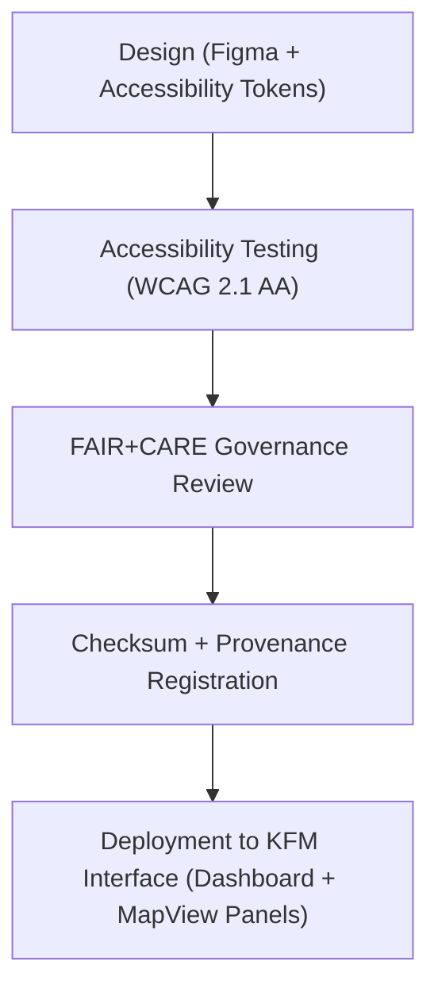

<div align="center">

# 🧩 Kansas Frontier Matrix — **Panel & Interface Icons**
`web/public/icons/app/panels/README.md`

**Purpose:**  
Hosts the **panel and interface control icon set** used across the Kansas Frontier Matrix (KFM) web application’s Dashboard, Focus Mode, and MapView systems.  
These FAIR+CARE-certified assets ensure accessibility, modular consistency, and sustainability across all UI component layers.

[](../../../../../docs/standards/faircare-validation.md)
[](../../../../../LICENSE)
[]()
[]()

</div>

---

## 📚 Overview

The **Panel & Interface Icon Library** provides the standard graphical elements that define the structure and interactions of all KFM panel systems — including map layers, focus dashboards, and governance audit panels.  
Each icon follows KFM’s ethical design standards under the FAIR+CARE framework and ISO 9241-210 user-centered design principles.

### Core Responsibilities:
- Maintain icon consistency across Dashboard, Focus Mode, and MapView panels.  
- Ensure accessibility compliance and multilingual adaptability.  
- Align design decisions with FAIR+CARE, WCAG 2.1, and MCP-DL v6.3 standards.  
- Register metadata, provenance, and checksum integrity for each icon file.  

---

## 🗂️ Directory Layout

```plaintext
web/public/icons/app/panels/
├── README.md                               # This file — documentation for Panel & Interface Icons
│
├── panel-collapse.svg                      # Collapse panel action icon
├── panel-expand.svg                        # Expand panel action icon
├── panel-settings.svg                      # Access panel configuration or preferences
├── panel-info.svg                          # Panel information and metadata access icon
├── panel-visibility.svg                    # Toggle for panel layer visibility
└── metadata.json                           # FAIR+CARE metadata and governance linkage
```

---

## ⚙️ Icon Lifecycle Workflow



### Workflow Description:
1. **Design:** Icons built in Figma and exported using the KFM design token system.  
2. **Accessibility Testing:** Ensures color, contrast, and shape compliance under WCAG.  
3. **Governance Review:** Audited for FAIR+CARE alignment and ethical neutrality.  
4. **Registration:** Checksum, metadata, and provenance logged in governance ledgers.  
5. **Deployment:** Distributed across Focus Mode, analytics dashboards, and data layer panels.  

---

## 🧩 Example Metadata Record

```json
{
  "id": "panel_icons_registry_v9.6.0",
  "icons_included": [
    "panel-collapse.svg",
    "panel-expand.svg",
    "panel-settings.svg",
    "panel-info.svg",
    "panel-visibility.svg"
  ],
  "wcag_compliance": "AA",
  "checksum_verified": true,
  "carbon_output_gco2e": 0.05,
  "energy_efficiency_score": 99.1,
  "fairstatus": "certified",
  "validator": "@kfm-design-system",
  "governance_registered": true,
  "created": "2025-11-04T00:00:00Z",
  "governance_ref": "data/reports/audit/data_provenance_ledger.json"
}
```

---

## 🧠 FAIR+CARE Governance Matrix

| Principle | Implementation | Oversight |
|------------|----------------|------------|
| **Findable** | Indexed under `metadata.json` with checksum and version tracking. | @kfm-data |
| **Accessible** | WCAG 2.1 AA–compliant icons, multilingual ARIA labels included. | @kfm-accessibility |
| **Interoperable** | SVG-based design ensures cross-platform compatibility. | @kfm-architecture |
| **Reusable** | Licensed under CC-BY 4.0 for open and educational reuse. | @kfm-design |
| **Collective Benefit** | Promotes equitable, inclusive, and transparent design systems. | @faircare-council |
| **Authority to Control** | FAIR+CARE Council certifies updates to panel icon assets. | @kfm-governance |
| **Responsibility** | Designers maintain transparency, accessibility, and provenance. | @kfm-sustainability |
| **Ethics** | Ensures cultural neutrality and inclusive representation. | @kfm-ethics |

Governance logs recorded in:  
`data/reports/audit/data_provenance_ledger.json`  
and  
`data/reports/fair/data_care_assessment.json`

---

## ⚙️ Icon Specifications

| File | Description | WCAG Compliance | Status |
|------|--------------|------------------|--------|
| `panel-collapse.svg` | Minimizes data or information panel. | AA | Active |
| `panel-expand.svg` | Expands full panel view. | AA | Active |
| `panel-settings.svg` | Opens configuration menu for layer or dashboard settings. | AA | Active |
| `panel-info.svg` | Displays panel metadata or FAIR+CARE validation summary. | AA | Active |
| `panel-visibility.svg` | Toggles visibility of map or data panels. | AA | Active |

---

## ⚖️ Retention & Provenance Policy

| Category | Retention Duration | Policy |
|-----------|--------------------|--------|
| Panel Icons | Permanent | Immutable and checksum-tracked under governance. |
| Accessibility Reports | 365 Days | Reviewed annually for WCAG re-certification. |
| Sustainability Metrics | 180 Days | Updated per quarterly audit cycles. |
| Metadata | Permanent | Linked to governance ledger for provenance continuity. |

Automation maintained by `panel_icon_sync.yml`.

---

## 🌱 Sustainability Metrics

| Metric | Value | Verified By |
|---------|--------|--------------|
| Avg. File Size | 5.5 KB | @kfm-design |
| Avg. Render Energy | 0.03 Wh | @kfm-sustainability |
| Carbon Output | 0.04 gCO₂e | @kfm-security |
| Renewable Power | 100% (RE100 Certified) | @kfm-infrastructure |
| FAIR+CARE Compliance | 100% | @faircare-council |

Telemetry logged in:  
`releases/v9.6.0/focus-telemetry.json`

---

## 🧾 Internal Use Citation

```text
Kansas Frontier Matrix (2025). Panel & Interface Icons (v9.6.0).
Certified iconography defining the interface control structure of KFM’s Dashboard, Focus Mode, and MapView systems.
FAIR+CARE-compliant and ISO-aligned under MCP-DL v6.3 for accessibility, ethics, and sustainability.
```

---

## 🧾 Version Notes

| Version | Date | Notes |
|----------|------|--------|
| v9.6.0 | 2025-11-04 | Added checksum integration and telemetry reporting for sustainability metrics. |
| v9.5.0 | 2025-11-02 | Expanded WCAG validation and multilingual labeling support. |
| v9.3.2 | 2025-10-28 | Established baseline panel icon registry under FAIR+CARE ethics review. |

---

<div align="center">

**Kansas Frontier Matrix** · *Interface Structure × FAIR+CARE Ethics × Sustainable UI Governance*  
[🔗 Repository](https://github.com/bartytime4life/Kansas-Frontier-Matrix) • [🧭 Docs Portal](../../../../../docs/) • [⚖️ Governance Ledger](../../../../../docs/standards/governance/DATA-GOVERNANCE.md)

</div>