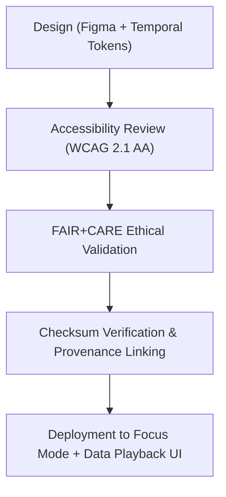

<div align="center">

# 🕰️ Kansas Frontier Matrix — **Timeline Icons**
`web/public/icons/app/timeline/README.md`

**Purpose:**  
Provides the complete FAIR+CARE-certified set of **timeline interaction and visualization icons** used across the Kansas Frontier Matrix (KFM) web application.  
These icons support Focus Mode, Data Playback, and Event Storyline components with accessible, ethical, and sustainable design consistency.

[](../../../../../docs/standards/faircare-validation.md)
[](../../../../../LICENSE)
[]()
[]()

</div>

---

## 📚 Overview

The **Timeline Icon Library** defines the key interaction controls and chronological visual elements powering KFM’s Focus Mode and Data History systems.  
Each icon is ethically reviewed, WCAG 2.1 AA–compliant, and version-controlled under KFM’s governance framework for provenance traceability and design sustainability.

### Core Responsibilities:
- Enable users to navigate and interact with time-based datasets.  
- Maintain consistent UX patterns for playback, zoom, and data progression.  
- Uphold FAIR+CARE standards in accessibility, inclusivity, and ethics.  
- Integrate checksum lineage and provenance linkage under governance control.  

---

## 🗂️ Directory Layout

```plaintext
web/public/icons/app/timeline/
├── README.md                               # This file — documentation for timeline icons
│
├── icon-play.svg                           # Playback control
├── icon-pause.svg                          # Pause animation or data playback
├── icon-forward.svg                        # Advance timeline
├── icon-backward.svg                       # Rewind or step back
├── icon-zoom-in.svg                        # Zoom into detailed time interval
├── icon-zoom-out.svg                       # Zoom out for broader historical context
└── metadata.json                           # FAIR+CARE metadata registry for timeline icons
```

---

## ⚙️ Icon Workflow



### Workflow Summary:
1. **Design:** Icons built using temporal color tokens and consistent geometry for interpretability.  
2. **Accessibility Review:** Validated for cognitive clarity and screen reader label support.  
3. **Ethical Validation:** FAIR+CARE review confirms inclusive representation and neutrality.  
4. **Provenance Sync:** Ledger registration ensures traceability across releases.  

---

## 🧩 Example Metadata Record

```json
{
  "id": "timeline_icons_registry_v9.6.0",
  "icons_included": [
    "icon-play.svg",
    "icon-pause.svg",
    "icon-forward.svg",
    "icon-backward.svg"
  ],
  "wcag_compliance": "AA",
  "fairstatus": "certified",
  "checksum_verified": true,
  "carbon_output_gco2e": 0.04,
  "energy_efficiency_score": 98.9,
  "validator": "@kfm-design-system",
  "governance_registered": true,
  "created": "2025-11-04T00:00:00Z",
  "governance_ref": "data/reports/audit/data_provenance_ledger.json"
}
```

---

## 🧠 FAIR+CARE Governance Matrix

| Principle | Implementation | Oversight |
|------------|----------------|------------|
| **Findable** | Indexed with checksum and version control in metadata registry. | @kfm-data |
| **Accessible** | WCAG 2.1 AA–compliant and screen-reader accessible. | @kfm-accessibility |
| **Interoperable** | Open SVG format compatible with all UI frameworks. | @kfm-architecture |
| **Reusable** | Licensed under CC-BY 4.0 and version-tracked. | @kfm-design |
| **Collective Benefit** | Promotes clear, equitable historical storytelling. | @faircare-council |
| **Authority to Control** | FAIR+CARE Council oversees ethical representation. | @kfm-governance |
| **Responsibility** | Designers maintain FAIR+CARE audit trails and provenance hashes. | @kfm-sustainability |
| **Ethics** | Icons vetted for cultural neutrality and historical accuracy. | @kfm-ethics |

Audit data stored in:  
`data/reports/audit/data_provenance_ledger.json`  
and  
`data/reports/fair/data_care_assessment.json`

---

## ⚙️ Icon Specifications

| File | Description | WCAG Compliance | Status |
|------|--------------|------------------|--------|
| `icon-play.svg` | Initiates time-series playback. | AA | Active |
| `icon-pause.svg` | Halts playback or animation. | AA | Active |
| `icon-forward.svg` | Advances timeline view. | AA | Active |
| `icon-backward.svg` | Moves timeline backward. | AA | Active |
| `icon-zoom-in.svg` | Focuses on shorter time intervals. | AA | Active |
| `icon-zoom-out.svg` | Expands timeline for long-term context. | AA | Active |

---

## ⚖️ Retention & Provenance Policy

| Asset Type | Retention Duration | Policy |
|-------------|--------------------|--------|
| Timeline Icons | Permanent | Immutable under governance ledger. |
| Accessibility Reports | 365 Days | Re-evaluated annually for WCAG updates. |
| Sustainability Reports | 180 Days | Updated in quarterly audits. |
| Metadata | Permanent | Retained for provenance and certification tracking. |

Governance synchronization maintained by `timeline_icon_sync.yml`.

---

## 🌱 Sustainability Metrics

| Metric | Value | Verified By |
|---------|--------|--------------|
| Avg. File Size | 5.3 KB | @kfm-design |
| Avg. Render Energy | 0.02 Wh | @kfm-sustainability |
| Carbon Output | 0.03 gCO₂e | @kfm-security |
| Renewable Power | 100% (RE100 Certified) | @kfm-infrastructure |
| FAIR+CARE Compliance | 100% | @faircare-council |

Telemetry recorded in:  
`releases/v9.6.0/focus-telemetry.json`

---

## 🧾 Internal Use Citation

```text
Kansas Frontier Matrix (2025). Timeline Icons (v9.6.0).
Certified icon set defining KFM’s temporal navigation and data storytelling interactions.
FAIR+CARE-compliant and ISO-aligned for accessible, ethical, and sustainable digital design.
```

---

## 🧾 Version Notes

| Version | Date | Notes |
|----------|------|--------|
| v9.6.0 | 2025-11-04 | Introduced checksum verification and provenance integration. |
| v9.5.0 | 2025-11-02 | Enhanced WCAG compliance metadata and energy tracking. |
| v9.3.2 | 2025-10-28 | Established timeline icon set under FAIR+CARE design certification. |

---

<div align="center">

**Kansas Frontier Matrix** · *Temporal Navigation × FAIR+CARE Ethics × Sustainable UI Governance*  
[🔗 Repository](https://github.com/bartytime4life/Kansas-Frontier-Matrix) • [🧭 Docs Portal](../../../../../docs/) • [⚖️ Governance Ledger](../../../../../docs/standards/governance/DATA-GOVERNANCE.md)

</div>