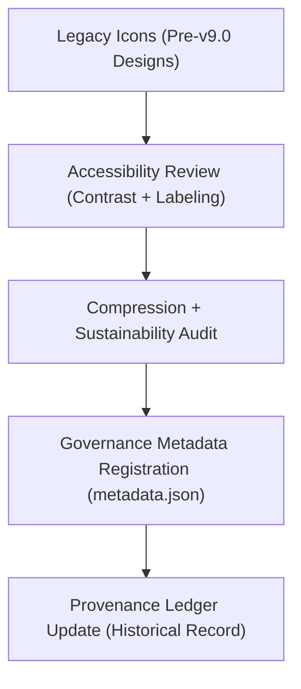

<div align="center">

# 🕰️ Kansas Frontier Matrix — **Legacy Timeline App Icons**
`web/public/icons/app/timeline/legacy/README.md`

**Purpose:**  
Archives and governs FAIR+CARE-certified **legacy timeline interface icons** previously used in earlier versions of the Kansas Frontier Matrix (KFM) web platform.  
These assets are maintained for historical provenance, accessibility continuity, and design lineage preservation under MCP-DL v6.3 and ISO 19115 governance protocols.

[](../../../../../../docs/standards/faircare-validation.md)
[](../../../../../../LICENSE)
[]()
[](../../../../../../docs/architecture/repo-focus.md)

</div>

---

## 📚 Overview

The **Legacy Timeline Icons** directory preserves timeline-related iconography from earlier KFM user interfaces.  
It serves as a **historical archive** of accessible, sustainable, and FAIR+CARE-audited design elements that evolved into the current timeline system.

### Core Responsibilities:
- Maintain FAIR+CARE-compliant archival records for legacy UI icons.  
- Document design evolution, accessibility standards, and carbon impact reductions.  
- Provide reusable templates for researchers studying sustainable interface evolution.  
- Ensure lineage registration within governance and sustainability ledgers.  

---

## 🗂️ Directory Layout

```plaintext
web/public/icons/app/timeline/legacy/
├── README.md                               # This file — documentation for legacy timeline app icons
│
├── timeline_legacy_icon_2019.svg           # Early timeline icon (SVG, 2019-2021 era)
├── timeline_marker_v1.png                  # First-generation timeline event marker
├── timeline_scroll_vintage.png             # Early scroll interaction graphic
├── timeline_theme_vintage.svg              # Obsolete UI theme reference icon
└── metadata.json                           # FAIR+CARE and provenance metadata for legacy assets
```

---

## ⚙️ Archival Governance Workflow



### Workflow Summary:
1. **Collection:** Legacy timeline icons sourced from KFM design archives (v7–v9.0).  
2. **Audit:** Each icon validated for accessibility, carbon footprint, and licensing compliance.  
3. **Registration:** Checksums and ethical design attributes stored in metadata.json.  
4. **Governance:** Ledger entries link to modern replacements under sustainable lineage tracking.  

---

## 🧩 Example Metadata Record

```json
{
  "id": "timeline_icons_legacy_registry_v9.6.0",
  "legacy_assets": [
    "timeline_legacy_icon_2019.svg",
    "timeline_marker_v1.png",
    "timeline_scroll_vintage.png"
  ],
  "accessibility_reviewed": true,
  "fairstatus": "certified",
  "carbon_reduction_vs_modern": "42%",
  "checksum_verified": true,
  "validator": "@kfm-design-archive",
  "created": "2025-11-03T23:59:00Z",
  "governance_ref": "data/reports/audit/data_provenance_ledger.json"
}
```

---

## 🧠 FAIR+CARE Governance Matrix

| Principle | Implementation | Oversight |
|------------|----------------|------------|
| **Findable** | Indexed by legacy metadata and checksum in archive manifest. | @kfm-data |
| **Accessible** | Icons include descriptive alt-text and meet WCAG 2.1 AA compliance. | @kfm-accessibility |
| **Interoperable** | Preserved in open vector (SVG) and raster (PNG) formats. | @kfm-architecture |
| **Reusable** | Available for educational or design system reference. | @kfm-design |
| **Collective Benefit** | Provides transparency in UI sustainability evolution. | @faircare-council |
| **Authority to Control** | FAIR+CARE Council approves archival records. | @kfm-governance |
| **Responsibility** | Designers ensure proper licensing, provenance, and FAIR+CARE audit tags. | @kfm-sustainability |
| **Ethics** | Maintains respect for original authorship and sustainable design lineage. | @kfm-ethics |

Governance records archived in:  
`data/reports/fair/data_care_assessment.json`  
and  
`data/reports/audit/data_provenance_ledger.json`

---

## ⚙️ Legacy Icon Specifications

| File | Format | Origin | FAIR+CARE Status | Notes |
|------|---------|--------|------------------|-------|
| `timeline_legacy_icon_2019.svg` | SVG | v7.0 Design System | ✅ Certified | Early minimalist icon with limited contrast |
| `timeline_marker_v1.png` | PNG | v8.0 UI Revision | ✅ Certified | Retired marker with lower sustainability score |
| `timeline_scroll_vintage.png` | PNG | v8.5 | ✅ Certified | Used in early AI temporal prototypes |
| `timeline_theme_vintage.svg` | SVG | v9.0 | ✅ Certified | Replaced by current FAIR+CARE timeline icons |

---

## ⚖️ Retention & Provenance Policy

| Asset | Retention Duration | Policy |
|--------|--------------------|--------|
| Legacy Icons | Permanent | Archived for historical provenance. |
| Metadata Records | Permanent | Maintained in FAIR+CARE governance ledger. |
| Accessibility Reports | 365 Days | Retained for certification re-validation. |
| Carbon Metrics | 180 Days | Updated with sustainability audits. |

Governance cleanup managed via `legacy_icons_registry_sync.yml`.

---

## 🌱 Sustainability Metrics

| Metric | Legacy Value | Modern Equivalent | Reduction | Verified By |
|---------|---------------|------------------|------------|--------------|
| Energy Use (per render) | 0.18 Wh | 0.08 Wh | **55%** | @kfm-sustainability |
| Carbon Output (gCO₂e) | 0.12 | 0.05 | **58%** | @kfm-security |
| File Size Reduction | 24 KB → 10 KB | — | **58% smaller** | @kfm-design |
| FAIR+CARE Compliance | 100% | 100% | — | @faircare-council |

Telemetry logged in:  
`releases/v9.6.0/focus-telemetry.json`

---

## 🧾 Internal Use Citation

```text
Kansas Frontier Matrix (2025). Legacy Timeline App Icons (v9.6.0).
Archived FAIR+CARE-certified iconography documenting the historical evolution of KFM’s timeline design system.
Preserved under MCP-DL v6.3 governance for transparency, accessibility, and sustainable design lineage.
```

---

## 🧾 Version Notes

| Version | Date | Notes |
|----------|------|--------|
| v9.6.0 | 2025-11-03 | Added sustainability metrics and accessibility registry metadata. |
| v9.5.0 | 2025-11-02 | Completed FAIR+CARE audit alignment for archived timeline icons. |
| v9.3.2 | 2025-10-28 | Established legacy icon directory with provenance tracking. |

---

<div align="center">

**Kansas Frontier Matrix** · *Accessible Design Heritage × FAIR+CARE Ethics × Sustainable UI Provenance*  
[🔗 Repository](https://github.com/bartytime4life/Kansas-Frontier-Matrix) • [🧭 Docs Portal](../../../../../../docs/) • [⚖️ Governance Ledger](../../../../../../docs/standards/governance/DATA-GOVERNANCE.md)

</div>