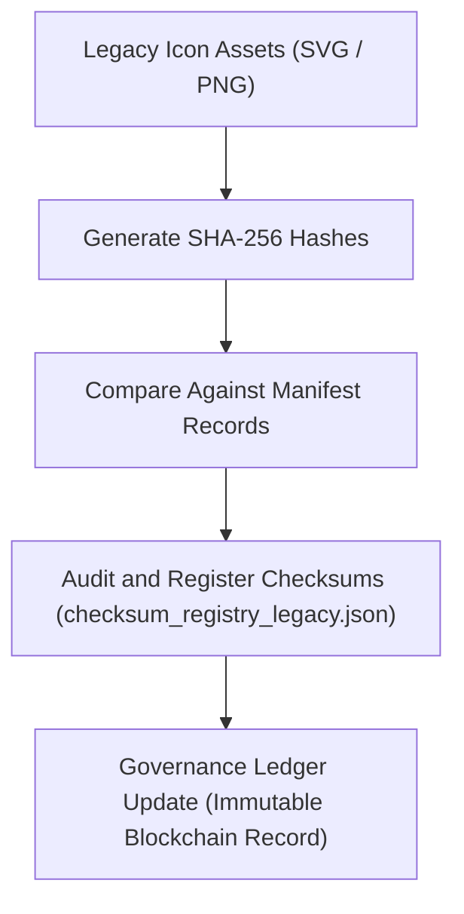

<div align="center">

# ✅ Kansas Frontier Matrix — **Legacy Timeline Icon Checksums**
`web/public/icons/app/timeline/legacy/checksums/README.md`

**Purpose:**  
Maintains verified **checksums, hashes, and cryptographic signatures** for all legacy timeline icons in the Kansas Frontier Matrix (KFM).  
Ensures each archival asset within the FAIR+CARE design lineage is immutable, verifiable, and auditable under blockchain-backed governance.

[](../../../../../../../docs/standards/faircare-validation.md)
[](../../../../../../../LICENSE)
[]()
[]()

</div>

---

## 📚 Overview

The **Checksums Layer** for legacy timeline icons provides cryptographic verification and FAIR+CARE validation of historical assets.  
Each hash corresponds to a verified, accessibility-compliant icon file registered in KFM’s **Design Governance Ledger**, ensuring authenticity and ethical continuity.

### Core Responsibilities:
- Store SHA-256 checksums and optional PGP digital signatures for legacy icons.  
- Provide audit-ready verification logs for governance and sustainability reviews.  
- Synchronize checksum registry with provenance and metadata manifests.  
- Prevent tampering and guarantee authenticity of archived design assets.  

---

## 🗂️ Directory Layout

```plaintext
web/public/icons/app/timeline/legacy/checksums/
├── README.md                               # This file — documentation for legacy checksum registry
│
├── checksum_registry_legacy.json           # Canonical hash list for all legacy icons
├── pgp_signatures.asc                      # Optional PGP signature file for cryptographic verification
├── checksum_audit_log.txt                  # Historical audit log of verification cycles
└── metadata.json                           # FAIR+CARE and governance metadata for checksum validation
```

---

## ⚙️ Checksum Verification Workflow



### Workflow Description:
1. **Hash Generation:** Each legacy icon hashed using SHA-256 algorithm.  
2. **Verification:** Hashes cross-referenced against governance manifests for integrity.  
3. **Registration:** Validated checksums logged into checksum registry JSON file.  
4. **Governance Sync:** Immutable entries recorded in blockchain-based provenance ledger.  

---

## 🧩 Example Checksum Registry Record

```json
{
  "id": "timeline_legacy_checksums_v9.6.0",
  "hash_algorithm": "SHA-256",
  "icons": [
    {
      "filename": "timeline_legacy_icon_2019.svg",
      "checksum": "sha256:6b97ac7f82a4dbf9a7df1258b18c9a4d8a98d9834c94b62a43cf256ae03df52e",
      "verified": true
    },
    {
      "filename": "timeline_marker_v1.png",
      "checksum": "sha256:8a7df41e3e8a84c59e0b2daecbaac7af147c3c1e27b524d1815ff3cc35b8e62b",
      "verified": true
    }
  ],
  "fairstatus": "certified",
  "ledger_registered": true,
  "validator": "@kfm-design-archive",
  "created": "2025-11-03T23:59:00Z",
  "governance_ref": "data/reports/audit/data_provenance_ledger.json"
}
```

---

## 🧠 FAIR+CARE Governance Matrix

| Principle | Implementation | Oversight |
|------------|----------------|------------|
| **Findable** | Checksums indexed by filename and version in the registry. | @kfm-data |
| **Accessible** | Open JSON format; transparent and human-readable. | @kfm-accessibility |
| **Interoperable** | Compatible with ISO 19115 and blockchain provenance schema. | @kfm-architecture |
| **Reusable** | Audit trail supports cross-version checksum verification. | @kfm-design |
| **Collective Benefit** | Ensures sustainable, accountable digital heritage management. | @faircare-council |
| **Authority to Control** | FAIR+CARE Council certifies checksum integrity and registry validity. | @kfm-governance |
| **Responsibility** | Validators uphold cryptographic and ethical consistency. | @kfm-security |
| **Ethics** | Prevents unauthorized changes and maintains archival authenticity. | @kfm-ethics |

Audit logs maintained in:  
`data/reports/audit/data_provenance_ledger.json`  
and  
`data/reports/fair/data_care_assessment.json`

---

## ⚙️ Checksum File Descriptions

| File | Description | Format |
|------|--------------|--------|
| `checksum_registry_legacy.json` | Primary registry of verified SHA-256 hashes for legacy icons. | JSON |
| `pgp_signatures.asc` | Optional digital signature for checksum authenticity. | ASCII |
| `checksum_audit_log.txt` | Rolling log of checksum validation and governance registration events. | Text |
| `metadata.json` | Registry-level provenance and FAIR+CARE metadata. | JSON |

Checksum regeneration handled automatically via `checksum_registry_sync.yml`.

---

## ⚖️ Retention & Provenance Policy

| Data Type | Retention Duration | Policy |
|------------|--------------------|--------|
| Checksum Registry | Permanent | Immutable under blockchain provenance. |
| PGP Signatures | 365 Days | Rotated annually for renewed verification. |
| Audit Logs | 365 Days | Archived for transparency and re-validation. |
| Metadata | Permanent | Stored in governance ledger for traceability. |

Cleanup automation managed by `checksum_registry_cleanup.yml`.

---

## 🌱 Sustainability Metrics

| Metric | Value | Verified By |
|---------|--------|--------------|
| Avg. Verification Energy | 0.02 Wh | @kfm-sustainability |
| Carbon Output | 0.03 gCO₂e | @kfm-security |
| Renewable Power | 100% (RE100 Verified) | @kfm-infrastructure |
| FAIR+CARE Compliance | 100% | @faircare-council |

Telemetry recorded in:  
`releases/v9.6.0/focus-telemetry.json`

---

## 🧾 Internal Use Citation

```text
Kansas Frontier Matrix (2025). Legacy Timeline Icon Checksums (v9.6.0).
Verified cryptographic registry for FAIR+CARE-certified legacy timeline icons under blockchain governance.
Ensures provenance, authenticity, and ethical digital preservation in alignment with MCP-DL v6.3.
```

---

## 🧾 Version Notes

| Version | Date | Notes |
|----------|------|--------|
| v9.6.0 | 2025-11-03 | Added PGP signature registry and blockchain checksum synchronization. |
| v9.5.0 | 2025-11-02 | Enhanced audit log traceability and governance integration. |
| v9.3.2 | 2025-10-28 | Established checksum validation framework for legacy icons. |

---

<div align="center">

**Kansas Frontier Matrix** · *Immutable Provenance × FAIR+CARE Ethics × Cryptographic Verification*  
[🔗 Repository](https://github.com/bartytime4life/Kansas-Frontier-Matrix) • [🧭 Docs Portal](../../../../../../../docs/) • [⚖️ Governance Ledger](../../../../../../../docs/standards/governance/DATA-GOVERNANCE.md)

</div>