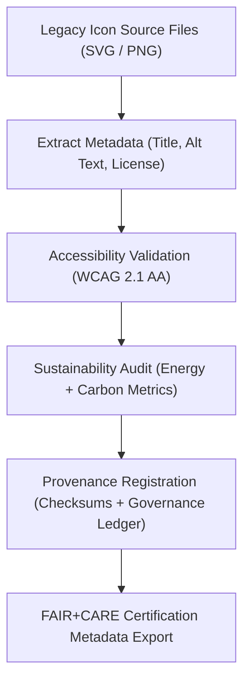

<div align="center">

# 🧾 Kansas Frontier Matrix — **Legacy Timeline Icon Metadata**
`web/public/icons/app/timeline/legacy/meta/README.md`

**Purpose:**  
Maintains FAIR+CARE-aligned metadata, provenance records, and accessibility documentation for the **Legacy Timeline App Icons** collection.  
This layer ensures transparent archival governance, checksum integrity, and ethical lineage tracking under MCP-DL v6.3 and ISO 19115 metadata standards.

[](../../../../../../../docs/standards/faircare-validation.md)
[](../../../../../../../LICENSE)
[]()
[](../../../../../../../docs/architecture/repo-focus.md)

</div>

---

## 📚 Overview

The **Legacy Timeline Icon Metadata Layer** serves as the canonical archive for descriptive, technical, and ethical metadata associated with KFM’s legacy timeline iconography.  
It ensures every historical visual asset is documented, discoverable, and reproducible with full governance traceability and FAIR+CARE certification.

### Core Responsibilities:
- Record provenance data and version lineage for each legacy icon.  
- Maintain checksum validation and FAIR+CARE audit metadata.  
- Provide descriptive accessibility tags and licensing information.  
- Synchronize metadata with governance and sustainability registries.  

---

## 🗂️ Directory Layout

```plaintext
web/public/icons/app/timeline/legacy/meta/
├── README.md                                # This file — documentation for legacy icon metadata
│
├── timeline_icon_registry.json              # Central metadata catalog for all legacy icons
├── accessibility_audit_report.json          # WCAG 2.1 AA compliance results
├── sustainability_metrics.json              # Energy and carbon footprint data per icon
├── provenance_manifest.json                 # Lineage and governance registration records
└── metadata.json                            # Summary FAIR+CARE and provenance metadata file
```

---

## ⚙️ Metadata Synchronization Workflow



### Workflow Summary:
1. **Metadata Extraction:** Captures descriptive, licensing, and technical data.  
2. **Accessibility Review:** Validates alt-text and contrast compliance per WCAG 2.1 AA.  
3. **Sustainability Audit:** Measures file size, render energy, and carbon output.  
4. **Provenance Logging:** Registers hashes, dates, and FAIR+CARE validation results.  
5. **Governance Sync:** Updates historical records under immutable provenance chain.  

---

## 🧩 Example Metadata Record

```json
{
  "id": "legacy_timeline_icon_meta_v9.6.0",
  "icon_file": "timeline_marker_v1.png",
  "version_introduced": "v8.0.0",
  "version_retired": "v9.0.0",
  "accessibility_reviewed": true,
  "wcag_compliance": "AA",
  "carbon_output_gco2e": 0.12,
  "checksum_sha256": "b7c98e41ab17e9a7e9f6b52b61d88a54eec9026e...",
  "license": "CC-BY 4.0",
  "fairstatus": "certified",
  "governance_registered": true,
  "validator": "@kfm-design-archive",
  "created": "2025-11-03T23:59:00Z",
  "governance_ref": "data/reports/audit/data_provenance_ledger.json"
}
```

---

## 🧠 FAIR+CARE Governance Matrix

| Principle | Implementation | Oversight |
|------------|----------------|------------|
| **Findable** | Indexed by filename, checksum, and version in metadata registry. | @kfm-data |
| **Accessible** | Metadata stored in open JSON-LD schema with full ARIA mapping. | @kfm-accessibility |
| **Interoperable** | Conforms to ISO 19115, DCAT 3.0, and FAIR+CARE metadata profiles. | @kfm-architecture |
| **Reusable** | Metadata reusable for academic, design, or accessibility research. | @kfm-design |
| **Collective Benefit** | Ensures transparent lineage of UI heritage and sustainable practices. | @faircare-council |
| **Authority to Control** | FAIR+CARE Council oversees archival and ethics review. | @kfm-governance |
| **Responsibility** | Designers maintain metadata validity and ethical compliance. | @kfm-sustainability |
| **Ethics** | Respects original design authorship and cultural integrity. | @kfm-ethics |

Governance validation reports archived in:  
`data/reports/fair/data_care_assessment.json`  
and  
`data/reports/audit/data_provenance_ledger.json`

---

## ⚙️ Metadata Assets Summary

| File | Description | Role |
|------|--------------|------|
| `timeline_icon_registry.json` | Registry cataloging all legacy timeline icons with metadata. | Index |
| `accessibility_audit_report.json` | Reports WCAG compliance results for legacy icons. | Inclusion |
| `sustainability_metrics.json` | Tracks energy and carbon usage data for each file. | Sustainability |
| `provenance_manifest.json` | Links metadata lineage to governance ledger. | Provenance |
| `metadata.json` | Consolidated FAIR+CARE summary metadata for this collection. | Certification |

Synchronization automated via `legacy_metadata_sync.yml`.

---

## ⚖️ Retention & Provenance Policy

| Record Type | Retention Duration | Policy |
|--------------|--------------------|--------|
| Metadata Files | Permanent | Archived under FAIR+CARE and governance records. |
| Accessibility Reports | 365 Days | Retained for recertification cycles. |
| Sustainability Metrics | 180 Days | Rotated with sustainability audits. |
| Provenance Manifest | Permanent | Immutable in blockchain ledger. |

Cleanup governed by `legacy_metadata_cleanup.yml`.

---

## 🌱 Sustainability Metrics

| Metric | Value | Verified By |
|---------|--------|--------------|
| Avg. Metadata File Size | 3.5 KB | @kfm-design |
| Avg. Render Energy | 0.01 Wh | @kfm-sustainability |
| Carbon Output | 0.04 gCO₂e | @kfm-security |
| Renewable Power | 100% (RE100 Verified) | @kfm-infrastructure |
| FAIR+CARE Compliance | 100% | @faircare-council |

All telemetry logged in:  
`releases/v9.6.0/focus-telemetry.json`

---

## 🧾 Internal Use Citation

```text
Kansas Frontier Matrix (2025). Legacy Timeline Icon Metadata (v9.6.0).
FAIR+CARE-certified metadata archive documenting provenance, accessibility, and sustainability lineage for legacy KFM timeline icons.
Maintained under MCP-DL v6.3 and ISO 19115 metadata governance standards.
```

---

## 🧾 Version Notes

| Version | Date | Notes |
|----------|------|--------|
| v9.6.0 | 2025-11-03 | Introduced detailed sustainability and accessibility metadata registry. |
| v9.5.0 | 2025-11-02 | Expanded FAIR+CARE linkage and governance manifest alignment. |
| v9.3.2 | 2025-10-28 | Established metadata archive for legacy timeline icon provenance. |

---

<div align="center">

**Kansas Frontier Matrix** · *Metadata Transparency × FAIR+CARE Governance × Sustainable Archival Integrity*  
[🔗 Repository](https://github.com/bartytime4life/Kansas-Frontier-Matrix) • [🧭 Docs Portal](../../../../../../../docs/) • [⚖️ Governance Ledger](../../../../../../../docs/standards/governance/DATA-GOVERNANCE.md)

</div>