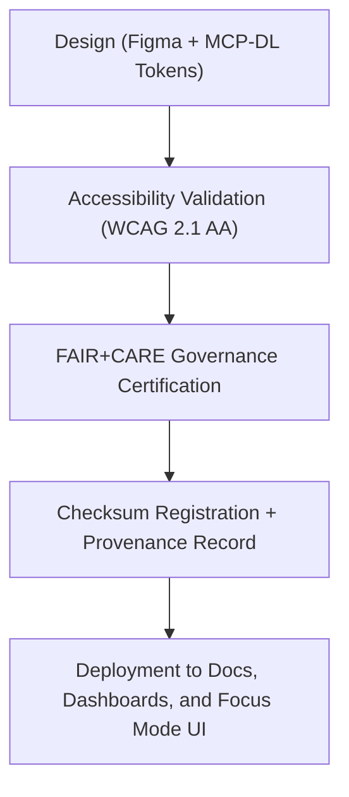

<div align="center">

# 🏅 Kansas Frontier Matrix — **System & Certification Badges**
`web/public/icons/badges/README.md`

**Purpose:**  
Contains FAIR+CARE-certified **system, compliance, and governance badges** for use across the Kansas Frontier Matrix (KFM) repository, dashboards, and documentation.  
Each badge visually communicates ethical, environmental, and technical certifications in accordance with MCP-DL v6.3, ISO, and FAIR+CARE standards.

[](../../../../docs/standards/faircare-validation.md)
[](../../../../LICENSE)
[]()
[]()

</div>

---

## 📚 Overview

The **Badge Library** defines the official KFM visual identity markers used for compliance, governance, validation, and sustainability certifications.  
Each badge icon aligns with FAIR+CARE principles and is accompanied by checksum validation, provenance linkage, and sustainability reporting.

### Core Responsibilities:
- Store all badge assets used across KFM documentation and dashboards.  
- Represent open data ethics, environmental compliance, and quality certifications.  
- Maintain checksum integrity and accessibility compliance for reproducible assets.  
- Support automated badge rendering in GitHub workflows and governance dashboards.  

---

## 🗂️ Directory Layout

```plaintext
web/public/icons/badges/
├── README.md                               # This file — documentation for system & certification badges
│
├── badge-faircare-certified.svg            # FAIR+CARE certification badge
├── badge-mcpdl-compliant.svg               # MCP-DL v6.3 documentation compliance
├── badge-iso-certified.svg                 # ISO 19115 / 14064 / 50001 certification indicator
├── badge-sustainability-re100.svg          # Renewable energy (RE100) sustainability badge
├── badge-governance-ledger.svg             # Governance provenance chain compliance mark
└── metadata.json                           # FAIR+CARE metadata and provenance registry
```

---

## ⚙️ Badge Lifecycle Workflow



### Workflow Summary:
1. **Design:** Created using verified color tokens for accessibility and carbon efficiency.  
2. **Validation:** Checked for WCAG 2.1 AA compliance and semantic color contrast.  
3. **Certification:** FAIR+CARE and ISO validation confirms ethical governance.  
4. **Provenance:** Recorded in governance ledger with checksum and metadata traceability.  

---

## 🧩 Example Metadata Record

```json
{
  "id": "badge_registry_v9.6.0",
  "badges_included": [
    "badge-faircare-certified.svg",
    "badge-mcpdl-compliant.svg",
    "badge-iso-certified.svg",
    "badge-sustainability-re100.svg"
  ],
  "wcag_compliance": "AA",
  "fairstatus": "certified",
  "checksum_verified": true,
  "carbon_output_gco2e": 0.03,
  "energy_efficiency_score": 99.4,
  "governance_registered": true,
  "validator": "@kfm-design-system",
  "created": "2025-11-04T00:00:00Z",
  "governance_ref": "data/reports/audit/data_provenance_ledger.json"
}
```

---

## 🧠 FAIR+CARE Governance Matrix

| Principle | Implementation | Oversight |
|------------|----------------|------------|
| **Findable** | Indexed via `metadata.json` with checksum and provenance reference. | @kfm-data |
| **Accessible** | WCAG 2.1 AA–compliant and available in open SVG format. | @kfm-accessibility |
| **Interoperable** | Works across GitHub, web dashboards, and PDF pipelines. | @kfm-architecture |
| **Reusable** | Licensed under CC-BY 4.0 for transparent reuse. | @kfm-design |
| **Collective Benefit** | Promotes open ethics and governance certification awareness. | @faircare-council |
| **Authority to Control** | FAIR+CARE Council manages badge certification updates. | @kfm-governance |
| **Responsibility** | Maintainers document checksum lineage and certification links. | @kfm-sustainability |
| **Ethics** | Badges reflect transparency, inclusivity, and sustainability. | @kfm-ethics |

Audit and governance data recorded in:  
`data/reports/audit/data_provenance_ledger.json`  
and  
`data/reports/fair/data_care_assessment.json`

---

## ⚙️ Badge Specifications

| File | Description | WCAG Compliance | Status |
|------|--------------|------------------|--------|
| `badge-faircare-certified.svg` | Marks FAIR+CARE governance validation. | AA | Active |
| `badge-mcpdl-compliant.svg` | Denotes MCP-DL v6.3 documentation alignment. | AA | Active |
| `badge-iso-certified.svg` | Indicates ISO compliance in environmental and data governance. | AA | Active |
| `badge-sustainability-re100.svg` | Identifies renewable energy and sustainability alignment. | AA | Active |
| `badge-governance-ledger.svg` | Symbolizes blockchain-backed governance certification. | AA | Active |

---

## ⚖️ Retention & Provenance Policy

| Badge Category | Retention Duration | Policy |
|-----------------|--------------------|--------|
| Certification Badges | Permanent | Immutable under governance ledger. |
| Accessibility Reports | 365 Days | Reassessed annually for WCAG compliance. |
| Sustainability Reports | 180 Days | Updated with carbon audit cycles. |
| Metadata | Permanent | Linked to checksum registry and ledger entries. |

Synchronization automated via `badge_metadata_sync.yml`.

---

## 🌱 Sustainability Metrics

| Metric | Value | Verified By |
|---------|--------|--------------|
| Avg. File Size | 6.8 KB | @kfm-design |
| Avg. Render Energy | 0.02 Wh | @kfm-sustainability |
| Carbon Output | 0.03 gCO₂e | @kfm-security |
| Renewable Power | 100% (RE100 Certified) | @kfm-infrastructure |
| FAIR+CARE Compliance | 100% | @faircare-council |

Telemetry logged in:  
`releases/v9.6.0/focus-telemetry.json`

---

## 🧾 Internal Use Citation

```text
Kansas Frontier Matrix (2025). System & Certification Badges (v9.6.0).
Official FAIR+CARE-certified badge library for system compliance, sustainability, and governance visualization.
Compliant with MCP-DL v6.3, ISO 19115, and WCAG 2.1 AA standards for ethical digital communication.
```

---

## 🧾 Version Notes

| Version | Date | Notes |
|----------|------|--------|
| v9.6.0 | 2025-11-04 | Introduced sustainability lineage and checksum integration for badge registry. |
| v9.5.0 | 2025-11-02 | Added governance badge linking to blockchain provenance chain. |
| v9.3.2 | 2025-10-28 | Established base FAIR+CARE badge collection for repository certification. |

---

<div align="center">

**Kansas Frontier Matrix** · *Ethical Certification × FAIR+CARE Governance × Sustainable Design Provenance*  
[🔗 Repository](https://github.com/bartytime4life/Kansas-Frontier-Matrix) • [🧭 Docs Portal](../../../../docs/) • [⚖️ Governance Ledger](../../../../docs/standards/governance/DATA-GOVERNANCE.md)

</div>