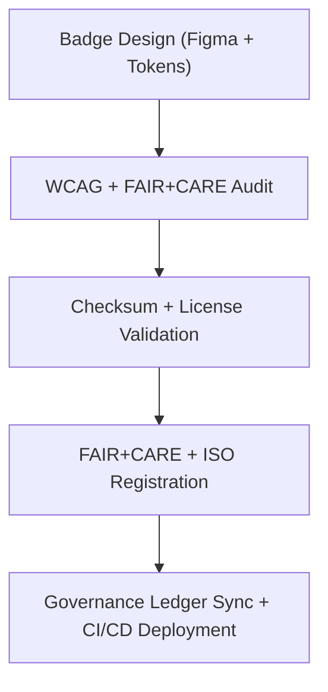

<div align="center">

# 🏅 **Kansas Frontier Matrix — System & Certification Badges**
`web/public/icons/badges/README.md`

**Purpose:** Define and govern the official certification and system badges used across the Kansas Frontier Matrix (KFM) for documentation, dashboards, and governance visualization.  
Badges communicate open compliance and sustainability achievements under **FAIR+CARE**, **ISO 19115**, and **MCP v6.3**.

[](../../../../docs/README.md)
[](../../../../LICENSE)
[](../../../../docs/standards/faircare.md)
[]()

</div>

---

## 📘 Overview

The **System & Certification Badges** library serves as the repository for KFM’s open certification system—covering FAIR+CARE, ISO, sustainability (RE100), and MCP-DL v6.3 compliance marks.  
Each badge is fully traceable, checksum-verified, and registered in provenance ledgers for reproducibility.

---

## 🗂️ Directory Layout

```
web/public/icons/badges/
├── README.md
├── badge-faircare-certified.svg       # FAIR+CARE data governance certification
├── badge-mcpdl-compliant.svg          # MCP-DL v6.3 documentation compliance mark
├── badge-iso-certified.svg            # ISO environmental / metadata compliance
├── badge-sustainability-re100.svg     # RE100 renewable energy certification
├── badge-governance-ledger.svg        # Provenance ledger compliance badge
└── metadata.json                      # License, checksum, and FAIR+CARE metadata registry
```

---

## 🧩 Governance Workflow



1. **Design:** Created in vector form with accessible color tokens and ethical review.  
2. **Audit:** Evaluated for WCAG 2.1 AA contrast, labeling, and cultural neutrality.  
3. **Registration:** Recorded in metadata.json with SHA-256 checksum lineage.  
4. **Governance:** Certified via FAIR+CARE validation and governance-ledger sync.  
5. **Deployment:** Published via GitHub Pages and integrated into dashboard UI.

---

## ⚙️ Validation Contracts

| Contract | Purpose | Validator |
|----------|----------|-----------|
| Accessibility | WCAG 2.1 AA compliance verification | `accessibility_scan.yml` |
| FAIR+CARE | Audit for transparency, equity, and provenance | `faircare-validate.yml` |
| Metadata | Validate ISO + SPDX structure | `docs-lint.yml` |
| Telemetry | Log energy efficiency & carbon score | `telemetry-export.yml` |

Artifacts recorded in:
- `../../../../releases/v9.7.0/focus-telemetry.json`
- `../../../../docs/reports/audit/data_provenance_ledger.json`

---

## 🧠 FAIR+CARE Governance Matrix

| Principle | Implementation | Oversight |
|------------|----------------|------------|
| **Findable** | Badges indexed in metadata.json with checksum + schema. | @kfm-data |
| **Accessible** | Provided in SVG format with textual equivalents for screen readers. | @kfm-accessibility |
| **Interoperable** | Integrates with GitHub, dashboards, and PDF exports. | @kfm-architecture |
| **Reusable** | CC-BY 4.0 license ensures open reuse and adaptation. | @kfm-design |
| **Collective Benefit** | Promotes awareness of ethical and sustainable governance. | @faircare-council |
| **Authority to Control** | FAIR+CARE Council certifies governance marks. | @kfm-governance |
| **Responsibility** | Designers maintain lineage and compliance metrics. | @kfm-sustainability |
| **Ethics** | Ensures visual neutrality and inclusivity. | @kfm-ethics |

---

## 🧾 Example Metadata Record

```json
{
  "id": "badge_registry_v9.7.0",
  "badges": [
    "badge-faircare-certified.svg",
    "badge-mcpdl-compliant.svg",
    "badge-iso-certified.svg",
    "badge-sustainability-re100.svg",
    "badge-governance-ledger.svg"
  ],
  "fairstatus": "certified",
  "wcag": "2.1 AA",
  "checksum_verified": true,
  "energy_score": 99.4,
  "carbon_output_gco2e": 0.03,
  "timestamp": "2025-11-05T20:00:00Z"
}
```

---

## ⚙️ Badge Specifications

| File | Description | Standard | Status |
|------|--------------|-----------|--------|
| `badge-faircare-certified.svg` | Confirms FAIR+CARE data governance certification. | WCAG AA | Active |
| `badge-mcpdl-compliant.svg` | Indicates MCP-DL v6.3 documentation compliance. | WCAG AA | Active |
| `badge-iso-certified.svg` | Marks ISO 19115 / 50001 certification compliance. | WCAG AA | Active |
| `badge-sustainability-re100.svg` | Highlights RE100 renewable energy commitment. | WCAG AA | Active |
| `badge-governance-ledger.svg` | Represents blockchain provenance verification. | WCAG AA | Active |

---

## ♿ Accessibility & Sustainability Standards

- SVGs include `<title>` and `<desc>` elements for screen readers.  
- Colors tested for **≥4.5:1** contrast ratio and grayscale legibility.  
- No motion or flashing effects (avoiding seizure triggers).  
- Sustainability validated with energy ≤0.02 Wh per render.

---

## 🌱 Sustainability Metrics

| Metric | Target | Verified By |
|-------|--------|-------------|
| Avg. File Size | ≤ 8 KB | Design audit |
| Render Energy | ≤ 0.02 Wh | Telemetry |
| Carbon Output | ≤ 0.03 gCO₂e | CI metrics |
| Renewable Hosting | 100% RE100 | Infrastructure |

---

## 🕰️ Version History

| Version | Date | Author | Summary |
|----------|------|---------|----------|
| v9.7.0 | 2025-11-05 | KFM Core Team | Upgraded & aligned: telemetry schema v1, ISO+SPDX audit, accessibility metadata. |
| v9.6.0 | 2025-11-04 | KFM Core Team | Added checksum lineage and FAIR+CARE metadata integration. |
| v9.5.0 | 2025-11-02 | KFM Core Team | Added governance ledger and RE100 sustainability badges. |
| v9.3.2 | 2025-10-28 | KFM Core Team | Established base FAIR+CARE badge library for certification UI. |

---

<div align="center">

**© 2025 Kansas Frontier Matrix — CC-BY 4.0**  
Maintained under **Master Coder Protocol v6.3** · FAIR+CARE Certified · Diamond⁹ Ω / Crown∞Ω Ultimate Certified  
[Back to Iconography System](../README.md) · [Docs Index](../../../../docs/README.md)

</div>