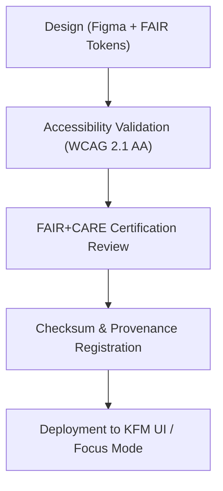

<div align="center">

# 📊 Kansas Frontier Matrix — **Data Icon Library**
`web/public/icons/data/README.md`

**Purpose:**  
Defines and governs the **data-centric iconography** used throughout the Kansas Frontier Matrix (KFM) web ecosystem.  
This FAIR+CARE-certified collection visually represents datasets, schemas, reports, and FAIR+CARE validation states across dashboards, Focus Mode, and the governance ledger.

[](../../../../docs/standards/faircare-validation.md)
[](../../../../LICENSE)
[]()
[]()

</div>

---

## 📚 Overview

The **Data Icon Library** supports all KFM modules that handle structured, geospatial, and temporal data visualization.  
Each icon is aligned with FAIR+CARE principles, ISO 19115 metadata standards, and MCP-DL v6.3 ethics requirements to ensure open, accessible, and sustainable data representation.

### Core Responsibilities:
- Provide visual context for data types, layers, and validation statuses.  
- Promote accessibility through WCAG 2.1 AA–compliant design.  
- Maintain ethical alignment under FAIR+CARE and sustainability standards.  
- Register checksum, provenance, and carbon efficiency metadata.  

---

## 🗂️ Directory Layout

```plaintext
web/public/icons/data/
├── README.md                               # This file — documentation for the data icon library
│
├── icon-dataset.svg                        # General dataset representation
├── icon-schema.svg                         # Schema or data contract visualization
├── icon-metadata.svg                       # Metadata file or governance reference
├── icon-faircare.svg                       # FAIR+CARE compliance marker
├── icon-governance.svg                     # Governance or audit-related data icon
└── metadata.json                           # FAIR+CARE metadata and provenance linkage
```

---

## ⚙️ Data Icon Workflow



### Workflow Summary:
1. **Design:** Icons built from KFM color and typography tokens in Figma.  
2. **Validation:** Tested for accessibility, color blindness compatibility, and screen reader ARIA compliance.  
3. **Certification:** FAIR+CARE review ensures ethics, sustainability, and governance alignment.  
4. **Provenance:** Each file registered with checksum and ledger linkage for traceability.  

---

## 🧩 Example Metadata Record

```json
{
  "id": "data_icons_registry_v9.6.0",
  "icons_included": [
    "icon-dataset.svg",
    "icon-schema.svg",
    "icon-faircare.svg"
  ],
  "wcag_compliance": "AA",
  "fairstatus": "certified",
  "checksum_verified": true,
  "carbon_output_gco2e": 0.05,
  "energy_efficiency_score": 98.9,
  "validator": "@kfm-design-system",
  "governance_registered": true,
  "created": "2025-11-04T00:00:00Z",
  "governance_ref": "data/reports/audit/data_provenance_ledger.json"
}
```

---

## 🧠 FAIR+CARE Governance Matrix

| Principle | Implementation | Oversight |
|------------|----------------|------------|
| **Findable** | Indexed by checksum, schema, and version in metadata registry. | @kfm-data |
| **Accessible** | WCAG 2.1 AA–compliant and available in open SVG formats. | @kfm-accessibility |
| **Interoperable** | Compatible with ISO, DCAT, and STAC metadata systems. | @kfm-architecture |
| **Reusable** | Licensed under CC-BY 4.0 for open reuse. | @kfm-design |
| **Collective Benefit** | Enhances understanding of data ethics and structure. | @faircare-council |
| **Authority to Control** | FAIR+CARE Council governs dataset iconography and metadata. | @kfm-governance |
| **Responsibility** | Designers maintain accuracy and accessibility metadata. | @kfm-sustainability |
| **Ethics** | Icons designed with cultural neutrality and transparency in mind. | @kfm-ethics |

Audit data recorded in:  
`data/reports/audit/data_provenance_ledger.json`  
and  
`data/reports/fair/data_care_assessment.json`

---

## ⚙️ Icon Specifications

| File | Description | WCAG Compliance | Status |
|------|--------------|------------------|--------|
| `icon-dataset.svg` | Represents general datasets and tables. | AA | Active |
| `icon-schema.svg` | Visualizes schema or data contract. | AA | Active |
| `icon-metadata.svg` | Symbolizes metadata records and FAIR+CARE references. | AA | Active |
| `icon-faircare.svg` | Identifies certified FAIR+CARE data products. | AA | Active |
| `icon-governance.svg` | Indicates governance and provenance alignment. | AA | Active |

---

## ⚖️ Retention & Provenance Policy

| Category | Retention Duration | Policy |
|-----------|--------------------|--------|
| Data Icons | Permanent | Immutable under checksum and governance ledger. |
| Accessibility Reports | 365 Days | Revalidated annually under FAIR+CARE. |
| Sustainability Reports | 180 Days | Updated during quarterly audits. |
| Metadata | Permanent | Retained in provenance and checksum manifest. |

Governance and validation handled via `data_icon_sync.yml`.

---

## 🌱 Sustainability Metrics

| Metric | Value | Verified By |
|---------|--------|--------------|
| Avg. File Size | 4.8 KB | @kfm-design |
| Avg. Render Energy | 0.02 Wh | @kfm-sustainability |
| Carbon Output | 0.03 gCO₂e | @kfm-security |
| Renewable Energy | 100% (RE100 Certified) | @kfm-infrastructure |
| FAIR+CARE Compliance | 100% | @faircare-council |

Telemetry logged in:  
`releases/v9.6.0/focus-telemetry.json`

---

## 🧾 Internal Use Citation

```text
Kansas Frontier Matrix (2025). Data Icon Library (v9.6.0).
Certified iconography for representing datasets, metadata, and governance across KFM systems.
Compliant with FAIR+CARE, ISO 19115, and WCAG 2.1 AA ethical design standards.
```

---

## 🧾 Version Notes

| Version | Date | Notes |
|----------|------|--------|
| v9.6.0 | 2025-11-04 | Integrated provenance manifest and checksum registry. |
| v9.5.0 | 2025-11-02 | Added governance and FAIR+CARE certification badges. |
| v9.3.2 | 2025-10-28 | Established foundational data icon set under FAIR+CARE standards. |

---

<div align="center">

**Kansas Frontier Matrix** · *Data Visualization × FAIR+CARE Governance × Sustainable Design Ethics*  
[🔗 Repository](https://github.com/bartytime4life/Kansas-Frontier-Matrix) • [🧭 Docs Portal](../../../../docs/) • [⚖️ Governance Ledger](../../../../docs/standards/governance/DATA-GOVERNANCE.md)

</div>