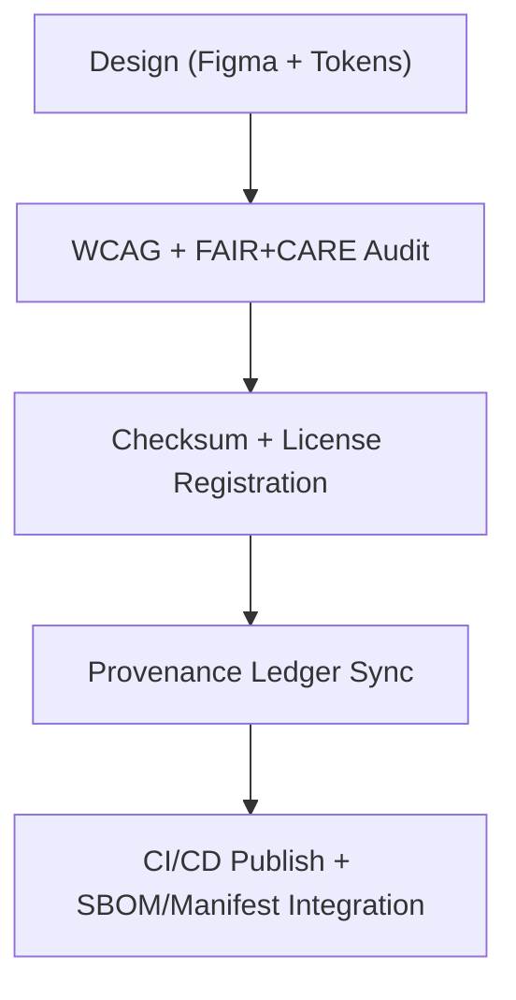

<div align="center">

# 📊 **Kansas Frontier Matrix — Data Icon Library**
`web/public/icons/data/README.md`

**Purpose:** Govern and document the dataset-centric iconography used across KFM UIs, dashboards, and governance reports.  
Icons are **FAIR+CARE-certified**, WCAG 2.1 AA–compliant, and metadata-linked for provenance and sustainability under **MCP v6.3** and **ISO 19115**.

[](../../../../docs/README.md)
[](../../../../LICENSE)
[](../../../../docs/standards/faircare.md)
[]()

</div>

---

## 📘 Overview

The **Data Icon Library** supplies consistent, interpretable, and ethical icons that represent datasets, schemas, metadata, and governance states in KFM.  
All assets are vector-first (SVG), minimized for energy, and registered with checksums and licenses.

---

## 🗂️ Directory Layout

```
web/public/icons/data/
├── README.md
├── icon-dataset.svg       # General dataset representation
├── icon-schema.svg        # Data contracts / schemas
├── icon-metadata.svg      # Metadata or registry references
├── icon-faircare.svg      # FAIR+CARE compliance marker
├── icon-governance.svg    # Governance or audit data symbol
└── metadata.json          # Registry linking icons to provenance and license
```

---

## 🧩 Governance Workflow



1. **Design:** Icons created using tokenized palettes and accessible geometry.  
2. **Audit:** WCAG 2.1 AA color/contrast and inclusivity checks.  
3. **Register:** Hash, SPDX license, and metadata recorded.  
4. **Governance:** Ledger entries track icon lineage and use.  
5. **Publish:** Distribution via CI; artifacts attached to **manifest** and **SBOM**.

---

## ⚙️ Validation Contracts

| Contract | Purpose | Validator |
|----------|----------|-----------|
| Accessibility | ARIA labels + contrast conformance | `accessibility_scan.yml` |
| FAIR+CARE | Ethics & provenance metadata validation | `faircare-validate.yml` |
| Metadata | ISO 19115 + SPDX schema verification | `docs-lint.yml` |
| Telemetry | Size + energy/carbon metrics logging | `telemetry-export.yml` |

Artifacts recorded in:
- `../../../../releases/v9.7.0/focus-telemetry.json`
- `../../../../docs/reports/audit/data_provenance_ledger.json`

---

## 🧠 FAIR+CARE Governance Matrix

| Principle | Implementation | Oversight |
|------------|----------------|------------|
| **Findable** | Indexed by checksum and role in metadata.json. | @kfm-data |
| **Accessible** | SVGs include `<title>` and `<desc>`; color-blind safe palettes. | @kfm-accessibility |
| **Interoperable** | ISO 19115 + FAIR+CARE compatible metadata. | @kfm-architecture |
| **Reusable** | CC-BY 4.0 licensed for open reuse. | @kfm-design |
| **Collective Benefit** | Improves comprehension of data roles and ethics. | @faircare-council |
| **Authority to Control** | Governance approval for new/additional icons. | @kfm-governance |
| **Responsibility** | Designers maintain lineage and audit trail. | @kfm-sustainability |
| **Ethics** | Neutral, non-stereotyped visual language. | @kfm-ethics |

---

## 🧾 Example Metadata Record

```json
{
  "id": "data_icons_v9.7.0",
  "icons": ["icon-dataset.svg", "icon-schema.svg", "icon-metadata.svg", "icon-faircare.svg"],
  "fairstatus": "certified",
  "wcag": "2.1 AA",
  "checksum_verified": true,
  "energy_score": 99.0,
  "timestamp": "2025-11-05T20:10:00Z"
}
```

---

## ⚙️ Specifications

| File | Description | WCAG Compliance | Status |
|------|-------------|------------------|--------|
| `icon-dataset.svg` | General dataset / table symbol. | AA | Active |
| `icon-schema.svg` | Data contract / schema file. | AA | Active |
| `icon-metadata.svg` | Metadata registry reference. | AA | Active |
| `icon-faircare.svg` | FAIR+CARE compliant dataset marker. | AA | Active |
| `icon-governance.svg` | Governance / audit chain symbol. | AA | Active |

---

## ♿ Accessibility & Sustainability Standards

- Minimum contrast **4.5:1** for primary mark variants.  
- SVGs carry screen-reader titles and are keyboard-focusable when interactive.  
- No embedded text; color-blind safe palettes validated.  
- Average file size ≤ **6 KB**; render energy ≤ **0.02 Wh**.

---

## 🌱 Sustainability Metrics

| Metric | Target | Verified By |
|-------|--------|-------------|
| Avg. File Size | ≤ 6 KB | Build metrics |
| Render Energy | ≤ 0.02 Wh | Telemetry |
| Carbon Output | ≤ 0.03 gCO₂e | CI telemetry |
| Renewable Hosting | 100% RE100 | Infrastructure |

---

## 🕰️ Version History

| Version | Date | Author | Summary |
|----------|------|---------|----------|
| v9.7.0 | 2025-11-05 | KFM Core Team | Upgraded & aligned: telemetry schema v1, governance contracts, accessibility rules. |
| v9.6.0 | 2025-11-04 | KFM Core Team | Added provenance manifest + checksum registry. |
| v9.5.0 | 2025-11-02 | KFM Core Team | Expanded icon set with FAIR+CARE markers. |
| v9.3.2 | 2025-10-28 | KFM Core Team | Established foundational data icon library. |

---

<div align="center">

**© 2025 Kansas Frontier Matrix — CC-BY 4.0**  
Maintained under **Master Coder Protocol v6.3** · FAIR+CARE Certified · Diamond⁹ Ω / Crown∞Ω Ultimate Certified  
[Back to Iconography System](../README.md) · [Docs Index](../../../../docs/README.md)

</div>