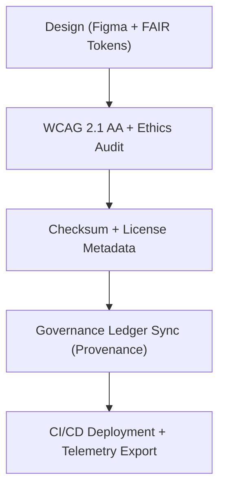

<div align="center">

# 🚩 **Kansas Frontier Matrix — Flag & Status Icon Library**
`web/public/icons/flags/README.md`

**Purpose:** Manage and certify all flag and status indicator icons across the Kansas Frontier Matrix (KFM) ecosystem.  
Icons visualize data quality, workflow states, and governance certification outcomes under **FAIR+CARE**, **ISO 9241-210**, and **MCP v6.3**.

[](../../../../docs/README.md)
[](../../../../LICENSE)
[](../../../../docs/standards/faircare.md)
[]()

</div>

---

## 📘 Overview

The **Flag & Status Icon Library** provides accessible, FAIR+CARE-validated graphical indicators for processes, validations, and audit results.  
Each icon is checksum-verified, metadata-linked, and designed for ethical and inclusive communication.

---

## 🗂️ Directory Layout

```
web/public/icons/flags/
├── README.md
├── flag-success.svg        # Workflow or validation success
├── flag-warning.svg        # Partial completion / caution
├── flag-error.svg          # Failure or exception marker
├── flag-inprogress.svg     # Active validation or build
├── flag-verified.svg       # Governance / FAIR+CARE certified state
└── metadata.json           # License + checksum + FAIR+CARE metadata registry
```

---

## 🧩 Governance Workflow



1. **Design:** Icons created with ethical color tokens and semantic shapes.  
2. **Audit:** Verified for contrast, color independence, and ARIA accessibility.  
3. **Register:** Hash, license, and metadata logged in registry.  
4. **Governance:** Linked to provenance ledger for reproducibility.  
5. **Publish:** Deployed via manifest and included in focus-telemetry logs.

---

## ⚙️ Validation Contracts

| Contract | Purpose | Validator |
|----------|----------|-----------|
| Accessibility | Validate contrast and assistive labeling | `accessibility_scan.yml` |
| FAIR+CARE | Verify ethics, inclusivity, and compliance | `faircare-validate.yml` |
| Metadata | Schema + SPDX consistency check | `docs-lint.yml` |
| Telemetry | Log file energy and carbon metrics | `telemetry-export.yml` |

Artifacts recorded in:
- `../../../../releases/v9.7.0/focus-telemetry.json`
- `../../../../docs/reports/audit/data_provenance_ledger.json`

---

## 🧠 FAIR+CARE Governance Matrix

| Principle | Implementation | Oversight |
|------------|----------------|------------|
| **Findable** | Indexed by checksum and type in metadata.json. | @kfm-data |
| **Accessible** | SVGs include ARIA labels, alt text, and title metadata. | @kfm-accessibility |
| **Interoperable** | ISO 9241-210 & FAIR+CARE metadata harmonization. | @kfm-architecture |
| **Reusable** | CC-BY 4.0 license ensures open reuse. | @kfm-design |
| **Collective Benefit** | Enhances workflow transparency and audit clarity. | @faircare-council |
| **Authority to Control** | Governance Council certifies flag use and design. | @kfm-governance |
| **Responsibility** | Validators maintain ethical color and symbolic balance. | @kfm-sustainability |
| **Ethics** | Avoids cultural misrepresentation; ensures neutral tone. | @kfm-ethics |

---

## 🧾 Example Metadata Record

```json
{
  "id": "flag_icons_v9.7.0",
  "icons": ["flag-success.svg", "flag-warning.svg", "flag-error.svg", "flag-inprogress.svg", "flag-verified.svg"],
  "fairstatus": "certified",
  "wcag": "2.1 AA",
  "checksum_verified": true,
  "energy_score": 98.8,
  "carbon_output_gco2e": 0.03,
  "timestamp": "2025-11-05T20:15:00Z"
}
```

---

## ⚙️ Icon Specifications

| File | Description | WCAG Compliance | Status |
|------|-------------|------------------|--------|
| `flag-success.svg` | Signifies successful validation or process completion. | AA | Active |
| `flag-warning.svg` | Indicates partial compliance or potential issue. | AA | Active |
| `flag-error.svg` | Marks failed validation or data issue. | AA | Active |
| `flag-inprogress.svg` | Represents ongoing workflows or builds. | AA | Active |
| `flag-verified.svg` | Confirms official FAIR+CARE certification. | AA | Active |

---

## ♿ Accessibility & Sustainability Standards

- Minimum contrast ratio: **4.5:1** (critical indicators).  
- Semantic ARIA roles applied (`role="status"`, `aria-label`).  
- No color-only differentiation; icons use shape semantics.  
- SVGs optimized ≤ **6 KB**; render energy ≤ **0.02 Wh**.  
- Audit data automatically exported to telemetry dashboards.

---

## 🌱 Sustainability Metrics

| Metric | Target | Verified By |
|-------|--------|-------------|
| Avg. File Size | ≤ 6 KB | Design validation |
| Render Energy | ≤ 0.02 Wh | Telemetry |
| Carbon Output | ≤ 0.03 gCO₂e | CI telemetry |
| Renewable Hosting | 100% RE100 | Infrastructure |

---

## 🕰️ Version History

| Version | Date | Author | Summary |
|----------|------|---------|----------|
| v9.7.0 | 2025-11-05 | KFM Core Team | Upgraded & aligned: telemetry schema v1, ARIA compliance, provenance tracking. |
| v9.6.0 | 2025-11-04 | KFM Core Team | Added checksum registry and sustainability metrics. |
| v9.5.0 | 2025-11-02 | KFM Core Team | Expanded accessibility testing for color safety. |
| v9.3.2 | 2025-10-28 | KFM Core Team | Established base status icon set under FAIR+CARE. |

---

<div align="center">

**© 2025 Kansas Frontier Matrix — CC-BY 4.0**  
Maintained under **Master Coder Protocol v6.3** · FAIR+CARE Certified · Diamond⁹ Ω / Crown∞Ω Ultimate Certified  
[Back to Iconography System](../README.md) · [Docs Index](../../../../docs/README.md)

</div>