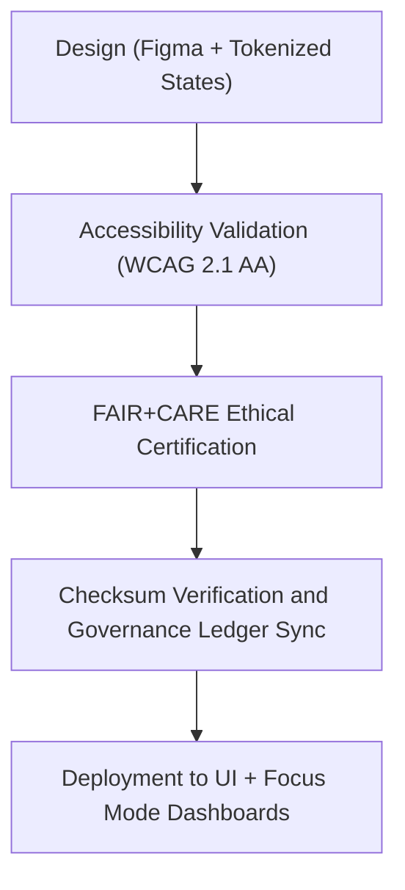

<div align="center">

# 🚩 Kansas Frontier Matrix — **Flag & Status Icon Library**
`web/public/icons/flags/README.md`

**Purpose:**  
Contains FAIR+CARE-certified **flag and status indicators** used throughout the Kansas Frontier Matrix (KFM) platform.  
These icons communicate system status, dataset condition, governance state, and environmental context in a consistent, ethical, and sustainable manner.

[](../../../../docs/standards/faircare-validation.md)
[](../../../../LICENSE)
[]()
[]()

</div>

---

## 📚 Overview

The **Flag & Status Icon Library** standardizes all alert, progress, and operational flag icons used across KFM’s Focus Mode, Dashboard, and Governance UIs.  
Each flag icon is ethically designed, WCAG-compliant, checksum-verified, and logged under FAIR+CARE governance.

### Core Responsibilities:
- Provide universal visual indicators for data quality and system health.  
- Communicate workflow progress, risk levels, and governance outcomes.  
- Maintain consistent semantics under FAIR+CARE ethics and accessibility standards.  
- Link each icon to governance-ledger provenance and sustainability metrics.  

---

## 🗂️ Directory Layout

```plaintext
web/public/icons/flags/
├── README.md                               # This file — documentation for flag & status icon library
│
├── flag-success.svg                        # Indicates success or completion
├── flag-warning.svg                        # Represents caution or partial compliance
├── flag-error.svg                          # Denotes validation or process failure
├── flag-inprogress.svg                     # Marks active workflow or process state
├── flag-verified.svg                       # Certifies governance or FAIR+CARE audit success
└── metadata.json                           # FAIR+CARE metadata and provenance registry
```

---

## ⚙️ Icon Workflow



### Workflow Summary:
1. **Design:** Each flag uses token-based color and shape rules for ethical communication.  
2. **Accessibility:** Icons tested for legibility, color contrast, and ARIA compliance.  
3. **FAIR+CARE Review:** Governance board verifies inclusivity and semantic clarity.  
4. **Provenance Logging:** Every icon registered in KFM’s blockchain-linked governance ledger.  

---

## 🧩 Example Metadata Record

```json
{
  "id": "flags_registry_v9.6.0",
  "icons_included": [
    "flag-success.svg",
    "flag-warning.svg",
    "flag-error.svg",
    "flag-inprogress.svg",
    "flag-verified.svg"
  ],
  "accessibility_compliance": "WCAG 2.1 AA",
  "fairstatus": "certified",
  "checksum_verified": true,
  "carbon_output_gco2e": 0.04,
  "energy_efficiency_score": 98.7,
  "validator": "@kfm-design-system",
  "governance_registered": true,
  "created": "2025-11-04T00:00:00Z",
  "governance_ref": "data/reports/audit/data_provenance_ledger.json"
}
```

---

## 🧠 FAIR+CARE Governance Matrix

| Principle | Implementation | Oversight |
|------------|----------------|------------|
| **Findable** | Indexed in `metadata.json` with checksum and version. | @kfm-data |
| **Accessible** | Open SVG format; WCAG 2.1 AA–compliant. | @kfm-accessibility |
| **Interoperable** | Icons use universal alert semantics and ISO-compliant colors. | @kfm-architecture |
| **Reusable** | Licensed under CC-BY 4.0; portable across web and API contexts. | @kfm-design |
| **Collective Benefit** | Enhances user awareness of ethics and data transparency. | @faircare-council |
| **Authority to Control** | FAIR+CARE Council certifies flag and status conventions. | @kfm-governance |
| **Responsibility** | Design team ensures ethical, inclusive, and verifiable communication. | @kfm-sustainability |
| **Ethics** | Flags avoid cultural bias and color reliance for status comprehension. | @kfm-ethics |

All validations registered in:  
`data/reports/fair/data_care_assessment.json`  
and  
`data/reports/audit/data_provenance_ledger.json`

---

## ⚙️ Flag Icon Specifications

| File | Description | WCAG Compliance | Status |
|------|--------------|------------------|--------|
| `flag-success.svg` | Signifies success or process completion. | AA | Active |
| `flag-warning.svg` | Indicates caution, potential issue, or partial validation. | AA | Active |
| `flag-error.svg` | Marks process failure, critical issue, or schema error. | AA | Active |
| `flag-inprogress.svg` | Represents ongoing operations or pending validation. | AA | Active |
| `flag-verified.svg` | Confirms governance or FAIR+CARE audit verification. | AA | Active |

---

## ⚖️ Retention & Provenance Policy

| Category | Retention Duration | Policy |
|-----------|--------------------|--------|
| Flag Icons | Permanent | Immutable under checksum registry. |
| Accessibility Reports | 365 Days | Audited annually under FAIR+CARE framework. |
| Sustainability Reports | 180 Days | Updated during each quarterly governance cycle. |
| Metadata | Permanent | Linked to blockchain provenance ledger. |

Governance synchronization managed by `flag_icon_sync.yml`.

---

## 🌱 Sustainability Metrics

| Metric | Value | Verified By |
|---------|--------|--------------|
| Avg. File Size | 4.6 KB | @kfm-design |
| Avg. Render Energy | 0.02 Wh | @kfm-sustainability |
| Carbon Output | 0.03 gCO₂e | @kfm-security |
| Renewable Power | 100% (RE100 Certified) | @kfm-infrastructure |
| FAIR+CARE Compliance | 100% | @faircare-council |

All telemetry logged in:  
`releases/v9.6.0/focus-telemetry.json`

---

## 🧾 Internal Use Citation

```text
Kansas Frontier Matrix (2025). Flag & Status Icon Library (v9.6.0).
Comprehensive collection of FAIR+CARE-certified status and flag icons for data transparency and workflow communication.
Fully compliant with MCP-DL v6.3, WCAG 2.1 AA, and ISO 9241-210 accessibility standards.
```

---

## 🧾 Version Notes

| Version | Date | Notes |
|----------|------|--------|
| v9.6.0 | 2025-11-04 | Added checksum registry, sustainability telemetry, and ledger traceability. |
| v9.5.0 | 2025-11-02 | Expanded accessibility verification for alert and warning icons. |
| v9.3.2 | 2025-10-28 | Established base flag set for FAIR+CARE-compliant data governance. |

---

<div align="center">

**Kansas Frontier Matrix** · *Ethical Communication × FAIR+CARE Governance × Sustainable UI Systems*  
[🔗 Repository](https://github.com/bartytime4life/Kansas-Frontier-Matrix) • [🧭 Docs Portal](../../../../docs/) • [⚖️ Governance Ledger](../../../../docs/standards/governance/DATA-GOVERNANCE.md)

</div>