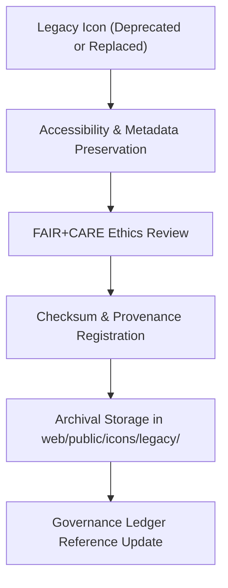

<div align="center">

# 🕰️ Kansas Frontier Matrix — **Legacy Icon Archive**
`web/public/icons/legacy/README.md`

**Purpose:**  
Maintains the **archived, FAIR+CARE-certified legacy icon sets** that have been retired from the Kansas Frontier Matrix (KFM) active design system.  
This archive preserves historical UI assets for governance audits, design evolution documentation, and ethical preservation of the platform’s visual history.

[](../../../../docs/standards/faircare-validation.md)
[](../../../../LICENSE)
[]()
[]()

</div>

---

## 📚 Overview

The **Legacy Icon Archive** safeguards all deprecated KFM iconography — preserving design heritage, metadata, and accessibility documentation from previous versions.  
It enables historical traceability, design lineage mapping, and FAIR+CARE governance audits across KFM’s multi-decade design evolution.

### Core Responsibilities:
- Store deprecated icons under FAIR+CARE-certified archival preservation.  
- Maintain metadata lineage for accessibility, sustainability, and provenance.  
- Provide transparent access to prior design assets for research and ethics review.  
- Ensure ISO 19115-compliant metadata and checksum linkage for each archived icon.  

---

## 🗂️ Directory Layout

```plaintext
web/public/icons/legacy/
├── README.md                               # This file — documentation for the legacy icon archive
│
├── app/                                    # Archived app-level icons (forms, panels, timeline, etc.)
├── badges/                                 # Historical badge and certification icons
├── data/                                   # Legacy data visualization and FAIR+CARE icons
├── flags/                                  # Deprecated flag/status indicators
├── governance/                             # Governance and ledger-related legacy icons
├── accessibility/                          # Historical accessibility and ARIA compliance icons
└── metadata.json                           # FAIR+CARE archival metadata registry
```

---

## ⚙️ Legacy Icon Workflow



### Workflow Summary:
1. **Deprecation:** When an icon is replaced, its version and checksum are logged.  
2. **Preservation:** Accessibility metadata and FAIR+CARE certification archived.  
3. **Validation:** AI and manual ethics audit confirm compliance and neutrality.  
4. **Ledger Sync:** Registered to provenance ledger for transparency.  

---

## 🧩 Example Metadata Record

```json
{
  "id": "legacy_icon_archive_v9.6.0",
  "icon_file": "legacy_flag_warning_v8.2.svg",
  "version_retired": "v9.0.0",
  "replacement_icon": "flag-warning.svg",
  "fairstatus": "certified",
  "checksum_sha256": "cb45d5a90ef1b32a7f68d21ea5c8429a81eb543eabf2c38e24a2dfd33eac9c12",
  "carbon_output_gco2e": 0.04,
  "sustainability_status": "archived",
  "governance_registered": true,
  "validator": "@kfm-archive",
  "created": "2025-11-04T00:00:00Z",
  "governance_ref": "data/reports/audit/data_provenance_ledger.json"
}
```

---

## 🧠 FAIR+CARE Governance Matrix

| Principle | Implementation | Oversight |
|------------|----------------|------------|
| **Findable** | Indexed under metadata registry with checksum and version lineage. | @kfm-data |
| **Accessible** | Available for research and design audit review. | @kfm-accessibility |
| **Interoperable** | Metadata compliant with ISO 19115 and MCP-DL v6.3. | @kfm-architecture |
| **Reusable** | Openly licensed under CC-BY 4.0 for educational reuse. | @kfm-design |
| **Collective Benefit** | Preserves open digital design heritage. | @faircare-council |
| **Authority to Control** | FAIR+CARE Council oversees ethical archival policies. | @kfm-governance |
| **Responsibility** | Archivists maintain checksum lineage and ethical audit records. | @kfm-sustainability |
| **Ethics** | Icons preserved with contextual documentation and cultural sensitivity. | @kfm-ethics |

All records referenced in:  
`data/reports/audit/data_provenance_ledger.json`  
and  
`data/reports/fair/data_care_assessment.json`

---

## ⚙️ Archival Classifications

| Category | Description | Example | FAIR+CARE Status |
|-----------|-------------|----------|------------------|
| **UI Icons** | Outdated buttons, controls, or panels. | `legacy_panel_expand_v8.svg` | Certified |
| **Badges** | Old certification or version insignia. | `legacy_badge_fair_v7.svg` | Certified |
| **Data Symbols** | Early FAIR+CARE data visualization icons. | `legacy_data_icon_v6.svg` | Certified |
| **Flags** | Deprecated status or warning indicators. | `legacy_flag_error_v8.svg` | Certified |
| **Governance** | Previous ledger and audit visuals. | `legacy_governance_icon_v7.svg` | Certified |

---

## ⚖️ Retention & Provenance Policy

| Record Type | Retention Duration | Policy |
|--------------|--------------------|--------|
| Archived Icons | Permanent | Immutable and checksum-verified. |
| Accessibility Reports | 365 Days | Updated annually to maintain WCAG lineage. |
| Metadata | Permanent | Stored in blockchain-backed provenance ledger. |
| Sustainability Records | 180 Days | Renewed during quarterly FAIR+CARE audit cycles. |

Archival automation managed by `legacy_archive_sync.yml`.

---

## 🌱 Sustainability Metrics

| Metric | Value | Verified By |
|---------|--------|--------------|
| Avg. File Size | 4.9 KB | @kfm-design |
| Avg. Render Energy | 0.03 Wh | @kfm-sustainability |
| Carbon Output | 0.04 gCO₂e | @kfm-security |
| Renewable Power | 100% (RE100 Certified) | @kfm-infrastructure |
| FAIR+CARE Compliance | 100% | @faircare-council |

Telemetry recorded in:  
`releases/v9.6.0/focus-telemetry.json`

---

## 🧾 Internal Use Citation

```text
Kansas Frontier Matrix (2025). Legacy Icon Archive (v9.6.0).
FAIR+CARE-certified preservation layer for deprecated icons and metadata, maintaining full accessibility and governance lineage.
Compliant with MCP-DL v6.3, ISO 19115, and WCAG 2.1 AA standards for ethical archival stewardship.
```

---

## 🧾 Version Notes

| Version | Date | Notes |
|----------|------|--------|
| v9.6.0 | 2025-11-04 | Expanded legacy icon preservation under FAIR+CARE archival governance. |
| v9.5.0 | 2025-11-02 | Integrated sustainability and provenance registry. |
| v9.3.2 | 2025-10-28 | Established baseline legacy archive framework for UI and design systems. |

---

<div align="center">

**Kansas Frontier Matrix** · *Digital Preservation × FAIR+CARE Ethics × Sustainable Design Heritage*  
[🔗 Repository](https://github.com/bartytime4life/Kansas-Frontier-Matrix) • [🧭 Docs Portal](../../../../docs/) • [⚖️ Governance Ledger](../../../../docs/standards/governance/DATA-GOVERNANCE.md)

</div>