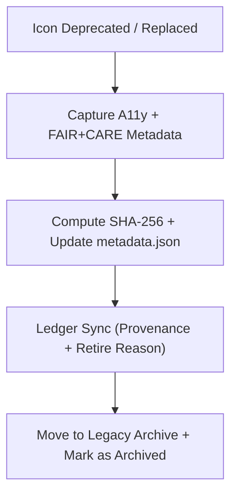

<div align="center">

# 🕰️ **Kansas Frontier Matrix — Legacy Icon Archive**
`web/public/icons/legacy/README.md`

**Purpose:** Preserve **retired and superseded** icon sets under FAIR+CARE archival governance — maintaining accessibility lineage, checksum provenance, and sustainability records for historical UI assets of the KFM platform.

[](../../../../docs/README.md)
[](../../../../LICENSE)
[](../../../../docs/standards/faircare.md)
[]()

</div>

---

## 📘 Overview

The **Legacy Icon Archive** safeguards deprecated iconography for governance audits, research, and design evolution.  
All assets are archived with **ISO 19115** metadata, WCAG lineage, and immutable checksum references to ensure transparent digital preservation.

---

## 🗂️ Directory Layout

```
web/public/icons/legacy/
├── README.md
├── app/            # Archived app UI icons (forms, panels, timeline)
├── badges/         # Historical certification marks
├── data/           # Legacy data & FAIR+CARE symbols
├── flags/          # Deprecated status indicators
├── governance/     # Past governance & ledger visuals
├── accessibility/  # Historical a11y-related icons
└── metadata.json   # Archival registry (license + checksum + provenance + retire reason)
```

---

## 🧩 Archival Workflow



1. **Deprecation:** Version and retire reason captured (e.g., contrast fail, new token).  
2. **Preservation:** A11y lineage and FAIR+CARE notes appended to registry.  
3. **Provenance:** Checksums and replacement links stored in governance ledgers.  
4. **Archival:** Files moved to `legacy/` and flagged as **Archived**.

---

## ⚙️ Validation Contracts

| Contract | Purpose | Validator |
|----------|----------|-----------|
| A11y Lineage | Preserve WCAG history and audit notes | `accessibility_scan.yml` |
| FAIR+CARE Archive | Confirm ethical retention context | `faircare-validate.yml` |
| Metadata | ISO 19115 + SPDX archival schema | `docs-lint.yml` |
| Telemetry | Archive energy + carbon provenance | `telemetry-export.yml` |

Artifacts recorded in:
- `../../../../docs/reports/audit/data_provenance_ledger.json`
- `../../../../releases/v9.7.0/focus-telemetry.json`

---

## 🧠 FAIR+CARE Governance Matrix

| Principle | Implementation | Oversight |
|------------|----------------|------------|
| **Findable** | Indexed by checksum, category, and retired version. | @kfm-data |
| **Accessible** | Publicly viewable for research & design audits. | @kfm-accessibility |
| **Interoperable** | ISO 19115 archival metadata across systems. | @kfm-architecture |
| **Reusable** | CC-BY 4.0 reuse permitted with attribution. | @kfm-design |
| **Collective Benefit** | Preserves design heritage and transparency. | @faircare-council |
| **Authority to Control** | Council authorizes archival + unarchive actions. | @kfm-governance |
| **Responsibility** | Archivists maintain lineage and checksum integrity. | @kfm-sustainability |
| **Ethics** | Contextual notes prevent misinterpretation of legacy symbols. | @kfm-ethics |

---

## 🧾 Example Archival Record

```json
{
  "id": "legacy_flag_warning_v8.2",
  "file": "flags/legacy_flag_warning_v8.2.svg",
  "retired_in": "v9.0.0",
  "replacement": "flags/flag-warning.svg",
  "retire_reason": "Contrast below AA; replaced with tokenized palette",
  "checksum_sha256": "cb45d5a90ef1b32a7f68d21ea5c8429a81eb543eabf2c38e24a2dfd33eac9c12",
  "a11y_lineage": ["AA (v8.0)", "AA fail (v8.2)"],
  "fairstatus": "certified",
  "timestamp": "2025-11-05T20:25:00Z"
}
```

---

## ♿ Accessibility & Sustainability Standards

- Historic assets retain their **original contrast and label metadata**.  
- Archival SVGs are **non-interactive** and marked as **deprecated**.  
- Energy + carbon provenance maintained for research comparatives.  
- Replacement links guide users to compliant, modern assets.

---

## 🌱 Sustainability Metrics

| Metric | Target | Verified By |
|-------|--------|-------------|
| Avg. File Size | ≤ 6 KB | Design audit |
| Archive Energy | ≤ 0.01 Wh | Telemetry |
| Carbon Output | ≤ 0.02 gCO₂e | CI telemetry |
| Renewable Hosting | 100% RE100 | Infrastructure |

---

## 🕰️ Version History

| Version | Date | Author | Summary |
|----------|------|---------|----------|
| v9.7.0 | 2025-11-05 | KFM Core Team | Upgraded & aligned: archival contracts, telemetry schema v1, retire-reason fields. |
| v9.6.0 | 2025-11-04 | KFM Core Team | Added checksum lineage and FAIR+CARE archival notes. |
| v9.5.0 | 2025-11-02 | KFM Core Team | Expanded categories and ISO archival metadata. |
| v9.3.2 | 2025-10-28 | KFM Core Team | Established legacy icon preservation framework. |

---

<div align="center">

**© 2025 Kansas Frontier Matrix — CC-BY 4.0**  
Maintained under **Master Coder Protocol v6.3** · FAIR+CARE Certified · Diamond⁹ Ω / Crown∞Ω Ultimate Certified  
[Back to Iconography System](../README.md) · [Docs Index](../../../../docs/README.md)

</div>