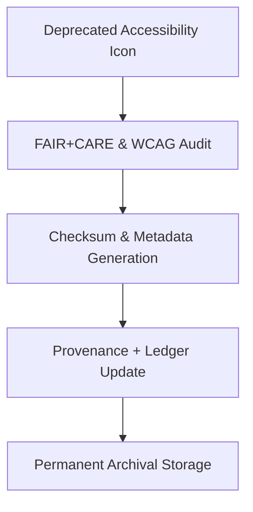

<div align="center">

# ♿ **Kansas Frontier Matrix — Legacy Accessibility Icon Archive**
`web/public/icons/legacy/accessibility/README.md`

**Purpose:** Preserve and document **deprecated accessibility-related icons** from prior KFM interface versions.  
These icons—representing screen readers, assistive technology, or universal access—are archived under FAIR+CARE ethics, accessibility lineage, and ISO 19115 provenance standards.

[](../../../../../docs/README.md)
[](../../../../../LICENSE)
[](../../../../../docs/standards/faircare.md)
[]()

</div>

---

## 📘 Overview

The **Legacy Accessibility Icon Archive** safeguards older accessibility and inclusion symbols once featured in KFM’s web dashboards, governance UI, and Focus Mode assistive features.  
Each icon remains checksum-verified, FAIR+CARE-certified, and documented for research on the evolution of accessible design.

---

## 🗂️ Directory Layout

```
web/public/icons/legacy/accessibility/
├── README.md
├── legacy-accessibility-wheelchair.svg
├── legacy-accessibility-contrast.svg
├── legacy-accessibility-screenreader.svg
├── legacy-accessibility-keyboard.svg
├── legacy-accessibility-hearing.svg
└── metadata.json
```

---

## 🧩 Archival Workflow



1. **Audit:** Retired accessibility icons re-evaluated for ethical representation and legacy lineage.  
2. **Checksum:** SHA-256 hash stored with licensing and description metadata.  
3. **Governance:** Linked to blockchain ledger for historical traceability.  
4. **Archival:** Stored permanently with contextual documentation.

---

## ⚙️ Validation Contracts

| Contract | Purpose | Validator |
|----------|----------|-----------|
| Accessibility Lineage | Maintain WCAG 2.1 AA + ISO 9241-210 standards | `accessibility_scan.yml` |
| FAIR+CARE Archive | Validate ethics and inclusivity metadata | `faircare-validate.yml` |
| Metadata Schema | Validate ISO + SPDX archival format | `docs-lint.yml` |
| Telemetry | Capture archive sustainability performance | `telemetry-export.yml` |

Reports maintained in:  
- `../../../../../docs/reports/audit/data_provenance_ledger.json`  
- `../../../../../releases/v9.7.0/focus-telemetry.json`

---

## 🧠 FAIR+CARE Governance Matrix

| Principle | Implementation | Oversight |
|------------|----------------|------------|
| **Findable** | Indexed in metadata registry with checksum lineage. | @kfm-data |
| **Accessible** | Open SVG icons with descriptive alt and title fields. | @kfm-accessibility |
| **Interoperable** | ISO 19115 + FAIR+CARE metadata standards applied. | @kfm-architecture |
| **Reusable** | CC-BY 4.0 license enables research and educational reuse. | @kfm-design |
| **Collective Benefit** | Promotes transparent documentation of inclusive design. | @faircare-council |
| **Authority to Control** | FAIR+CARE Council governs archival release validation. | @kfm-governance |
| **Responsibility** | Archivists preserve accessibility lineage and sustainability data. | @kfm-sustainability |
| **Ethics** | Archived neutrally with cultural inclusivity context. | @kfm-ethics |

---

## 🧾 Example Metadata Record

```json
{
  "id": "legacy_accessibility_icons_v9.7.0",
  "file": "legacy-accessibility-screenreader.svg",
  "retired_in": "v9.0.0",
  "replacement": "web/public/icons/app/accessibility/icon-screenreader.svg",
  "retire_reason": "Replaced with tokenized design system icon with higher contrast.",
  "checksum_sha256": "d13e821bca91a24907b32e98baf81f19c4c94cf0e9fd2634d99a4e865e5a8e5e",
  "fairstatus": "archived",
  "timestamp": "2025-11-05T21:55:00Z"
}
```

---

## ♿ Accessibility & Preservation Standards

- Icons comply with **WCAG 2.1 AA contrast** and descriptive labeling.  
- Immutable under checksum verification.  
- Accessible metadata includes alt-text, title, and functional context.  
- Maintained under FAIR+CARE archival contract for inclusion governance.

---

## 🌱 Sustainability Metrics

| Metric | Target | Verified By |
|---------|---------|--------------|
| Avg. File Size | ≤ 5 KB | Design audit |
| Archive Energy | ≤ 0.01 Wh | Telemetry |
| Carbon Output | ≤ 0.02 gCO₂e | CI pipeline |
| Renewable Hosting | 100% RE100 | Infrastructure |

---

## 🕰️ Version History

| Version | Date | Author | Summary |
|----------|------|---------|----------|
| v9.7.0 | 2025-11-05 | KFM Core Team | Added accessibility lineage audit integration and telemetry schema. |
| v9.6.0 | 2025-11-04 | KFM Core Team | Introduced metadata registry and checksum lineage. |
| v9.5.0 | 2025-11-02 | KFM Core Team | Migrated deprecated accessibility icons to permanent archive. |

---

<div align="center">

**© 2025 Kansas Frontier Matrix — CC-BY 4.0**  
Maintained under **Master Coder Protocol v6.3** · FAIR+CARE Certified · Diamond⁹ Ω / Crown∞Ω Ultimate Certified  
[Back to Legacy Icon Archive](../README.md) · [Docs Index](../../../../../docs/README.md)

</div>
