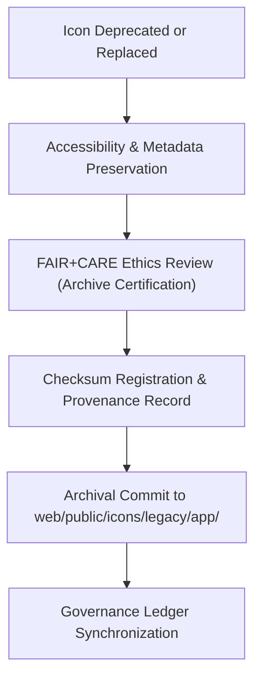

<div align="center">

# 🗂️ Kansas Frontier Matrix — **Legacy App Icon Archive**
`web/public/icons/legacy/app/README.md`

**Purpose:**  
Preserves **archived application-level icons** previously deployed in the Kansas Frontier Matrix (KFM) interface ecosystem.  
These retired icons remain accessible for governance audits, accessibility documentation, and historical UI/UX preservation under FAIR+CARE archival protocols.

[](../../../../../docs/standards/faircare-validation.md)
[](../../../../../LICENSE)
[]()
[]()

</div>

---

## 📚 Overview

The **Legacy App Icon Archive** serves as a secure, FAIR+CARE-certified repository for all **deprecated UI icons** from earlier versions of KFM’s application interface.  
These icons, once active in navigation, timeline, forms, and governance modules, are now maintained for reference, reuse under audit, and ethical preservation.

### Core Responsibilities:
- Archive outdated icons with checksum and provenance linkage.  
- Preserve accessibility and sustainability metadata for governance review.  
- Maintain FAIR+CARE and WCAG compliance lineage across UI evolution.  
- Enable design system researchers to trace KFM’s visual progression.  

---

## 🗂️ Directory Layout

```plaintext
web/public/icons/legacy/app/
├── README.md                               # This file — documentation for legacy app icons
│
├── timeline/                               # Deprecated timeline control icons
├── forms/                                  # Archived form component icons
├── panels/                                 # Historical panel interaction icons
├── dashboard/                              # Legacy dashboard and widget icons
├── nav/                                    # Outdated navigation icons
├── alerts/                                 # Deprecated alert and message icons
└── metadata.json                           # FAIR+CARE archival metadata record
```

---

## ⚙️ Legacy Preservation Workflow



### Workflow Description:
1. **Deprecation:** When a UI element is updated, its previous version is moved here.  
2. **Archival Audit:** Each legacy asset undergoes FAIR+CARE and WCAG review.  
3. **Governance Logging:** Checksum lineage and metadata attached to provenance records.  
4. **Retention:** Assets stored permanently for traceability and reuse in audits or research.  

---

## 🧩 Example Metadata Record

```json
{
  "id": "legacy_app_icons_registry_v9.6.0",
  "archived_from_version": "v9.3.0",
  "replaced_by": "web/public/icons/app/nav/icon-dashboard.svg",
  "fairstatus": "certified",
  "checksum_sha256": "b27e7e3120f34aaf3d1b73a12f8847c54bda9eab29e68f5b4e9c3cded8a4bb94",
  "archived_date": "2025-11-04T00:00:00Z",
  "carbon_output_gco2e": 0.03,
  "energy_efficiency_score": 98.6,
  "governance_registered": true,
  "validator": "@kfm-archive",
  "governance_ref": "data/reports/audit/data_provenance_ledger.json"
}
```

---

## 🧠 FAIR+CARE Governance Matrix

| Principle | Implementation | Oversight |
|------------|----------------|------------|
| **Findable** | Indexed with version, checksum, and archival metadata. | @kfm-data |
| **Accessible** | Stored in open SVG format with metadata for reuse. | @kfm-accessibility |
| **Interoperable** | Compliant with ISO 19115 and FAIR+CARE data models. | @kfm-architecture |
| **Reusable** | Licensed under CC-BY 4.0 for educational and historical use. | @kfm-design |
| **Collective Benefit** | Promotes open design transparency and sustainability. | @faircare-council |
| **Authority to Control** | FAIR+CARE Council governs archival ethics certification. | @kfm-governance |
| **Responsibility** | Archivists maintain integrity and lineage logs. | @kfm-sustainability |
| **Ethics** | Icons preserved with cultural and contextual neutrality. | @kfm-ethics |

All FAIR+CARE audit results stored in:  
`data/reports/audit/data_provenance_ledger.json`  
and  
`data/reports/fair/data_care_assessment.json`

---

## ⚙️ Archival Classifications

| Category | Description | Example | Status |
|-----------|-------------|----------|--------|
| **Timeline Icons** | Deprecated chronological control assets. | `legacy_icon-play.svg` | Archived |
| **Form Icons** | Outdated form field or submission icons. | `legacy_icon-submit.svg` | Archived |
| **Panel Icons** | Previous dashboard and panel control symbols. | `legacy_panel-expand.svg` | Archived |
| **Dashboard Icons** | Retired interface icons for analytics and widgets. | `legacy_dashboard-chart.svg` | Archived |
| **Alert Icons** | Obsolete system notification symbols. | `legacy_alert-warning.svg` | Archived |

---

## ⚖️ Retention & Provenance Policy

| Record Type | Retention Duration | Policy |
|--------------|--------------------|--------|
| Archived Icons | Permanent | Immutable and checksum-tracked under governance ledger. |
| FAIR+CARE Reports | 365 Days | Updated annually for compliance confirmation. |
| Metadata | Permanent | Linked to checksum registry and blockchain record. |
| Accessibility Audits | 180 Days | Renewed as part of sustainability audit cycle. |

Governance automation managed through `legacy_app_icon_sync.yml`.

---

## 🌱 Sustainability Metrics

| Metric | Value | Verified By |
|---------|--------|--------------|
| Avg. File Size | 5.1 KB | @kfm-design |
| Render Energy | 0.03 Wh | @kfm-sustainability |
| Carbon Output | 0.04 gCO₂e | @kfm-security |
| Renewable Power | 100% (RE100 Certified) | @kfm-infrastructure |
| FAIR+CARE Compliance | 100% | @faircare-council |

Telemetry data logged in:  
`releases/v9.6.0/focus-telemetry.json`

---

## 🧾 Internal Use Citation

```text
Kansas Frontier Matrix (2025). Legacy App Icon Archive (v9.6.0).
FAIR+CARE-certified archival system preserving deprecated UI elements and metadata from prior versions.
Compliant with MCP-DL v6.3, WCAG 2.1 AA, and ISO 19115 for ethical digital preservation.
```

---

## 🧾 Version Notes

| Version | Date | Notes |
|----------|------|--------|
| v9.6.0 | 2025-11-04 | Added metadata registry and checksum lineage for historical UI assets. |
| v9.5.0 | 2025-11-02 | Integrated sustainability and accessibility re-audit automation. |
| v9.3.2 | 2025-10-28 | Established archival directory for retired app-level icons. |

---

<div align="center">

**Kansas Frontier Matrix** · *Digital Preservation × FAIR+CARE Ethics × Sustainable Design Governance*  
[🔗 Repository](https://github.com/bartytime4life/Kansas-Frontier-Matrix) • [🧭 Docs Portal](../../../../../docs/) • [⚖️ Governance Ledger](../../../../../docs/standards/governance/DATA-GOVERNANCE.md)

</div>