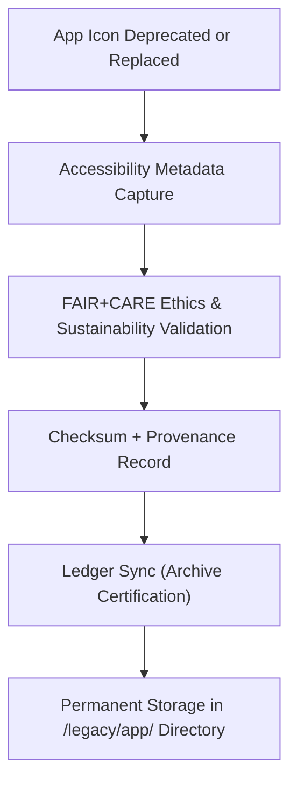

<div align="center">

# 🗂️ **Kansas Frontier Matrix — Legacy App Icon Archive**
`web/public/icons/legacy/app/README.md`

**Purpose:**  
Preserve all **deprecated application-level UI icons** formerly used within the Kansas Frontier Matrix (KFM) interface ecosystem.  
These legacy assets support transparency, research, and ethical preservation under **FAIR+CARE archival governance** and **ISO 19115** metadata traceability.

[](../../../../../docs/README.md)
[](../../../../../LICENSE)
[](../../../../../docs/standards/faircare.md)
[]()

</div>

---

## 📘 Overview

The **Legacy App Icon Archive** maintains historical icons for navigation, timeline, dashboard, and alert systems from previous KFM versions.  
These icons serve as reference artifacts for **design audits, accessibility evolution**, and **open governance provenance**.

---

## 🗂️ Directory Layout

```
web/public/icons/legacy/app/
├── README.md
├── alerts/              # Deprecated alert and system message icons
├── dashboard/           # Historical dashboard, graph, and widget icons
├── forms/               # Archived form and data entry icons
├── nav/                 # Outdated navigation and menu icons
├── panels/              # Previous dashboard panel and layout icons
├── timeline/            # Retired timeline and playback controls
└── metadata.json        # FAIR+CARE archival metadata registry
```

---

## 🧩 Archival Workflow



1. **Deprecation:** Previous icon versions flagged during UI modernization.  
2. **Preservation:** Metadata recorded (checksum, accessibility lineage, replacement mapping).  
3. **Verification:** FAIR+CARE validation ensures ethical and inclusive representation.  
4. **Archival:** Assets stored under immutable provenance chain in governance ledger.  

---

## ⚙️ Validation Contracts

| Contract | Purpose | Validator |
|----------|----------|-----------|
| Accessibility Lineage | Record historical WCAG compliance. | `accessibility_scan.yml` |
| FAIR+CARE Archive | Verify ethical retention and sustainability. | `faircare-validate.yml` |
| Metadata Schema | Validate archival metadata (ISO 19115 + SPDX). | `docs-lint.yml` |
| Telemetry | Capture archive energy and storage efficiency. | `telemetry-export.yml` |

Artifacts logged in:
- `../../../../../docs/reports/audit/data_provenance_ledger.json`
- `../../../../../releases/v9.7.0/focus-telemetry.json`

---

## 🧠 FAIR+CARE Governance Matrix

| Principle | Implementation | Oversight |
|------------|----------------|------------|
| **Findable** | Indexed by ID, checksum, and replacement mapping in metadata.json. | @kfm-data |
| **Accessible** | Publicly available SVGs with contextual archival metadata. | @kfm-accessibility |
| **Interoperable** | Conforms to ISO 19115 + FAIR+CARE archival schema. | @kfm-architecture |
| **Reusable** | CC-BY 4.0 licensed for research, education, and design studies. | @kfm-design |
| **Collective Benefit** | Enables transparency in UI evolution and inclusive design practices. | @faircare-council |
| **Authority to Control** | FAIR+CARE Council reviews archival inclusion annually. | @kfm-governance |
| **Responsibility** | Archivists maintain checksum lineage and sustainability logs. | @kfm-sustainability |
| **Ethics** | Preserved with cultural neutrality and context documentation. | @kfm-ethics |

---

## 🧾 Example Metadata Record

```json
{
  "id": "legacy_app_icons_archive_v9.7.0",
  "file": "nav/legacy-icon-home-v8.svg",
  "retired_in": "v9.0.0",
  "replacement": "nav/icon-home.svg",
  "retire_reason": "Updated for WCAG AA and governance token consistency",
  "fairstatus": "archived",
  "checksum_sha256": "ef29a314f9e4a87b6ac0c3a998af1f72b3e98f8b19e6dc2ff59d3cf18b8d92e3",
  "energy_score": 98.6,
  "timestamp": "2025-11-05T21:05:00Z",
  "governance_ref": "data/reports/audit/data_provenance_ledger.json"
}
```

---

## ♿ Accessibility & Preservation Standards

- Archived icons retain **contrast metadata**, **title**, and **ARIA description**.  
- Color and shape lineage tracked for historical accessibility analysis.  
- Non-active status enforced; assets remain for governance and research.  
- Sustainability metrics reported annually in archival review.

---

## 🌱 Sustainability Metrics

| Metric | Target | Verified By |
|-------|--------|-------------|
| Avg. File Size | ≤ 6 KB | Design audit |
| Archive Energy | ≤ 0.01 Wh | Telemetry |
| Carbon Output | ≤ 0.02 gCO₂e | CI telemetry |
| Renewable Hosting | 100% RE100 | Infrastructure |

---

## 🕰️ Version History

| Version | Date | Author | Summary |
|----------|------|---------|----------|
| v9.7.0 | 2025-11-05 | KFM Core Team | Created app-level legacy archive with telemetry schema v1. |
| v9.6.0 | 2025-11-04 | KFM Core Team | Added metadata lineage and sustainability traceability. |
| v9.5.0 | 2025-11-02 | KFM Core Team | Integrated legacy dashboard and timeline sets. |
| v9.3.2 | 2025-10-28 | KFM Core Team | Established foundational archive for deprecated UI icons. |

---

<div align="center">

**© 2025 Kansas Frontier Matrix — CC-BY 4.0**  
Maintained under **Master Coder Protocol v6.3** · FAIR+CARE Certified · Diamond⁹ Ω / Crown∞Ω Ultimate Certified  
[Back to Legacy Archive](../README.md) · [Docs Index](../../../../../docs/README.md)

</div>