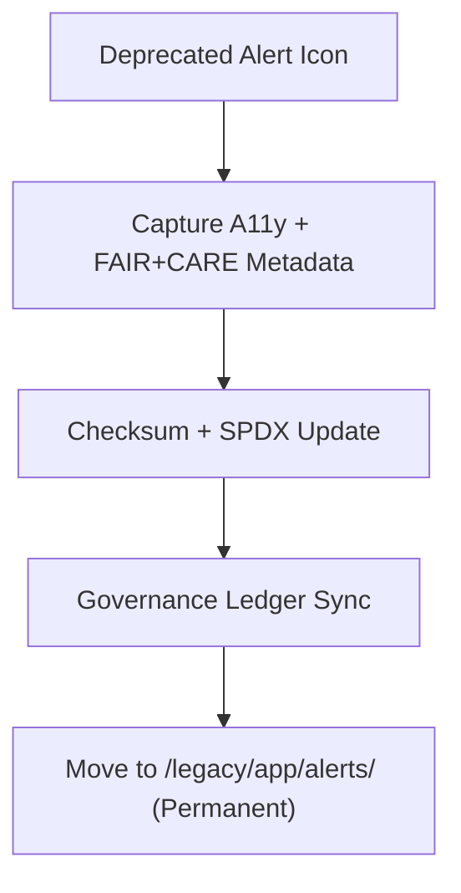

<div align="center">

# 🚨 **Kansas Frontier Matrix — Legacy Alert Icon Archive**
`web/public/icons/legacy/app/alerts/README.md`

**Purpose:** Preserve all **deprecated alert and notification icons** formerly used in KFM’s UI and Focus Mode.  
Assets are archived with FAIR+CARE lineage, WCAG metadata, and checksum provenance to support transparent design history under **MCP v6.3**.

[](../../../../../../docs/README.md)
[](../../../../../../LICENSE)
[](../../../../../../docs/standards/faircare.md)
[]()

</div>

---

## 📘 Overview

The **Legacy Alert Icon Archive** maintains retired symbols for warnings, errors, information, and success notifications from earlier KFM releases.  
Icons are stored for audit reproducibility, accessibility research, and governance provenance mapping.

---

## 🗂️ Directory Layout

```
web/public/icons/legacy/app/alerts/
├── README.md
├── legacy-alert-error.svg
├── legacy-alert-warning.svg
├── legacy-alert-info.svg
├── legacy-alert-success.svg
└── metadata.json
```

---

## 🧩 Archival Workflow



1. **Audit & Capture:** Accessibility lineage and ethical notes preserved.  
2. **Checksum:** SHA-256 + license recorded for each file.  
3. **Governance:** Archive registration added to provenance ledgers.  
4. **Storage:** Icons retained permanently for research and documentation.

---

## ⚙️ Validation Contracts

| Contract | Purpose | Validator |
|----------|----------|-----------|
| Accessibility Lineage | Maintain WCAG history + alt-text context | `accessibility_scan.yml` |
| FAIR+CARE Archive | Ethical retention and cultural neutrality | `faircare-validate.yml` |
| Metadata Schema | ISO 19115 + SPDX archival conformance | `docs-lint.yml` |
| Telemetry | Archive energy and carbon footprint | `telemetry-export.yml` |

Artifacts recorded in:
- `../../../../../../docs/reports/audit/data_provenance_ledger.json`
- `../../../../../../releases/v9.7.0/focus-telemetry.json`

---

## 🧠 FAIR+CARE Governance Matrix

| Principle | Implementation | Oversight |
|------------|----------------|------------|
| **Findable** | Indexed by checksum and retired version in metadata.json. | @kfm-data |
| **Accessible** | SVGs include `<title>` and `<desc>` archival context. | @kfm-accessibility |
| **Interoperable** | ISO 19115 archival metadata across KFM systems. | @kfm-architecture |
| **Reusable** | CC-BY 4.0 license for research/education reuse. | @kfm-design |
| **Collective Benefit** | Documents ethical evolution of alert semantics. | @faircare-council |
| **Authority to Control** | Council certifies archival retention and replacement mapping. | @kfm-governance |
| **Responsibility** | Archivists maintain checksums, lineage, and sustainability logs. | @kfm-sustainability |
| **Ethics** | Preserved with neutral language and context to avoid misuse. | @kfm-ethics |

---

## 🧾 Example Metadata Record

```json
{
  "id": "legacy_alerts_v9.7.0",
  "file": "legacy-alert-warning.svg",
  "retired_in": "v9.0.0",
  "replacement": "web/public/icons/app/alerts/icon-warning.svg",
  "retire_reason": "Updated to pass AA contrast and new token palette",
  "checksum_sha256": "a94d5be289f7b3d9286d4566f1433d21c8b4f4a33c32e2d1d0ff67b73345e21e",
  "fairstatus": "archived",
  "a11y_lineage": ["AA (v8.0)", "AA fail (v8.2)"],
  "timestamp": "2025-11-05T21:10:00Z"
}
```

---

## ♿ Accessibility & Preservation Standards

- Archived SVGs retain title/desc and **contrast lineage** metadata.  
- Non-interactive; not used in live UI.  
- Color tokens mapped for historical comparison.  
- Telemetry monitored for archival sustainability impact.

---

## 🌱 Sustainability Metrics

| Metric | Target | Verified By |
|-------|--------|-------------|
| Avg. File Size | ≤ 5 KB | Design audit |
| Archive Energy | ≤ 0.01 Wh | Telemetry |
| Carbon Output | ≤ 0.02 gCO₂e | CI pipeline |
| Renewable Hosting | 100% RE100 | Infrastructure |

---

## 🕰️ Version History

| Version | Date | Author | Summary |
|----------|------|---------|----------|
| v9.7.0 | 2025-11-05 | KFM Core Team | Upgraded & aligned with telemetry schema v1 and governance mapping. |
| v9.6.0 | 2025-11-04 | KFM Core Team | Added checksum registry and a11y lineage capture. |
| v9.5.0 | 2025-11-02 | KFM Core Team | Migrated v8 alert icons to archival directory. |

---

<div align="center">

**© 2025 Kansas Frontier Matrix — CC-BY 4.0**  
Maintained under **Master Coder Protocol v6.3** · FAIR+CARE Certified · Diamond⁹ Ω / Crown∞Ω Ultimate Certified  
[Back to Legacy App Icons](../README.md) · [Docs Index](../../../../../../docs/README.md)

</div>