<div align="center">

# 🚨 Kansas Frontier Matrix — **Legacy Alert Icon Archive**
`web/public/icons/legacy/app/alerts/README.md`

**Purpose:**  
Preserves **deprecated alert and notification icons** once used in KFM’s web interface and Focus Mode environments.  
This archive safeguards accessibility, provenance, and FAIR+CARE certification records for all retired system alert symbols.

[](../../../../../../docs/standards/faircare-validation.md)
[](../../../../../../LICENSE)
[]()
[]()

</div>

---

## 📚 Overview

The **Legacy Alert Icon Archive** retains historical icons representing warnings, errors, notifications, and validations from earlier KFM versions.  
These icons have been replaced by updated, ethically designed equivalents, but are preserved for transparency, research, and governance lineage tracking.

### Core Responsibilities:
- Maintain archived alert icons with full checksum and provenance records.  
- Ensure legacy icons remain accessible for audit, validation, and research.  
- Align archival metadata with FAIR+CARE and ISO 19115 standards.  
- Protect ethical and accessibility documentation for all alert-related assets.  

---

## 🗂️ Directory Layout

```plaintext
web/public/icons/legacy/app/alerts/
├── README.md                               # This file — documentation for legacy alert icons
│
├── legacy-alert-error.svg                  # Deprecated critical error indicator
├── legacy-alert-warning.svg                # Outdated warning or caution symbol
├── legacy-alert-info.svg                   # Historical info or system notice icon
├── legacy-alert-success.svg                # Replaced success notification icon
└── metadata.json                           # FAIR+CARE metadata and archival provenance record
```

---

## ⚙️ Archival Workflow

```mermaid
flowchart TD
    A["Deprecated Alert Icon"] --> B["FAIR+CARE Audit & Accessibility Reassessment"]
    B --> C["Checksum & Provenance Registration"]
    C --> D["Archival Commit → web/public/icons/legacy/app/alerts/"]
    D --> E["Governance Ledger Registration"]
```



### Workflow Summary:
1. **Audit:** Review and certify accessibility, ethics, and historical context.  
2. **Preserve:** Store icon under immutable checksum governance.  
3. **Register:** Append archival metadata to KFM provenance ledger.  
4. **Trace:** Link deprecation reason and successor icons for historical transparency.  

---

## 🧩 Example Metadata Record

```json
{
  "id": "legacy_alert_icons_registry_v9.6.0",
  "archived_from_version": "v9.0.0",
  "replaced_by": [
    "web/public/icons/app/alerts/icon-error.svg",
    "web/public/icons/app/alerts/icon-warning.svg"
  ],
  "fairstatus": "certified",
  "checksum_sha256": "a94d5be289f7b3d9286d4566f1433d21c8b4f4a33c32e2d1d0ff67b73345e21e",
  "archived_date": "2025-11-04T00:00:00Z",
  "carbon_output_gco2e": 0.03,
  "energy_efficiency_score": 99.0,
  "validator": "@kfm-archive",
  "governance_registered": true,
  "governance_ref": "data/reports/audit/data_provenance_ledger.json"
}
```

---

## 🧠 FAIR+CARE Governance Matrix

| Principle | Implementation | Oversight |
|------------|----------------|------------|
| **Findable** | Indexed with checksum, metadata, and replacement reference. | @kfm-data |
| **Accessible** | Stored in open SVG format with accessibility documentation. | @kfm-accessibility |
| **Interoperable** | Metadata aligned with ISO 19115 archival schema. | @kfm-architecture |
| **Reusable** | Licensed under CC-BY 4.0 for archival research and design reuse. | @kfm-design |
| **Collective Benefit** | Preserves ethical and historical design evolution. | @faircare-council |
| **Authority to Control** | FAIR+CARE Council governs archival review and release. | @kfm-governance |
| **Responsibility** | Archivists document lineage, checksums, and ethical context. | @kfm-sustainability |
| **Ethics** | Archived with transparency and sensitivity to user experience history. | @kfm-ethics |

Records logged under:  
`data/reports/fair/data_care_assessment.json`  
and  
`data/reports/audit/data_provenance_ledger.json`

---

## ⚙️ Archival Classification

| File | Description | Original Function | Replaced By |
|------|--------------|--------------------|--------------|
| `legacy-alert-error.svg` | Critical error symbol (red triangle). | Fatal error display. | `icon-error.svg` |
| `legacy-alert-warning.svg` | Caution or system risk indicator. | System warnings. | `icon-warning.svg` |
| `legacy-alert-info.svg` | Informational message icon. | Notifications, hints. | `icon-info.svg` |
| `legacy-alert-success.svg` | Success or completion mark. | Task validation, upload complete. | `icon-success.svg` |

---

## ⚖️ Retention & Provenance Policy

| Record Type | Retention Duration | Policy |
|--------------|--------------------|--------|
| Archived Icons | Permanent | Immutable and checksum-verified. |
| FAIR+CARE Reports | 365 Days | Renewed with annual design audit. |
| Metadata | Permanent | Linked to blockchain provenance ledger. |
| Accessibility Tests | 180 Days | Updated with each governance cycle. |

Archival automation handled via `legacy_alert_icon_sync.yml`.

---

## 🌱 Sustainability Metrics

| Metric | Value | Verified By |
|---------|--------|--------------|
| Avg. File Size | 4.5 KB | @kfm-design |
| Avg. Render Energy | 0.02 Wh | @kfm-sustainability |
| Carbon Output | 0.03 gCO₂e | @kfm-security |
| Renewable Energy | 100% (RE100 Certified) | @kfm-infrastructure |
| FAIR+CARE Compliance | 100% | @faircare-council |

Telemetry maintained in:  
`releases/v9.6.0/focus-telemetry.json`

---

## 🧾 Internal Use Citation

```text
Kansas Frontier Matrix (2025). Legacy Alert Icon Archive (v9.6.0).
FAIR+CARE-certified archival repository for deprecated system alert icons, preserving ethical design history and accessibility compliance lineage.
Compliant with MCP-DL v6.3, WCAG 2.1 AA, and ISO 19115 archival metadata standards.
```

---

## 🧾 Version Notes

| Version | Date | Notes |
|----------|------|--------|
| v9.6.0 | 2025-11-04 | Added checksum registry and sustainability audit linkage. |
| v9.5.0 | 2025-11-02 | Integrated accessibility and provenance re-audit process. |
| v9.3.2 | 2025-10-28 | Established baseline archive for deprecated alert icons. |

---

<div align="center">

**Kansas Frontier Matrix** · *Ethical Preservation × FAIR+CARE Archival Governance × Sustainable Design Heritage*  
[🔗 Repository](https://github.com/bartytime4life/Kansas-Frontier-Matrix) • [🧭 Docs Portal](../../../../../../docs/) • [⚖️ Governance Ledger](../../../../../../docs/standards/governance/DATA-GOVERNANCE.md)

</div>