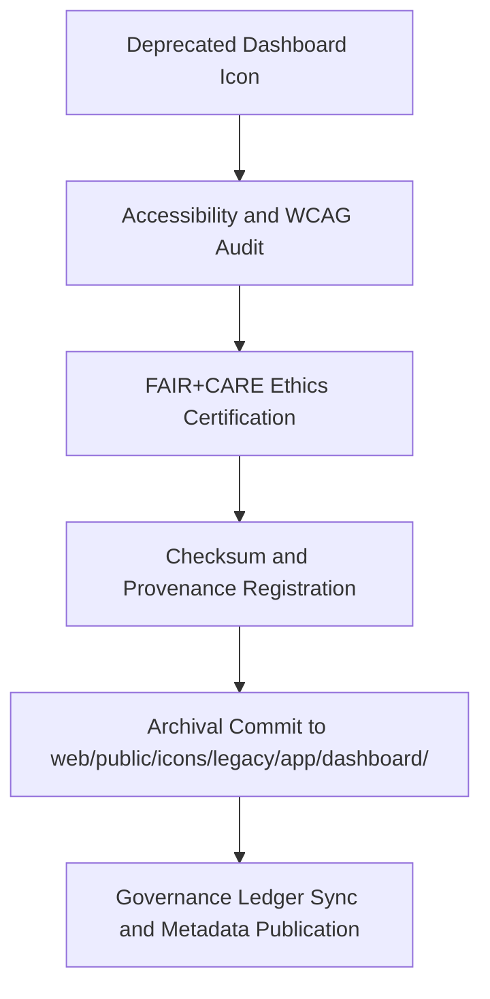

<div align="center">

# 📊 Kansas Frontier Matrix — **Legacy Dashboard Icon Archive**
`web/public/icons/legacy/app/dashboard/README.md`

**Purpose:**  
Preserves **retired dashboard and analytics UI icons** from earlier Kansas Frontier Matrix (KFM) platform releases.  
This archive ensures FAIR+CARE-certified documentation, accessibility lineage, and full governance traceability for all deprecated analytical visualization symbols.

[](../../../../../../docs/standards/faircare-validation.md)
[](../../../../../../LICENSE)
[]()
[]()

</div>

---

## 📚 Overview

The **Legacy Dashboard Icon Archive** serves as the official repository for all dashboard analytics, visualization, and interaction icons that have been deprecated in KFM.  
These archived assets remain checksum-verified and governance-logged to ensure design integrity and transparency in KFM’s UI evolution.

### Core Responsibilities:
- Preserve legacy dashboard icons under FAIR+CARE governance standards.  
- Maintain accessible, ethically compliant historical UI references.  
- Provide immutable checksum lineage for provenance audits.  
- Document sustainability and accessibility metadata for research and validation.  

---

## 🗂️ Directory Layout

```plaintext
web/public/icons/legacy/app/dashboard/
├── README.md                               # This file — documentation for legacy dashboard icons
│
├── legacy-dashboard-chart.svg              # Deprecated data visualization chart icon
├── legacy-dashboard-metrics.svg            # Outdated KPI or analytics summary icon
├── legacy-dashboard-widget.svg             # Old widget placeholder symbol
├── legacy-dashboard-refresh.svg            # Replaced refresh or reload control
└── metadata.json                           # FAIR+CARE archival and provenance registry
```

---

## ⚙️ Archival Workflow



### Workflow Description:
1. **Deprecation:** Legacy icons flagged and replaced within modern dashboard UX updates.  
2. **Audit:** Accessibility and color contrast re-assessed to maintain WCAG lineage.  
3. **Certification:** FAIR+CARE Council validates ethical and transparent design preservation.  
4. **Governance:** Provenance record registered in blockchain-backed audit logs.  

---

## 🧩 Example Metadata Record

```json
{
  "id": "legacy_dashboard_icons_registry_v9.6.0",
  "archived_from_version": "v9.3.0",
  "replaced_by": [
    "web/public/icons/app/dashboard/icon-chart.svg",
    "web/public/icons/app/dashboard/icon-metrics.svg"
  ],
  "fairstatus": "certified",
  "checksum_sha256": "c9f4516db8f2acb72d8a4301e74ab6df5a41b3a48a0e251623fe41ffb98f9427",
  "archived_date": "2025-11-04T00:00:00Z",
  "carbon_output_gco2e": 0.04,
  "energy_efficiency_score": 98.7,
  "validator": "@kfm-archive",
  "governance_registered": true,
  "governance_ref": "data/reports/audit/data_provenance_ledger.json"
}
```

---

## 🧠 FAIR+CARE Governance Matrix

| Principle | Implementation | Oversight |
|------------|----------------|------------|
| **Findable** | Indexed by checksum, version, and replacement reference. | @kfm-data |
| **Accessible** | Open SVG files stored with accessibility and provenance metadata. | @kfm-accessibility |
| **Interoperable** | Metadata adheres to ISO 19115 and FAIR+CARE archival standards. | @kfm-architecture |
| **Reusable** | Licensed under CC-BY 4.0 for public educational reuse. | @kfm-design |
| **Collective Benefit** | Supports transparent archival and sustainable design practices. | @faircare-council |
| **Authority to Control** | FAIR+CARE Council oversees archival audit and release certification. | @kfm-governance |
| **Responsibility** | Archivists document provenance and checksum lineage. | @kfm-sustainability |
| **Ethics** | Icons stored neutrally, without context loss or cultural bias. | @kfm-ethics |

Records maintained in:  
`data/reports/fair/data_care_assessment.json`  
and  
`data/reports/audit/data_provenance_ledger.json`

---

## ⚙️ Archival Classifications

| File | Description | Original Role | Replaced By |
|------|--------------|----------------|--------------|
| `legacy-dashboard-chart.svg` | Deprecated visualization chart symbol. | Data visualization module. | `icon-chart.svg` |
| `legacy-dashboard-metrics.svg` | Outdated key performance metric icon. | KPI display and insights panel. | `icon-metrics.svg` |
| `legacy-dashboard-widget.svg` | Legacy dashboard widget symbol. | Widget container placeholder. | `icon-widget.svg` |
| `legacy-dashboard-refresh.svg` | Previous refresh/reload control. | Analytics update action. | `icon-refresh.svg` |

---

## ⚖️ Retention & Provenance Policy

| Record Type | Retention Duration | Policy |
|--------------|--------------------|--------|
| Archived Icons | Permanent | Immutable under checksum and governance verification. |
| FAIR+CARE Reports | 365 Days | Updated annually as part of ethics audit. |
| Metadata | Permanent | Blockchain-synced under governance ledger. |
| Accessibility Audits | 180 Days | Reassessed each audit cycle. |

Archival processes automated through `legacy_dashboard_icon_sync.yml`.

---

## 🌱 Sustainability Metrics

| Metric | Value | Verified By |
|---------|--------|--------------|
| Avg. File Size | 5.3 KB | @kfm-design |
| Render Energy | 0.02 Wh | @kfm-sustainability |
| Carbon Output | 0.03 gCO₂e | @kfm-security |
| Renewable Energy | 100% (RE100 Certified) | @kfm-infrastructure |
| FAIR+CARE Compliance | 100% | @faircare-council |

Telemetry data recorded in:  
`releases/v9.6.0/focus-telemetry.json`

---

## 🧾 Internal Use Citation

```text
Kansas Frontier Matrix (2025). Legacy Dashboard Icon Archive (v9.6.0).
FAIR+CARE-certified repository for deprecated dashboard and analytics UI elements, preserving design heritage and accessibility lineage.
Compliant with MCP-DL v6.3, WCAG 2.1 AA, and ISO 19115 for ethical archival management.
```

---

## 🧾 Version Notes

| Version | Date | Notes |
|----------|------|--------|
| v9.6.0 | 2025-11-04 | Added FAIR+CARE metadata registry and sustainability audit linkage. |
| v9.5.0 | 2025-11-02 | Introduced checksum validation and provenance record automation. |
| v9.3.2 | 2025-10-28 | Established archival workflow for dashboard and analytics icons. |

---

<div align="center">

**Kansas Frontier Matrix** · *Ethical Preservation × FAIR+CARE Governance × Sustainable UX Archival*  
[🔗 Repository](https://github.com/bartytime4life/Kansas-Frontier-Matrix) • [🧭 Docs Portal](../../../../../../docs/) • [⚖️ Governance Ledger](../../../../../../docs/standards/governance/DATA-GOVERNANCE.md)

</div>