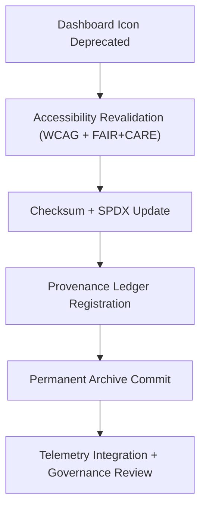

<div align="center">

# 📊 **Kansas Frontier Matrix — Legacy Dashboard Icon Archive**
`web/public/icons/legacy/app/dashboard/README.md`

**Purpose:** Preserve and document all **deprecated dashboard and analytics icons** previously used in the Kansas Frontier Matrix (KFM) web application.  
All assets remain FAIR+CARE-certified, checksum-verified, and ethically archived under ISO 19115 metadata standards.

[](../../../../../../docs/README.md)
[](../../../../../../LICENSE)
[](../../../../../../docs/standards/faircare.md)
[]()

</div>

---

## 📘 Overview

The **Legacy Dashboard Icon Archive** provides long-term retention of retired analytical and visualization symbols from earlier KFM versions.  
Icons within this archive are maintained with checksum lineage, accessibility reports, and sustainability telemetry to support full lifecycle transparency.

---

## 🗂️ Directory Layout

```
web/public/icons/legacy/app/dashboard/
├── README.md
├── legacy-dashboard-chart.svg
├── legacy-dashboard-metrics.svg
├── legacy-dashboard-widget.svg
├── legacy-dashboard-refresh.svg
└── metadata.json
```

---

## 🧩 Archival Workflow



### Lifecycle Summary:
1. **Deprecation:** Icons superseded during design system updates.  
2. **Revalidation:** Historical WCAG and FAIR+CARE metrics rechecked.  
3. **Verification:** Checksum lineage appended to provenance ledger.  
4. **Archival:** Immutable registration in blockchain-synced governance logs.  
5. **Sustainability:** Energy and storage metrics reported to telemetry records.

---

## ⚙️ Validation Contracts

| Contract | Purpose | Validator |
|----------|----------|-----------|
| Accessibility Audit | Maintain WCAG contrast lineage. | `accessibility_scan.yml` |
| FAIR+CARE Ethics | Verify ethical and cultural neutrality. | `faircare-validate.yml` |
| Metadata Schema | Enforce ISO 19115 + SPDX archival format. | `docs-lint.yml` |
| Telemetry | Track sustainability impact and file efficiency. | `telemetry-export.yml` |

Artifacts registered under:
- `../../../../../../docs/reports/audit/data_provenance_ledger.json`
- `../../../../../../releases/v9.7.0/focus-telemetry.json`

---

## 🧠 FAIR+CARE Governance Matrix

| Principle | Implementation | Oversight |
|------------|----------------|------------|
| **Findable** | Archived with metadata registry and checksum ID. | @kfm-data |
| **Accessible** | Retained in open SVG format with license references. | @kfm-accessibility |
| **Interoperable** | Conforms to ISO 19115 and FAIR+CARE metadata schemas. | @kfm-architecture |
| **Reusable** | CC-BY 4.0 license permits educational and audit reuse. | @kfm-design |
| **Collective Benefit** | Demonstrates open design evolution and sustainability. | @faircare-council |
| **Authority to Control** | FAIR+CARE Council reviews annual archival renewals. | @kfm-governance |
| **Responsibility** | Archivists maintain energy logs and checksum validation. | @kfm-sustainability |
| **Ethics** | Icons preserved neutrally for transparency and inclusivity. | @kfm-ethics |

---

## 🧾 Example Metadata Record

```json
{
  "id": "legacy_dashboard_archive_v9.7.0",
  "file": "legacy-dashboard-metrics.svg",
  "retired_in": "v9.0.0",
  "replacement": "web/public/icons/app/dashboard/icon-metrics.svg",
  "retire_reason": "Redesigned for modern accessibility and color token standards.",
  "checksum_sha256": "c9f4516db8f2acb72d8a4301e74ab6df5a41b3a48a0e251623fe41ffb98f9427",
  "fairstatus": "archived",
  "energy_score": 98.7,
  "timestamp": "2025-11-05T21:15:00Z"
}
```

---

## ♿ Accessibility & Preservation Standards

- Archived SVGs maintain `<title>` and `<desc>` for assistive documentation.  
- Retired assets remain read-only and checksum-locked.  
- Version lineage maintained for transparency in accessibility evolution.  
- Metadata includes previous WCAG contrast and color audit results.

---

## 🌱 Sustainability Metrics

| Metric | Target | Verified By |
|-------|--------|-------------|
| Avg. File Size | ≤ 6 KB | Design audit |
| Archive Energy | ≤ 0.01 Wh | Telemetry |
| Carbon Output | ≤ 0.02 gCO₂e | CI telemetry |
| Renewable Hosting | 100% RE100 | Infrastructure |

---

## 🕰️ Version History

| Version | Date | Author | Summary |
|----------|------|---------|----------|
| v9.7.0 | 2025-11-05 | KFM Core Team | Upgraded archive for telemetry integration and governance schema v1. |
| v9.6.0 | 2025-11-04 | KFM Core Team | Added metadata registry and FAIR+CARE audit linkage. |
| v9.5.0 | 2025-11-02 | KFM Core Team | Migrated v8 assets into permanent archival ledger. |
| v9.3.2 | 2025-10-28 | KFM Core Team | Established baseline dashboard icon archive. |

---

<div align="center">

**© 2025 Kansas Frontier Matrix — CC-BY 4.0**  
Maintained under **Master Coder Protocol v6.3** · FAIR+CARE Certified · Diamond⁹ Ω / Crown∞Ω Ultimate Certified  
[Back to Legacy App Icons](../README.md) · [Docs Index](../../../../../../docs/README.md)

</div>