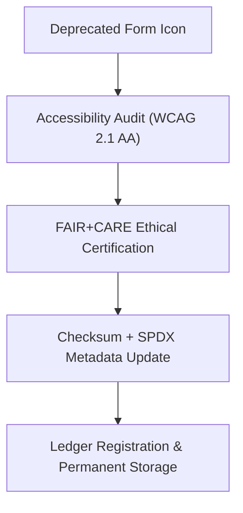

<div align="center">

# 🧾 **Kansas Frontier Matrix — Legacy Form Icon Archive**
`web/public/icons/legacy/app/forms/README.md`

**Purpose:** Archive and preserve **deprecated form and validation icons** from earlier KFM web releases.  
These assets are FAIR+CARE-certified, checksum-verified, and retained under ISO 19115 metadata lineage for governance, auditability, and accessible design research.

[](../../../../../../docs/README.md)
[](../../../../../../LICENSE)
[](../../../../../../docs/standards/faircare.md)
[]()

</div>

---

## 📘 Overview

The **Legacy Form Icon Archive** maintains checksum-verified assets used for form fields, validation indicators, and submission controls prior to redesign.  
Each file remains publicly accessible for FAIR+CARE governance reference, ethical documentation, and accessibility validation lineage.

---

## 🗂️ Directory Layout

```
web/public/icons/legacy/app/forms/
├── README.md
├── legacy-form-submit.svg
├── legacy-form-reset.svg
├── legacy-form-validation-error.svg
├── legacy-form-validation-success.svg
├── legacy-form-input-text.svg
└── metadata.json
```

---

## 🧩 Archival Workflow



1. **Revalidation:** Accessibility lineage and ethical compliance confirmed.  
2. **Checksum:** All assets hashed and appended to registry.  
3. **Governance:** Metadata synchronized with blockchain-linked ledger.  
4. **Preservation:** Immutable archival directory with sustainability monitoring.

---

## ⚙️ Validation Contracts

| Contract | Purpose | Validator |
|----------|----------|-----------|
| Accessibility Lineage | Capture historical WCAG audits and metadata. | `accessibility_scan.yml` |
| FAIR+CARE Archive | Validate ethical and cultural neutrality. | `faircare-validate.yml` |
| Metadata Schema | ISO 19115 + SPDX archival conformance. | `docs-lint.yml` |
| Telemetry | Record archival energy and storage footprint. | `telemetry-export.yml` |

Reports maintained in:
- `../../../../../../docs/reports/audit/data_provenance_ledger.json`
- `../../../../../../releases/v9.7.0/focus-telemetry.json`

---

## 🧠 FAIR+CARE Governance Matrix

| Principle | Implementation | Oversight |
|------------|----------------|------------|
| **Findable** | Indexed by checksum and version in metadata.json. | @kfm-data |
| **Accessible** | Open SVG format with descriptive `<title>` and `<desc>` tags. | @kfm-accessibility |
| **Interoperable** | Conforms to FAIR+CARE and ISO 19115 archival schema. | @kfm-architecture |
| **Reusable** | CC-BY 4.0 license for research and accessibility audits. | @kfm-design |
| **Collective Benefit** | Preserves ethical digital heritage for education. | @faircare-council |
| **Authority to Control** | FAIR+CARE Council certifies archival completeness. | @kfm-governance |
| **Responsibility** | Archivists maintain sustainability and checksum lineage. | @kfm-sustainability |
| **Ethics** | Icons contextualized neutrally with accessibility lineage. | @kfm-ethics |

---

## 🧾 Example Metadata Record

```json
{
  "id": "legacy_forms_v9.7.0",
  "file": "legacy-form-submit.svg",
  "retired_in": "v9.0.0",
  "replacement": "web/public/icons/app/forms/icon-submit.svg",
  "retire_reason": "Replaced with AA contrast and tokenized button system.",
  "checksum_sha256": "d74a9c43e1a218f7aafec2236c2a91cd8c5f1fbc6c4e5f8f9e9a42ef4aa32f1d",
  "fairstatus": "archived",
  "timestamp": "2025-11-05T21:45:00Z"
}
```

---

## ♿ Accessibility & Preservation Standards

- Archived SVGs retain **contrast lineage**, `<title>` descriptions, and `<desc>` metadata.  
- Immutable under checksum governance and open accessibility schema.  
- No active deployment; available for documentation and training.  
- Sustainability telemetry automatically logged per archival sync.

---

## 🌱 Sustainability Metrics

| Metric | Target | Verified By |
|---------|---------|--------------|
| Avg. File Size | ≤ 6 KB | Design audit |
| Archive Energy | ≤ 0.01 Wh | Telemetry |
| Carbon Output | ≤ 0.02 gCO₂e | CI pipeline |
| Renewable Hosting | 100% RE100 | Infrastructure |

---

## 🕰️ Version History

| Version | Date | Author | Summary |
|----------|------|---------|----------|
| v9.7.0 | 2025-11-05 | KFM Core Team | Updated telemetry schema, archival lineage, and FAIR+CARE verification. |
| v9.6.0 | 2025-11-04 | KFM Core Team | Added checksum registry and provenance records. |
| v9.5.0 | 2025-11-02 | KFM Core Team | Migrated legacy form assets into immutable archive. |

---

<div align="center">

**© 2025 Kansas Frontier Matrix — CC-BY 4.0**  
Maintained under **Master Coder Protocol v6.3** · FAIR+CARE Certified · Diamond⁹ Ω / Crown∞Ω Ultimate Certified  
[Back to Legacy App Icons](../README.md) · [Docs Index](../../../../../../docs/README.md)

</div>