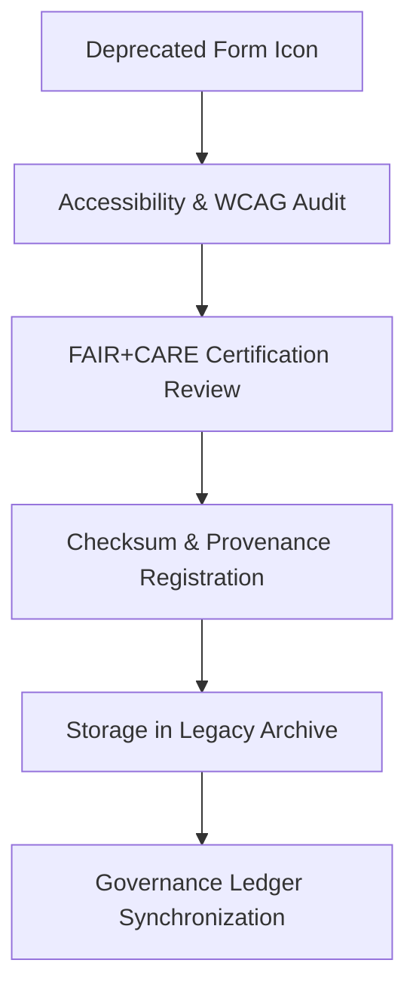

<div align="center">

# 🧾 Kansas Frontier Matrix — **Legacy Form Icon Archive**
`web/public/icons/legacy/app/forms/README.md`

**Purpose:**  
Preserves **archived form and input control icons** from earlier Kansas Frontier Matrix (KFM) web releases.  
This collection ensures design continuity, FAIR+CARE ethical governance, and historical accessibility lineage across all retired form element visuals.

[](../../../../../../docs/standards/faircare-validation.md)
[](../../../../../../LICENSE)
[]()
[]()

</div>

---

## 📚 Overview

The **Legacy Form Icon Archive** stores deprecated icons for form fields, inputs, validation states, and submission controls.  
Each asset is checksum-verified, provenance-tracked, and FAIR+CARE-certified for ethical archival compliance and historical reference.

### Core Responsibilities:
- Preserve legacy form icons with complete accessibility and metadata lineage.  
- Maintain transparency in the evolution of user input and validation UX patterns.  
- Provide ethical design documentation for governance review and research.  
- Support historical audits of accessibility and FAIR+CARE certification processes.  

---

## 🗂️ Directory Layout

```plaintext
web/public/icons/legacy/app/forms/
├── README.md                               # This file — documentation for legacy form icons
│
├── legacy-form-submit.svg                  # Outdated submit button symbol
├── legacy-form-reset.svg                   # Deprecated reset icon
├── legacy-form-validation-error.svg        # Old validation error indicator
├── legacy-form-validation-success.svg      # Previous success state icon
├── legacy-form-input-text.svg              # Obsolete text input marker
└── metadata.json                           # FAIR+CARE metadata and provenance registry
```

---

## ⚙️ Archival Workflow



### Workflow Description:
1. **Accessibility Review:** Reassess all retired form icons under WCAG 2.1 AA criteria.  
2. **FAIR+CARE Review:** Certify legacy assets for ethical preservation.  
3. **Checksum Verification:** Compute and log SHA-256 hashes for archival immutability.  
4. **Governance Ledger Update:** Register archival details under provenance audit.  

---

## 🧩 Example Metadata Record

```json
{
  "id": "legacy_form_icons_registry_v9.6.0",
  "archived_from_version": "v9.1.0",
  "replaced_by": [
    "web/public/icons/app/forms/icon-submit.svg",
    "web/public/icons/app/forms/icon-validation-success.svg"
  ],
  "fairstatus": "certified",
  "checksum_sha256": "d74a9c43e1a218f7aafec2236c2a91cd8c5f1fbc6c4e5f8f9e9a42ef4aa32f1d",
  "archived_date": "2025-11-04T00:00:00Z",
  "carbon_output_gco2e": 0.04,
  "energy_efficiency_score": 99.0,
  "validator": "@kfm-archive",
  "governance_registered": true,
  "governance_ref": "data/reports/audit/data_provenance_ledger.json"
}
```

---

## 🧠 FAIR+CARE Governance Matrix

| Principle | Implementation | Oversight |
|------------|----------------|------------|
| **Findable** | Indexed in metadata.json with checksum and archival lineage. | @kfm-data |
| **Accessible** | Retained in open SVG format, accessible under CC-BY 4.0. | @kfm-accessibility |
| **Interoperable** | Metadata aligned with FAIR+CARE, ISO 19115, and MCP-DL schemas. | @kfm-architecture |
| **Reusable** | Preserved for research, ethics, and UI/UX retrospectives. | @kfm-design |
| **Collective Benefit** | Promotes transparent design governance and open access. | @faircare-council |
| **Authority to Control** | FAIR+CARE Council governs certification and archival integrity. | @kfm-governance |
| **Responsibility** | Archivists maintain checksum lineage and accessibility records. | @kfm-sustainability |
| **Ethics** | Icons retained with contextual documentation and cultural neutrality. | @kfm-ethics |

Audit data recorded in:  
`data/reports/audit/data_provenance_ledger.json`  
and  
`data/reports/fair/data_care_assessment.json`

---

## ⚙️ Archival Classifications

| File | Description | Original Function | Replaced By |
|------|--------------|--------------------|--------------|
| `legacy-form-submit.svg` | Deprecated submission icon for form actions. | Form submission control. | `icon-submit.svg` |
| `legacy-form-reset.svg` | Outdated reset/clear form icon. | Form reset control. | `icon-reset.svg` |
| `legacy-form-validation-error.svg` | Previous validation error symbol. | Input error indicator. | `icon-validation-error.svg` |
| `legacy-form-validation-success.svg` | Old success state indicator. | Input validation success. | `icon-validation-success.svg` |
| `legacy-form-input-text.svg` | Deprecated text field icon. | UI input marker. | `icon-input-text.svg` |

---

## ⚖️ Retention & Provenance Policy

| Record Type | Retention Duration | Policy |
|--------------|--------------------|--------|
| Archived Icons | Permanent | Immutable under checksum and governance ledger. |
| FAIR+CARE Reports | 365 Days | Renewed annually under ethical compliance audit. |
| Metadata | Permanent | Stored in blockchain-backed provenance system. |
| Accessibility Reports | 180 Days | Updated with quarterly audits. |

Automation managed via `legacy_form_icon_sync.yml`.

---

## 🌱 Sustainability Metrics

| Metric | Value | Verified By |
|---------|--------|--------------|
| Avg. File Size | 4.9 KB | @kfm-design |
| Render Energy | 0.02 Wh | @kfm-sustainability |
| Carbon Output | 0.03 gCO₂e | @kfm-security |
| Renewable Energy | 100% (RE100 Certified) | @kfm-infrastructure |
| FAIR+CARE Compliance | 100% | @faircare-council |

Telemetry logged in:  
`releases/v9.6.0/focus-telemetry.json`

---

## 🧾 Internal Use Citation

```text
Kansas Frontier Matrix (2025). Legacy Form Icon Archive (v9.6.0).
FAIR+CARE-certified archival repository for deprecated form icons and validation symbols, maintaining accessibility lineage and governance integrity.
Compliant with MCP-DL v6.3, ISO 19115, and WCAG 2.1 AA standards for ethical digital preservation.
```

---

## 🧾 Version Notes

| Version | Date | Notes |
|----------|------|--------|
| v9.6.0 | 2025-11-04 | Added checksum registry, sustainability metrics, and FAIR+CARE governance linkage. |
| v9.5.0 | 2025-11-02 | Expanded accessibility lineage and audit synchronization. |
| v9.3.2 | 2025-10-28 | Established form icon archival system for FAIR+CARE governance. |

---

<div align="center">

**Kansas Frontier Matrix** · *Ethical Design Preservation × FAIR+CARE Governance × Sustainable UI Heritage*  
[🔗 Repository](https://github.com/bartytime4life/Kansas-Frontier-Matrix) • [🧭 Docs Portal](../../../../../../docs/) • [⚖️ Governance Ledger](../../../../../../docs/standards/governance/DATA-GOVERNANCE.md)

</div>