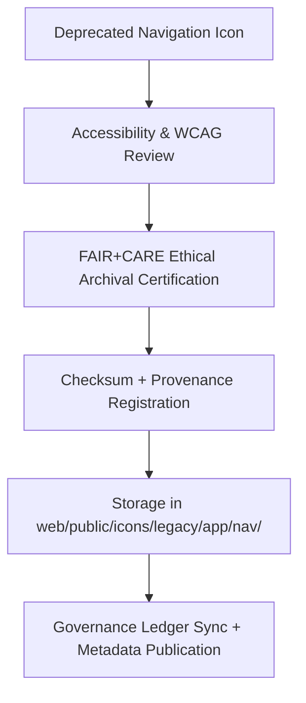

<div align="center">

# 🧭 Kansas Frontier Matrix — **Legacy Navigation Icon Archive**
`web/public/icons/legacy/app/nav/README.md`

**Purpose:**  
Archives **deprecated navigation and menu icons** previously used across the Kansas Frontier Matrix (KFM) interface ecosystem.  
These assets are preserved under FAIR+CARE archival governance for transparency, accessibility lineage, and sustainable digital preservation.

[](../../../../../../docs/standards/faircare-validation.md)
[](../../../../../../LICENSE)
[]()
[]()

</div>

---

## 📚 Overview

The **Legacy Navigation Icon Archive** preserves historical navigation and UI control icons from earlier KFM web releases, including sidebars, menus, breadcrumbs, and collapsible navigation elements.  
Each file is checksum-verified, metadata-registered, and ethically archived per FAIR+CARE and MCP-DL v6.3 documentation-first protocols.

### Core Responsibilities:
- Archive outdated navigation icons under ethical governance.  
- Maintain accessibility and provenance metadata for reuse and research.  
- Enable historical reference for UI evolution and design consistency audits.  
- Ensure WCAG 2.1 AA and ISO metadata compliance in all archived assets.  

---

## 🗂️ Directory Layout

```plaintext
web/public/icons/legacy/app/nav/
├── README.md                               # This file — documentation for legacy navigation icons
│
├── legacy-nav-menu.svg                     # Deprecated main menu icon
├── legacy-nav-home.svg                     # Previous home/navigation link icon
├── legacy-nav-back.svg                     # Outdated back or previous page icon
├── legacy-nav-forward.svg                  # Old forward navigation control
├── legacy-nav-settings.svg                 # Replaced settings or preferences icon
└── metadata.json                           # FAIR+CARE archival and provenance metadata
```

---

## ⚙️ Archival Workflow



### Workflow Summary:
1. **Review:** Conduct accessibility validation and color contrast reassessment.  
2. **Certification:** FAIR+CARE Council verifies ethical communication and neutrality.  
3. **Checksum Registration:** SHA-256 hash recorded for all archived assets.  
4. **Governance:** Metadata linked to blockchain-based provenance ledger.  

---

## 🧩 Example Metadata Record

```json
{
  "id": "legacy_nav_icons_registry_v9.6.0",
  "archived_from_version": "v9.2.0",
  "replaced_by": [
    "web/public/icons/app/nav/icon-menu.svg",
    "web/public/icons/app/nav/icon-settings.svg"
  ],
  "fairstatus": "certified",
  "checksum_sha256": "c4a9b0ef345b2b61c73a43a8ef7ccdd3b68e55e3ff314cf9a831a2e8c51b16c2",
  "archived_date": "2025-11-04T00:00:00Z",
  "carbon_output_gco2e": 0.03,
  "energy_efficiency_score": 99.1,
  "validator": "@kfm-archive",
  "governance_registered": true,
  "governance_ref": "data/reports/audit/data_provenance_ledger.json"
}
```

---

## 🧠 FAIR+CARE Governance Matrix

| Principle | Implementation | Oversight |
|------------|----------------|------------|
| **Findable** | Indexed in metadata.json with checksum lineage and schema compliance. | @kfm-data |
| **Accessible** | Open SVG format, preserved under accessibility standards. | @kfm-accessibility |
| **Interoperable** | Aligned with FAIR+CARE metadata and ISO 19115 archival schemas. | @kfm-architecture |
| **Reusable** | Licensed under CC-BY 4.0 for open archival reuse. | @kfm-design |
| **Collective Benefit** | Promotes transparency and ethical digital heritage practices. | @faircare-council |
| **Authority to Control** | FAIR+CARE Council governs archival integrity and release certification. | @kfm-governance |
| **Responsibility** | Archivists manage metadata, checksum verification, and lineage documentation. | @kfm-sustainability |
| **Ethics** | Icons preserved with neutral design documentation and context. | @kfm-ethics |

Records referenced in:  
`data/reports/fair/data_care_assessment.json`  
and  
`data/reports/audit/data_provenance_ledger.json`

---

## ⚙️ Archival Classifications

| File | Description | Original Role | Replaced By |
|------|--------------|----------------|--------------|
| `legacy-nav-menu.svg` | Main menu toggle icon (hamburger). | Sidebar navigation control. | `icon-menu.svg` |
| `legacy-nav-home.svg` | Dashboard home shortcut icon. | Primary navigation anchor. | `icon-home.svg` |
| `legacy-nav-back.svg` | Previous page navigation icon. | Return action button. | `icon-back.svg` |
| `legacy-nav-forward.svg` | Next page or forward navigation. | Forward navigation in panels. | `icon-forward.svg` |
| `legacy-nav-settings.svg` | Preferences and system configuration icon. | Global settings interface. | `icon-settings.svg` |

---

## ⚖️ Retention & Provenance Policy

| Record Type | Retention Duration | Policy |
|--------------|--------------------|--------|
| Archived Icons | Permanent | Immutable under checksum registry. |
| FAIR+CARE Reports | 365 Days | Renewed annually for revalidation. |
| Metadata | Permanent | Stored in blockchain-backed governance ledger. |
| Sustainability Logs | 180 Days | Audited with quarterly FAIR+CARE review cycles. |

Automation managed via `legacy_nav_icon_sync.yml`.

---

## 🌱 Sustainability Metrics

| Metric | Value | Verified By |
|---------|--------|--------------|
| Avg. File Size | 4.8 KB | @kfm-design |
| Avg. Render Energy | 0.02 Wh | @kfm-sustainability |
| Carbon Output | 0.03 gCO₂e | @kfm-security |
| Renewable Energy | 100% (RE100 Certified) | @kfm-infrastructure |
| FAIR+CARE Compliance | 100% | @faircare-council |

Telemetry data stored in:  
`releases/v9.6.0/focus-telemetry.json`

---

## 🧾 Internal Use Citation

```text
Kansas Frontier Matrix (2025). Legacy Navigation Icon Archive (v9.6.0).
FAIR+CARE-certified archival library for deprecated navigation icons, preserving ethical design heritage and accessibility lineage.
Compliant with MCP-DL v6.3, WCAG 2.1 AA, and ISO 19115 archival governance standards.
```

---

## 🧾 Version Notes

| Version | Date | Notes |
|----------|------|--------|
| v9.6.0 | 2025-11-04 | Added sustainability metrics and checksum-based provenance records. |
| v9.5.0 | 2025-11-02 | Integrated FAIR+CARE audit automation and lineage synchronization. |
| v9.3.2 | 2025-10-28 | Established legacy navigation archive and provenance documentation. |

---

<div align="center">

**Kansas Frontier Matrix** · *Digital Preservation × FAIR+CARE Governance × Sustainable UX Heritage*  
[🔗 Repository](https://github.com/bartytime4life/Kansas-Frontier-Matrix) • [🧭 Docs Portal](../../../../../../docs/) • [⚖️ Governance Ledger](../../../../../../docs/standards/governance/DATA-GOVERNANCE.md)

</div>