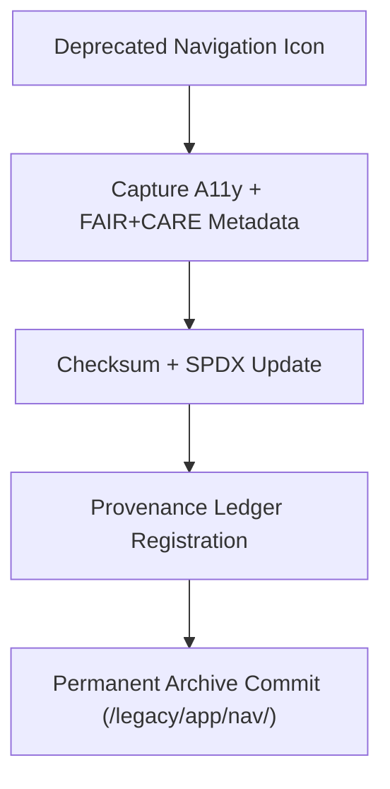

<div align="center">

# 🧭 **Kansas Frontier Matrix — Legacy Navigation Icon Archive**
`web/public/icons/legacy/app/nav/README.md`

**Purpose:** Archive all **deprecated navigation and menu icons** from prior KFM web releases.  
Assets are preserved with FAIR+CARE lineage, WCAG metadata, and checksum provenance for transparent, ethical design heritage under **MCP v6.3**.

[](../../../../../../docs/README.md)
[](../../../../../../LICENSE)
[](../../../../../../docs/standards/faircare.md)
[]()

</div>

---

## 📘 Overview

The **Legacy Navigation Icon Archive** maintains historic icons used for menus, home links, back/forward actions, and settings.  
These artifacts remain publicly accessible for audit reproducibility, accessibility research, and governance provenance mapping.

---

## 🗂️ Directory Layout

```
web/public/icons/legacy/app/nav/
├── README.md
├── legacy-nav-menu.svg
├── legacy-nav-home.svg
├── legacy-nav-back.svg
├── legacy-nav-forward.svg
├── legacy-nav-settings.svg
└── metadata.json
```

---

## 🧩 Archival Workflow



1. **Revalidation:** WCAG contrast + semantics recorded as lineage.  
2. **Verification:** SHA-256 checksums and license stored in registry.  
3. **Governance:** Archive registration added to provenance ledgers.  
4. **Storage:** Assets retained permanently for historical reference.

---

## ⚙️ Validation Contracts

| Contract | Purpose | Validator |
|----------|----------|-----------|
| Accessibility Lineage | Preserve WCAG history + alt/title context | `accessibility_scan.yml` |
| FAIR+CARE Archive | Ethical retention & neutrality | `faircare-validate.yml` |
| Metadata Schema | ISO 19115 + SPDX archival format | `docs-lint.yml` |
| Telemetry | Archive energy and storage footprint | `telemetry-export.yml` |

Artifacts logged in:
- `../../../../../../docs/reports/audit/data_provenance_ledger.json`
- `../../../../../../releases/v9.7.0/focus-telemetry.json`

---

## 🧠 FAIR+CARE Governance Matrix

| Principle | Implementation | Oversight |
|------------|----------------|------------|
| **Findable** | Indexed by checksum and retired version in metadata.json. | @kfm-data |
| **Accessible** | SVGs include `<title>` and `<desc>` archival context. | @kfm-accessibility |
| **Interoperable** | ISO 19115 archival metadata alignment. | @kfm-architecture |
| **Reusable** | CC-BY 4.0 license; suitable for research and teaching. | @kfm-design |
| **Collective Benefit** | Documents UI evolution for open design scholarship. | @faircare-council |
| **Authority to Control** | Council certifies archival entries and replacements. | @kfm-governance |
| **Responsibility** | Archivists maintain checksums, lineage, and sustainability logs. | @kfm-sustainability |
| **Ethics** | Preserved with neutral description to avoid misuse. | @kfm-ethics |

---

## 🧾 Example Metadata Record

```json
{
  "id": "legacy_nav_v9.7.0",
  "file": "legacy-nav-menu.svg",
  "retired_in": "v9.0.0",
  "replacement": "web/public/icons/app/nav/icon-menu.svg",
  "retire_reason": "Updated for AA contrast and tokenized color system",
  "checksum_sha256": "c4a9b0ef345b2b61c73a43a8ef7ccdd3b68e55e3ff314cf9a831a2e8c51b16c2",
  "fairstatus": "archived",
  "timestamp": "2025-11-05T21:25:00Z"
}
```

---

## ♿ Accessibility & Preservation Standards

- Archived SVGs keep **title/desc** and contrast lineage metadata.  
- Not used in live UI; retained for documentation only.  
- Color tokens mapped to modern equivalents for comparison.  
- Telemetry monitors storage and archival energy footprint.

---

## 🌱 Sustainability Metrics

| Metric | Target | Verified By |
|-------|--------|-------------|
| Avg. File Size | ≤ 6 KB | Design audit |
| Archive Energy | ≤ 0.01 Wh | Telemetry |
| Carbon Output | ≤ 0.02 gCO₂e | CI telemetry |
| Renewable Hosting | 100% RE100 | Infrastructure |

---

## 🕰️ Version History

| Version | Date | Author | Summary |
|----------|------|---------|----------|
| v9.7.0 | 2025-11-05 | KFM Core Team | Upgraded archive: telemetry schema v1, governance mapping, a11y lineage. |
| v9.6.0 | 2025-11-04 | KFM Core Team | Added checksum registry and archival metadata. |
| v9.5.0 | 2025-11-02 | KFM Core Team | Migrated v8 nav icons to permanent archive. |

---

<div align="center">

**© 2025 Kansas Frontier Matrix — CC-BY 4.0**  
Maintained under **Master Coder Protocol v6.3** · FAIR+CARE Certified · Diamond⁹ Ω / Crown∞Ω Ultimate Certified  
[Back to Legacy App Icons](../README.md) · [Docs Index](../../../../../../docs/README.md)

</div>