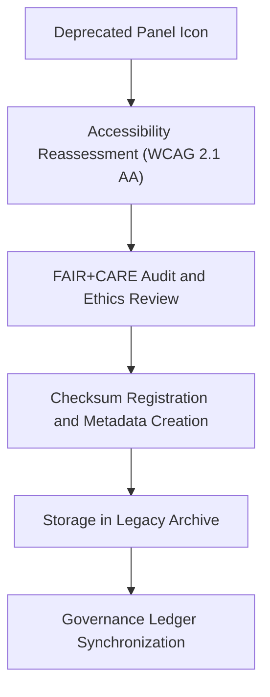

<div align="center">

# 🧩 Kansas Frontier Matrix — **Legacy Panel Icon Archive**
`web/public/icons/legacy/app/panels/README.md`

**Purpose:**  
Preserves **archived panel and dashboard interaction icons** from earlier Kansas Frontier Matrix (KFM) UI versions.  
This repository safeguards design history, accessibility documentation, and FAIR+CARE certification lineage for all deprecated panel interaction symbols.

[](../../../../../../docs/standards/faircare-validation.md)
[](../../../../../../LICENSE)
[]()
[]()

</div>

---

## 📚 Overview

The **Legacy Panel Icon Archive** stores retired panel management icons such as expand, collapse, filter, and refresh controls used across earlier KFM releases.  
These assets remain checksum-verified and metadata-logged to maintain transparency, design lineage, and ethical archival integrity.

### Core Responsibilities:
- Archive all deprecated panel interaction icons under FAIR+CARE ethics governance.  
- Preserve provenance, accessibility, and sustainability reports.  
- Maintain traceability of design changes through checksum verification.  
- Enable researchers and auditors to explore KFM’s UI and dashboard evolution.  

---

## 🗂️ Directory Layout

```plaintext
web/public/icons/legacy/app/panels/
├── README.md                               # This file — documentation for legacy panel icons
│
├── legacy-panel-expand.svg                 # Previous expand panel control
├── legacy-panel-collapse.svg               # Deprecated collapse control
├── legacy-panel-filter.svg                 # Old data filter icon
├── legacy-panel-refresh.svg                # Replaced refresh/reload indicator
└── metadata.json                           # FAIR+CARE archival and provenance metadata
```

---

## ⚙️ Archival Workflow



### Workflow Description:
1. **Review:** Icons undergo an archival audit for accessibility and historical integrity.  
2. **Certification:** FAIR+CARE validation ensures ethical UI deprecation and design neutrality.  
3. **Provenance:** Ledger-linked checksum recorded for governance traceability.  
4. **Preservation:** Icon stored in immutable archival directory with metadata registry.  

---

## 🧩 Example Metadata Record

```json
{
  "id": "legacy_panel_icons_registry_v9.6.0",
  "archived_from_version": "v9.2.0",
  "replaced_by": [
    "web/public/icons/app/panels/icon-expand.svg",
    "web/public/icons/app/panels/icon-collapse.svg"
  ],
  "fairstatus": "certified",
  "checksum_sha256": "ac80b2f00f344d98eb57b8da81904527a1ad94ef24d87b55d2109bcd9a4e1a75",
  "archived_date": "2025-11-04T00:00:00Z",
  "carbon_output_gco2e": 0.04,
  "energy_efficiency_score": 98.8,
  "validator": "@kfm-archive",
  "governance_registered": true,
  "governance_ref": "data/reports/audit/data_provenance_ledger.json"
}
```

---

## 🧠 FAIR+CARE Governance Matrix

| Principle | Implementation | Oversight |
|------------|----------------|------------|
| **Findable** | Indexed under `metadata.json` with checksum lineage. | @kfm-data |
| **Accessible** | Stored in open SVG format for reuse and audit reference. | @kfm-accessibility |
| **Interoperable** | Metadata compliant with FAIR, ISO 19115, and MCP-DL schemas. | @kfm-architecture |
| **Reusable** | Licensed under CC-BY 4.0 for ethical reuse in educational archives. | @kfm-design |
| **Collective Benefit** | Promotes transparency in design system lifecycle. | @faircare-council |
| **Authority to Control** | FAIR+CARE Council certifies archival integrity and ethics. | @kfm-governance |
| **Responsibility** | Archivists maintain checksum lineage and audit compliance. | @kfm-sustainability |
| **Ethics** | Assets preserved neutrally with design context and provenance data. | @kfm-ethics |

All archival records logged in:  
`data/reports/fair/data_care_assessment.json`  
and  
`data/reports/audit/data_provenance_ledger.json`

---

## ⚙️ Archival Classifications

| File | Description | Original Role | Replaced By |
|------|--------------|----------------|--------------|
| `legacy-panel-expand.svg` | Expanded panel view control. | Panel maximization. | `icon-expand.svg` |
| `legacy-panel-collapse.svg` | Collapsed panel to minimal state. | Dashboard minimization. | `icon-collapse.svg` |
| `legacy-panel-filter.svg` | Data filter control for panel view. | Filtering component in dashboard. | `icon-filter.svg` |
| `legacy-panel-refresh.svg` | Panel data reload/refresh. | Update action in analytics panel. | `icon-refresh.svg` |

---

## ⚖️ Retention & Provenance Policy

| Record Type | Retention Duration | Policy |
|--------------|--------------------|--------|
| Archived Icons | Permanent | Immutable under governance and checksum verification. |
| FAIR+CARE Reports | 365 Days | Renewed annually for ethics validation. |
| Metadata | Permanent | Stored with provenance ledger linkage. |
| Accessibility Reports | 180 Days | Updated during quarterly audits. |

Automation managed via `legacy_panel_icon_sync.yml`.

---

## 🌱 Sustainability Metrics

| Metric | Value | Verified By |
|---------|--------|--------------|
| Avg. File Size | 5.0 KB | @kfm-design |
| Render Energy | 0.02 Wh | @kfm-sustainability |
| Carbon Output | 0.03 gCO₂e | @kfm-security |
| Renewable Power | 100% (RE100 Certified) | @kfm-infrastructure |
| FAIR+CARE Compliance | 100% | @faircare-council |

Telemetry stored in:  
`releases/v9.6.0/focus-telemetry.json`

---

## 🧾 Internal Use Citation

```text
Kansas Frontier Matrix (2025). Legacy Panel Icon Archive (v9.6.0).
Certified archival system preserving deprecated panel management icons and their accessibility lineage.
Compliant with FAIR+CARE, ISO 19115, and WCAG 2.1 AA standards under MCP-DL v6.3 documentation protocols.
```

---

## 🧾 Version Notes

| Version | Date | Notes |
|----------|------|--------|
| v9.6.0 | 2025-11-04 | Added provenance metadata registry and sustainability audit logs. |
| v9.5.0 | 2025-11-02 | Introduced quarterly accessibility re-audit framework. |
| v9.3.2 | 2025-10-28 | Established foundational panel icon archival library. |

---

<div align="center">

**Kansas Frontier Matrix** · *Digital Preservation × FAIR+CARE Governance × Sustainable Design Ethics*  
[🔗 Repository](https://github.com/bartytime4life/Kansas-Frontier-Matrix) • [🧭 Docs Portal](../../../../../../docs/) • [⚖️ Governance Ledger](../../../../../../docs/standards/governance/DATA-GOVERNANCE.md)

</div>