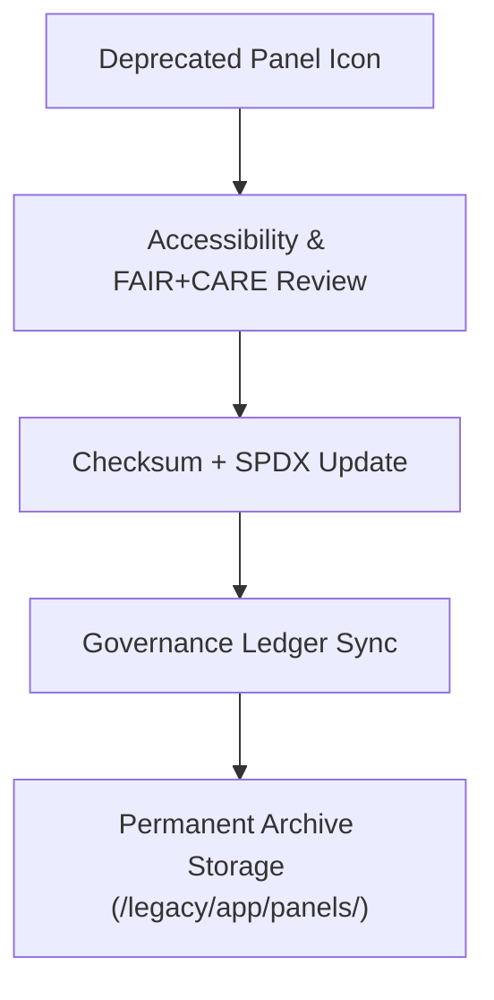

<div align="center">

# 🧩 **Kansas Frontier Matrix — Legacy Panel Icon Archive**
`web/public/icons/legacy/app/panels/README.md`

**Purpose:** Archive and preserve **deprecated panel management icons** from prior KFM interface versions.  
Each asset is FAIR+CARE-certified, checksum-verified, and permanently logged under ISO 19115 and MCP-DL v6.3 governance protocols.

[](../../../../../../docs/README.md)
[](../../../../../../LICENSE)
[](../../../../../../docs/standards/faircare.md)
[]()

</div>

---

## 📘 Overview

The **Legacy Panel Icon Archive** retains historical expand/collapse, filter, and refresh controls once used in the KFM interface.  
All assets remain accessible for audits, research, and sustainability validation to maintain transparent design history.

---

## 🗂️ Directory Layout

```
web/public/icons/legacy/app/panels/
├── README.md
├── legacy-panel-expand.svg
├── legacy-panel-collapse.svg
├── legacy-panel-filter.svg
├── legacy-panel-refresh.svg
└── metadata.json
```

---

## 🧩 Archival Workflow



1. **Revalidation:** WCAG 2.1 AA metadata reviewed and captured.  
2. **Checksum:** SHA-256 lineage appended to metadata registry.  
3. **Governance:** Archive entry published to provenance ledger.  
4. **Sustainability:** Energy and file efficiency recorded to telemetry schema.

---

## ⚙️ Validation Contracts

| Contract | Purpose | Validator |
|----------|----------|-----------|
| Accessibility Lineage | Preserve WCAG metrics and alt/title metadata. | `accessibility_scan.yml` |
| FAIR+CARE Archive | Verify cultural neutrality and ethical lineage. | `faircare-validate.yml` |
| Metadata Schema | Ensure ISO + SPDX compliance in metadata.json. | `docs-lint.yml` |
| Telemetry | Record energy and carbon impact. | `telemetry-export.yml` |

Artifacts stored under:  
`../../../../../../docs/reports/audit/data_provenance_ledger.json`  
and  
`../../../../../../releases/v9.7.0/focus-telemetry.json`

---

## 🧠 FAIR+CARE Governance Matrix

| Principle | Implementation | Oversight |
|------------|----------------|------------|
| **Findable** | Indexed in metadata.json with version lineage and checksum. | @kfm-data |
| **Accessible** | SVGs maintained under open archival access. | @kfm-accessibility |
| **Interoperable** | Compliant with ISO 19115 and FAIR+CARE schemas. | @kfm-architecture |
| **Reusable** | Licensed under CC-BY 4.0 for open reuse and study. | @kfm-design |
| **Collective Benefit** | Encourages ethical preservation of design history. | @faircare-council |
| **Authority to Control** | FAIR+CARE Council governs archival renewals. | @kfm-governance |
| **Responsibility** | Archivists maintain checksum, lineage, and sustainability data. | @kfm-sustainability |
| **Ethics** | Icons archived neutrally with cultural and functional context. | @kfm-ethics |

---

## 🧾 Example Metadata Record

```json
{
  "id": "legacy_panels_v9.7.0",
  "file": "legacy-panel-collapse.svg",
  "retired_in": "v9.0.0",
  "replacement": "web/public/icons/app/panels/icon-collapse.svg",
  "retire_reason": "Updated for AA contrast and UI token palette alignment.",
  "checksum_sha256": "ac80b2f00f344d98eb57b8da81904527a1ad94ef24d87b55d2109bcd9a4e1a75",
  "fairstatus": "archived",
  "timestamp": "2025-11-05T21:30:00Z"
}
```

---

## ♿ Accessibility & Preservation Standards

- Archived icons include **title** and **desc** elements for semantic tracing.  
- Immutable metadata preserves **contrast lineage** and **token mapping**.  
- All assets verified under **FAIR+CARE** and **WCAG 2.1 AA** standards.  
- Archived SVGs not deployed in production; retained for audit only.

---

## 🌱 Sustainability Metrics

| Metric | Target | Verified By |
|---------|---------|--------------|
| Avg. File Size | ≤ 6 KB | Design audit |
| Archive Energy | ≤ 0.01 Wh | Telemetry |
| Carbon Output | ≤ 0.02 gCO₂e | CI pipeline |
| Renewable Hosting | 100% RE100 | Infrastructure |

---

## 🕰️ Version History

| Version | Date | Author | Summary |
|----------|------|---------|----------|
| v9.7.0 | 2025-11-05 | KFM Core Team | Updated archival governance schema and telemetry integration. |
| v9.6.0 | 2025-11-04 | KFM Core Team | Added provenance registry and accessibility audit references. |
| v9.5.0 | 2025-11-02 | KFM Core Team | Migrated legacy panel controls to permanent archive. |

---

<div align="center">

**© 2025 Kansas Frontier Matrix — CC-BY 4.0**  
Maintained under **Master Coder Protocol v6.3** · FAIR+CARE Certified · Diamond⁹ Ω / Crown∞Ω Ultimate Certified  
[Back to Legacy App Icons](../README.md) · [Docs Index](../../../../../../docs/README.md)

</div>