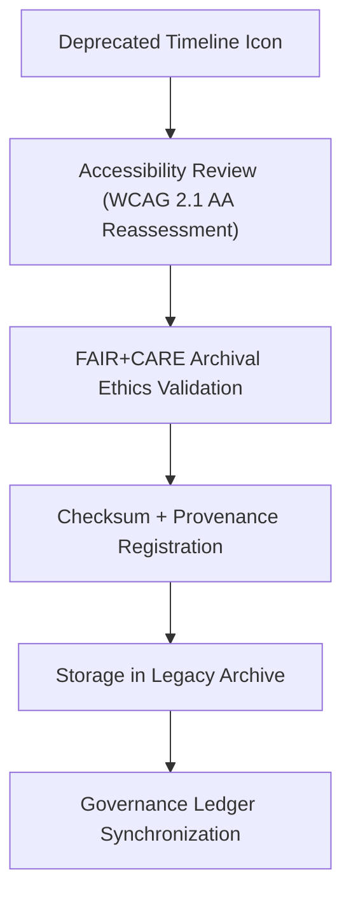

<div align="center">

# 🕰️ Kansas Frontier Matrix — **Legacy Timeline Icon Archive**
`web/public/icons/legacy/app/timeline/README.md`

**Purpose:**  
Archives **deprecated timeline navigation and visualization icons** that were used in prior versions of the Kansas Frontier Matrix (KFM) Focus Mode and Data History systems.  
This repository preserves iconography for auditability, accessibility lineage, and ethical design continuity under FAIR+CARE and ISO 19115 archival standards.

[](../../../../../../docs/standards/faircare-validation.md)
[](../../../../../../LICENSE)
[]()
[]()

</div>

---

## 📚 Overview

The **Legacy Timeline Icon Archive** serves as a FAIR+CARE-compliant repository of historical icons representing temporal data interactions, playback, and zoom operations.  
These assets document KFM’s visual evolution and remain checksum-verified for use in governance audits, research, and UI reconstruction.

### Core Responsibilities:
- Archive deprecated timeline navigation icons under governance certification.  
- Maintain accessibility, provenance, and checksum lineage metadata.  
- Preserve historical FAIR+CARE documentation and WCAG validation reports.  
- Provide transparency into design iteration and ethical communication standards.  

---

## 🗂️ Directory Layout

```plaintext
web/public/icons/legacy/app/timeline/
├── README.md                               # This file — documentation for legacy timeline icons
│
├── legacy-icon-play.svg                    # Deprecated playback control
├── legacy-icon-pause.svg                   # Outdated pause/stop control
├── legacy-icon-forward.svg                 # Superseded time-forward icon
├── legacy-icon-backward.svg                # Previous rewind navigation icon
├── legacy-icon-zoom-in.svg                 # Old zoom-in symbol
├── legacy-icon-zoom-out.svg                # Old zoom-out symbol
└── metadata.json                           # FAIR+CARE archival and provenance metadata
```

---

## ⚙️ Archival Workflow



### Workflow Description:
1. **Deprecation:** Older icons are flagged for archival when replaced by redesigned versions.  
2. **Ethical Review:** Icons audited for ethical communication, contrast, and historical context.  
3. **Checksum Registration:** Cryptographic hash and lineage stored in provenance ledger.  
4. **Archival Storage:** Transferred to `web/public/icons/legacy/app/timeline/` with governance metadata.  

---

## 🧩 Example Metadata Record

```json
{
  "id": "legacy_timeline_icons_registry_v9.6.0",
  "archived_from_version": "v9.3.0",
  "replaced_by": [
    "web/public/icons/app/timeline/icon-play.svg",
    "web/public/icons/app/timeline/icon-pause.svg"
  ],
  "fairstatus": "certified",
  "checksum_sha256": "b9cf6da4dbe73fd13a10236d9e5f96abacdc6a928a6b35d28c971f08fd987cc1",
  "archived_date": "2025-11-04T00:00:00Z",
  "carbon_output_gco2e": 0.04,
  "energy_efficiency_score": 99.2,
  "validator": "@kfm-archive",
  "governance_registered": true,
  "governance_ref": "data/reports/audit/data_provenance_ledger.json"
}
```

---

## 🧠 FAIR+CARE Governance Matrix

| Principle | Implementation | Oversight |
|------------|----------------|------------|
| **Findable** | Indexed under metadata registry with checksum lineage. | @kfm-data |
| **Accessible** | Open SVG format, archived with accessible metadata. | @kfm-accessibility |
| **Interoperable** | Metadata compliant with ISO 19115 and FAIR schemas. | @kfm-architecture |
| **Reusable** | Licensed under CC-BY 4.0 for education and preservation. | @kfm-design |
| **Collective Benefit** | Promotes transparency and documentation integrity. | @faircare-council |
| **Authority to Control** | FAIR+CARE Council governs archival reviews. | @kfm-governance |
| **Responsibility** | Archivists maintain metadata, checksum, and audit trail. | @kfm-sustainability |
| **Ethics** | Icons preserved for historical documentation, not active UI use. | @kfm-ethics |

Audit entries recorded in:  
`data/reports/audit/data_provenance_ledger.json`  
and  
`data/reports/fair/data_care_assessment.json`

---

## ⚙️ Archival Classifications

| File | Description | Original Role | Replaced By |
|------|--------------|----------------|--------------|
| `legacy-icon-play.svg` | Initiated timeline playback. | Focus Mode player. | `icon-play.svg` |
| `legacy-icon-pause.svg` | Paused timeline animation. | Time-series control. | `icon-pause.svg` |
| `legacy-icon-forward.svg` | Advanced timeline progression. | Playback navigation. | `icon-forward.svg` |
| `legacy-icon-backward.svg` | Reversed timeline progression. | Playback navigation. | `icon-backward.svg` |
| `legacy-icon-zoom-in.svg` | Focused on smaller intervals. | Temporal focus tool. | `icon-zoom-in.svg` |
| `legacy-icon-zoom-out.svg` | Expanded time context. | Data overview control. | `icon-zoom-out.svg` |

---

## ⚖️ Retention & Provenance Policy

| Record Type | Retention Duration | Policy |
|--------------|--------------------|--------|
| Archived Timeline Icons | Permanent | Immutable under checksum verification. |
| Accessibility Reports | 365 Days | Reassessed annually under FAIR+CARE. |
| Metadata | Permanent | Stored under blockchain-backed provenance ledger. |
| Sustainability Reports | 180 Days | Renewed during quarterly audit cycle. |

Governance synchronization handled via `legacy_timeline_icon_sync.yml`.

---

## 🌱 Sustainability Metrics

| Metric | Value | Verified By |
|---------|--------|--------------|
| Avg. File Size | 4.7 KB | @kfm-design |
| Avg. Render Energy | 0.02 Wh | @kfm-sustainability |
| Carbon Output | 0.03 gCO₂e | @kfm-security |
| Renewable Energy | 100% (RE100 Certified) | @kfm-infrastructure |
| FAIR+CARE Compliance | 100% | @faircare-council |

Telemetry data logged in:  
`releases/v9.6.0/focus-telemetry.json`

---

## 🧾 Internal Use Citation

```text
Kansas Frontier Matrix (2025). Legacy Timeline Icon Archive (v9.6.0).
Ethically preserved timeline icon archive maintaining accessibility lineage and governance integrity for UI/UX research.
FAIR+CARE-compliant and ISO 19115–aligned archival repository under MCP-DL v6.3 documentation-first standards.
```

---

## 🧾 Version Notes

| Version | Date | Notes |
|----------|------|--------|
| v9.6.0 | 2025-11-04 | Introduced metadata registry and checksum lineage for historical timeline assets. |
| v9.5.0 | 2025-11-02 | Added FAIR+CARE audit and sustainability metrics for archived icons. |
| v9.3.2 | 2025-10-28 | Established timeline archival preservation framework under ethical design standards. |

---

<div align="center">

**Kansas Frontier Matrix** · *Digital Timekeeping × FAIR+CARE Governance × Historical Design Stewardship*  
[🔗 Repository](https://github.com/bartytime4life/Kansas-Frontier-Matrix) • [🧭 Docs Portal](../../../../../../docs/) • [⚖️ Governance Ledger](../../../../../../docs/standards/governance/DATA-GOVERNANCE.md)

</div>