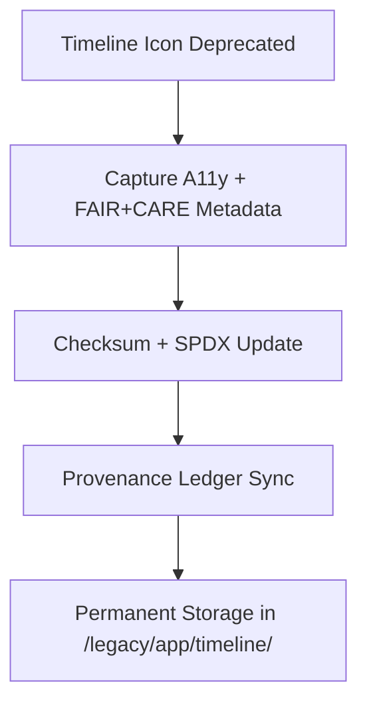

<div align="center">

# 🕰️ **Kansas Frontier Matrix — Legacy Timeline Icon Archive**
`web/public/icons/legacy/app/timeline/README.md`

**Purpose:** Archive **deprecated timeline navigation and time-series visualization icons** from prior KFM releases.  
Assets are preserved with FAIR+CARE, ISO 19115 metadata, and checksum lineage to ensure transparent design history and accessibility reproducibility under **MCP v6.3**.

[](../../../../../../docs/README.md)
[](../../../../../../LICENSE)
[](../../../../../../docs/standards/faircare.md)
[]()

</div>

---

## 📘 Overview

The **Legacy Timeline Icon Archive** retains superseded icons for playback, navigation, and zoom interactions used in Focus Mode and time-based dashboards.  
All archived icons are available for **audit reproducibility**, **accessibility research**, and **open governance provenance**.

---

## 🗂️ Directory Layout

```
web/public/icons/legacy/app/timeline/
├── README.md
├── legacy-icon-play.svg
├── legacy-icon-pause.svg
├── legacy-icon-forward.svg
├── legacy-icon-backward.svg
├── legacy-icon-zoom-in.svg
├── legacy-icon-zoom-out.svg
└── metadata.json
```

---

## 🧩 Archival Workflow



1. **Revalidation:** WCAG AA lineage and color token mapping preserved.  
2. **Verification:** SHA-256 checksums recorded with license fields.  
3. **Governance:** Archive entries linked to ledger reports and replacements.  
4. **Storage:** Icons retained permanently for historical documentation.

---

## ⚙️ Validation Contracts

| Contract | Purpose | Validator |
|----------|----------|-----------|
| Accessibility Lineage | Maintain WCAG history + alt/title context | `accessibility_scan.yml` |
| FAIR+CARE Archive | Ethical retention and context notes | `faircare-validate.yml` |
| Metadata Schema | ISO 19115 + SPDX archival conformance | `docs-lint.yml` |
| Telemetry | Archive energy + storage footprint | `telemetry-export.yml` |

Artifacts recorded in:
- `../../../../../../docs/reports/audit/data_provenance_ledger.json`
- `../../../../../../releases/v9.7.0/focus-telemetry.json`

---

## 🧠 FAIR+CARE Governance Matrix

| Principle | Implementation | Oversight |
|------------|----------------|------------|
| **Findable** | Indexed by checksum and retired version in metadata.json. | @kfm-data |
| **Accessible** | SVGs include `<title>` and `<desc>` archival context. | @kfm-accessibility |
| **Interoperable** | Aligned with ISO 19115 + FAIR+CARE archival schemas. | @kfm-architecture |
| **Reusable** | CC-BY 4.0 license for research and education reuse. | @kfm-design |
| **Collective Benefit** | Documents ethical evolution of time-based UI. | @faircare-council |
| **Authority to Control** | Board certifies archival retention and replacements. | @kfm-governance |
| **Responsibility** | Archivists maintain checksums, lineage, and sustainability logs. | @kfm-sustainability |
| **Ethics** | Preserved neutrally with context to avoid misuse. | @kfm-ethics |

---

## 🧾 Example Metadata Record

```json
{
  "id": "legacy_timeline_v9.7.0",
  "file": "legacy-icon-zoom-in.svg",
  "retired_in": "v9.0.0",
  "replacement": "web/public/icons/app/timeline/icon-zoom-in.svg",
  "retire_reason": "Updated for AA contrast and tokenized geometry",
  "checksum_sha256": "b9cf6da4dbe73fd13a10236d9e5f96abacdc6a928a6b35d28c971f08fd987cc1",
  "fairstatus": "archived",
  "timestamp": "2025-11-05T21:40:00Z"
}
```

---

## ♿ Accessibility & Preservation Standards

- Archived SVGs retain **title/desc** and **contrast lineage** metadata.  
- Icons are read-only; not used in active UI.  
- Token mapping to modern replacements documented for reference.  
- Telemetry tracks archival sustainability impact.

---

## 🌱 Sustainability Metrics

| Metric | Target | Verified By |
|-------|--------|-------------|
| Avg. File Size | ≤ 6 KB | Design audit |
| Archive Energy | ≤ 0.01 Wh | Telemetry |
| Carbon Output | ≤ 0.02 gCO₂e | CI pipeline |
| Renewable Hosting | 100% RE100 | Infrastructure |

---

## 🕰️ Version History

| Version | Date | Author | Summary |
|----------|------|---------|----------|
| v9.7.0 | 2025-11-05 | KFM Core Team | Upgraded archive with telemetry schema v1 and governance mapping. |
| v9.6.0 | 2025-11-04 | KFM Core Team | Added archival registry and checksum lineage. |
| v9.5.0 | 2025-11-02 | KFM Core Team | Migrated v8 timeline icons into permanent archive. |

---

<div align="center">

**© 2025 Kansas Frontier Matrix — CC-BY 4.0**  
Maintained under **Master Coder Protocol v6.3** · FAIR+CARE Certified · Diamond⁹ Ω / Crown∞Ω Ultimate Certified  
[Back to Legacy App Icons](../README.md) · [Docs Index](../../../../../../docs/README.md)

</div>