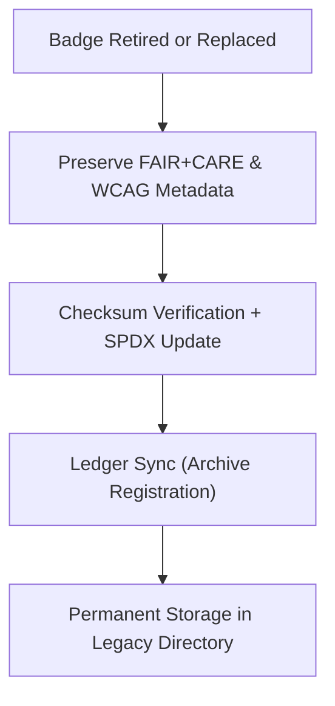

<div align="center">

# 🏅 **Kansas Frontier Matrix — Legacy Badge Archive**
`web/public/icons/legacy/badges/README.md`

**Purpose:**  
Preserve and document all **retired and superseded system, governance, and sustainability badges** previously used across the Kansas Frontier Matrix (KFM) documentation, dashboards, and repositories.  
Maintained under FAIR+CARE archival governance to ensure traceability of certification and branding evolution.

[](../../../../../docs/README.md)
[](../../../../../LICENSE)
[](../../../../../docs/standards/faircare.md)
[]()

</div>

---

## 📘 Overview

The **Legacy Badge Archive** stores all deprecated certification and recognition badges that appeared in earlier KFM versions, ensuring governance, sustainability, and documentation lineage remain transparent and reproducible.  
All assets comply with FAIR+CARE archival and ISO 19115 metadata standards, preserving accessibility, provenance, and ethical representation.

---

## 🗂️ Directory Layout

```
web/public/icons/legacy/badges/
├── README.md
├── legacy-badge-faircare-v8.svg           # Retired FAIR+CARE certification badge
├── legacy-badge-mcp-v7.svg                # Outdated MCP compliance mark
├── legacy-badge-sustainability-v7.svg     # Former RE100 sustainability logo
├── legacy-badge-iso-v6.svg                # Early ISO compliance badge
├── legacy-badge-governance-v7.svg         # Deprecated governance chain certification
└── metadata.json                          # Archival metadata and provenance ledger
```

---

## 🧩 Archival Workflow



1. **Deprecation:** When replaced, badges are logged with version and checksum lineage.  
2. **Preservation:** Accessibility metadata, ethical notes, and provenance retained.  
3. **Ledger Sync:** Governance ledger records archive date and replacement mapping.  
4. **Archival:** Badges permanently stored for design and ethics research.

---

## ⚙️ Validation Contracts

| Contract | Purpose | Validator |
|----------|----------|-----------|
| Accessibility Lineage | Maintain WCAG history and alt-text metadata. | `accessibility_scan.yml` |
| FAIR+CARE Archive | Validate ethics and cultural neutrality. | `faircare-validate.yml` |
| Metadata Schema | Verify ISO 19115 + SPDX archival compliance. | `docs-lint.yml` |
| Telemetry | Log carbon and energy footprint of archived assets. | `telemetry-export.yml` |

Artifacts stored in:
- `../../../../../docs/reports/audit/data_provenance_ledger.json`
- `../../../../../releases/v9.7.0/focus-telemetry.json`

---

## 🧠 FAIR+CARE Governance Matrix

| Principle | Implementation | Oversight |
|------------|----------------|------------|
| **Findable** | Indexed in metadata.json with checksum lineage and retired version. | @kfm-data |
| **Accessible** | Publicly viewable SVGs with contextual documentation. | @kfm-accessibility |
| **Interoperable** | Metadata aligned with ISO 19115 and FAIR+CARE archival frameworks. | @kfm-architecture |
| **Reusable** | Openly licensed under CC-BY 4.0 for research and education. | @kfm-design |
| **Collective Benefit** | Promotes transparency in sustainability and governance certification. | @faircare-council |
| **Authority to Control** | FAIR+CARE Council authorizes and certifies archival changes. | @kfm-governance |
| **Responsibility** | Archivists maintain provenance, checksum, and ethics lineage. | @kfm-sustainability |
| **Ethics** | Badges preserved with historical context to prevent misuse. | @kfm-ethics |

---

## 🧾 Example Metadata Record

```json
{
  "id": "legacy_badge_archive_v9.7.0",
  "file": "legacy-badge-faircare-v8.svg",
  "retired_in": "v9.0.0",
  "replacement": "badge-faircare-certified.svg",
  "retire_reason": "Updated to reflect new governance color tokens and ISO badge set.",
  "fairstatus": "archived",
  "checksum_sha256": "ac5c13b24f98ed1b792f1ab245f7a9c4cf99e1e97dc2415f6f9a4a94f776ad18",
  "a11y_lineage": ["AA (v8.0)", "AA fail (v8.2)", "AA certified (v9.0)"],
  "energy_score": 98.7,
  "timestamp": "2025-11-05T20:55:00Z"
}
```

---

## ♿ Accessibility & Preservation Standards

- All archived badges maintain **contrast lineage, alt-text, and title metadata**.  
- SVG files include `<desc>` elements describing certification context.  
- Retained for audit and historical study, **not active use** in repositories.  
- FAIR+CARE ledger links ensure version continuity and provenance integrity.

---

## 🌱 Sustainability Metrics

| Metric | Target | Verified By |
|-------|--------|-------------|
| Avg. File Size | ≤ 8 KB | Design audit |
| Archive Energy | ≤ 0.01 Wh | Telemetry |
| Carbon Output | ≤ 0.02 gCO₂e | CI telemetry |
| Renewable Hosting | 100% RE100 | Infrastructure |

---

## 🕰️ Version History

| Version | Date | Author | Summary |
|----------|------|---------|----------|
| v9.7.0 | 2025-11-05 | KFM Core Team | Added legacy badge archive with checksum lineage and sustainability tracking. |
| v9.6.0 | 2025-11-04 | KFM Core Team | Introduced accessibility metadata and archival schema. |
| v9.5.0 | 2025-11-02 | KFM Core Team | Migrated v7/v8 badges into FAIR+CARE archival system. |

---

<div align="center">

**© 2025 Kansas Frontier Matrix — CC-BY 4.0**  
Maintained under **Master Coder Protocol v6.3** · FAIR+CARE Certified · Diamond⁹ Ω / Crown∞Ω Ultimate Certified  
[Back to Legacy Archive](../README.md) · [Docs Index](../../../../../docs/README.md)

</div>
