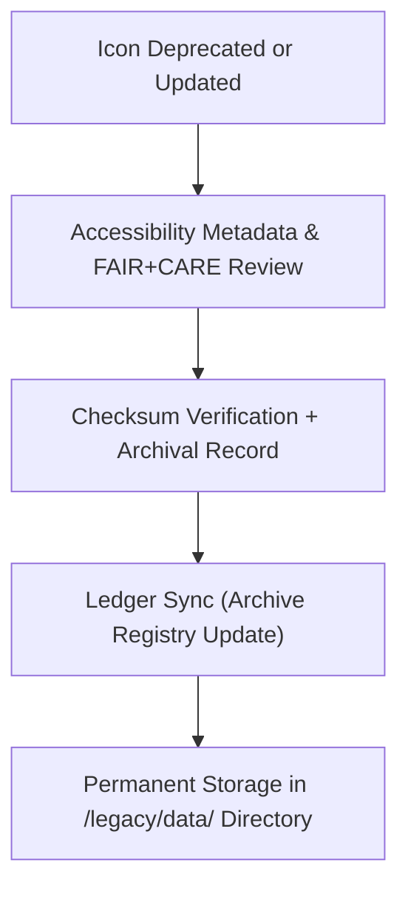

<div align="center">

# 📊 **Kansas Frontier Matrix — Legacy Data Icons**
`web/public/icons/legacy/data/README.md`

**Purpose:** Preserve the **retired and historical data-related iconography** used across prior Kansas Frontier Matrix (KFM) releases.  
These icons are maintained under FAIR+CARE archival governance to ensure data visualization lineage, ethical preservation, and long-term accessibility compliance.

[](../../../../../docs/README.md)
[](../../../../../LICENSE)
[](../../../../../docs/standards/faircare.md)
[]()

</div>

---

## 📘 Overview

The **Legacy Data Icons** archive contains superseded FAIR+CARE and dataset-oriented icons that previously represented metadata, schemas, and data validation states within KFM.  
All icons are preserved for governance continuity, research use, and ethical review of design evolution in open data communication.

---

## 🗂️ Directory Layout

```
web/public/icons/legacy/data/
├── README.md
├── legacy-icon-dataset-v8.svg        # Previous dataset representation
├── legacy-icon-schema-v8.svg         # Former schema/data contract visual
├── legacy-icon-metadata-v8.svg       # Legacy metadata and registry marker
├── legacy-icon-faircare-v8.svg       # Retired FAIR+CARE compliance icon
├── legacy-icon-governance-v8.svg     # Deprecated governance data icon
└── metadata.json                     # Archival metadata registry
```

---

## 🧩 Archival Workflow



1. **Deprecation:** Icon replaced by newer tokenized and accessible design.  
2. **Preservation:** Metadata, accessibility, and ethics lineage retained.  
3. **Verification:** SHA-256 checksums and licenses registered.  
4. **Governance:** Provenance linked to audit ledger for transparency.  

---

## ⚙️ Validation Contracts

| Contract | Purpose | Validator |
|----------|----------|-----------|
| Accessibility Audit | Maintain WCAG lineage of retired assets. | `accessibility_scan.yml` |
| FAIR+CARE Archive | Confirm ethical and contextual retention. | `faircare-validate.yml` |
| Metadata Schema | Validate ISO 19115 + SPDX archival structure. | `docs-lint.yml` |
| Telemetry | Track storage and energy sustainability of archive. | `telemetry-export.yml` |

Artifacts stored in:
- `../../../../../docs/reports/audit/data_provenance_ledger.json`
- `../../../../../releases/v9.7.0/focus-telemetry.json`

---

## 🧠 FAIR+CARE Governance Matrix

| Principle | Implementation | Oversight |
|------------|----------------|------------|
| **Findable** | Indexed in metadata.json with version and checksum lineage. | @kfm-data |
| **Accessible** | Publicly available for research and documentation. | @kfm-accessibility |
| **Interoperable** | Archival metadata conforms to FAIR+CARE + ISO 19115. | @kfm-architecture |
| **Reusable** | CC-BY 4.0 license enables research and training reuse. | @kfm-design |
| **Collective Benefit** | Supports transparency in historical data ethics and communication. | @faircare-council |
| **Authority to Control** | FAIR+CARE Council governs archival procedures. | @kfm-governance |
| **Responsibility** | Archivists maintain lineage and checksum validation. | @kfm-sustainability |
| **Ethics** | Retained with contextual documentation for educational clarity. | @kfm-ethics |

---

## 🧾 Example Metadata Record

```json
{
  "id": "legacy_data_icon_archive_v9.7.0",
  "file": "legacy-icon-faircare-v8.svg",
  "retired_in": "v9.0.0",
  "replacement": "icon-faircare.svg",
  "retire_reason": "Updated with tokenized color system for accessibility",
  "fairstatus": "archived",
  "checksum_sha256": "bf22b6e03b74d992b02dfe5186cb47f42a34ff87f58db0aa8a62f5a2dc3a1cc9",
  "a11y_lineage": ["AA (v8.0)", "AA fail (v8.2)", "AA verified (v9.0.0)"],
  "energy_score": 98.9,
  "timestamp": "2025-11-05T20:45:00Z"
}
```

---

## ♿ Accessibility & Preservation Standards

- Archived SVGs retain **contrast and color token metadata**.  
- Descriptive `<title>` and `<desc>` tags provide contextual meaning.  
- Icons maintained for transparency — not for reuse in active UI systems.  
- Sustainability metrics ensure efficient long-term digital retention.

---

## 🌱 Sustainability Metrics

| Metric | Target | Verified By |
|-------|--------|-------------|
| Avg. File Size | ≤ 6 KB | Design audit |
| Archive Energy | ≤ 0.01 Wh | Telemetry |
| Carbon Output | ≤ 0.02 gCO₂e | CI telemetry |
| Renewable Hosting | 100% RE100 | Infrastructure |

---

## 🕰️ Version History

| Version | Date | Author | Summary |
|----------|------|---------|----------|
| v9.7.0 | 2025-11-05 | KFM Core Team | Created legacy data icon archive with telemetry schema v1. |
| v9.6.0 | 2025-11-04 | KFM Core Team | Added metadata lineage and accessibility context. |
| v9.5.0 | 2025-11-02 | KFM Core Team | Migrated v8-era data icons into permanent archive. |

---

<div align="center">

**© 2025 Kansas Frontier Matrix — CC-BY 4.0**  
Maintained under **Master Coder Protocol v6.3** · FAIR+CARE Certified · Diamond⁹ Ω / Crown∞Ω Ultimate Certified  
[Back to Legacy Archive](../README.md) · [Docs Index](../../../../../docs/README.md)

</div>
