<div align="center">

# 🚩 **Kansas Frontier Matrix — Legacy Flag & Status Icons**
`web/public/icons/legacy/flags/README.md`

**Purpose:** Preserve and document all **deprecated flag and status icons** previously used in the Kansas Frontier Matrix (KFM) governance and UI systems.  
These archived assets retain accessibility, sustainability, and provenance records under **FAIR+CARE archival governance** for long-term design and ethics traceability.

[](../../../../../docs/README.md)
[](../../../../../LICENSE)
[](../../../../../docs/standards/faircare.md)
[]()

</div>

---

## 📘 Overview

The **Legacy Flag & Status Icons** archive retains all superseded alert, status, and process-state icons from earlier KFM versions.  
These icons are maintained to support **audit reproducibility**, **design lineage analysis**, and **ethical preservation** within the governance framework.

---

## 🗂️ Directory Layout

```
web/public/icons/legacy/flags/
├── README.md
├── legacy-flag-success-v8.svg        # Deprecated success indicator
├── legacy-flag-warning-v8.svg        # Previous caution symbol
├── legacy-flag-error-v8.svg          # Older failure/error marker
├── legacy-flag-inprogress-v8.svg     # Former workflow activity icon
├── legacy-flag-verified-v8.svg       # Retired audit verification badge
└── metadata.json                     # Archival metadata and provenance registry
```

---

## 🧩 Archival Workflow

```mermaid
flowchart TD
A["Flag Icon Deprecated (v8.x–v9.0)"] --> B["A11y + FAIR+CARE Lineage Preservation"]
B --> C["Checksum Verification + Metadata Record"]
C --> D["Governance Ledger Sync (Archival Update)"]
D --> E["Storage in /legacy/flags/ with Immutable Provenance"]
```



1. **Deprecation:** Icons retired when replaced by improved accessible versions.  
2. **Preservation:** Metadata lineage and accessibility status logged.  
3. **Checksum:** SHA-256 hashes confirm asset integrity.  
4. **Ledger Sync:** Governance ledger links legacy icons with replacement versions.  
5. **Archive:** Icons stored permanently for transparency and research.

---

## ⚙️ Validation Contracts

| Contract | Purpose | Validator |
|----------|----------|-----------|
| Accessibility Lineage | Record prior WCAG compliance state | `accessibility_scan.yml` |
| FAIR+CARE Archive | Confirm ethical preservation and context documentation | `faircare-validate.yml` |
| Metadata Schema | Verify ISO 19115 + SPDX archival conformance | `docs-lint.yml` |
| Telemetry | Measure archival carbon and storage efficiency | `telemetry-export.yml` |

Artifacts logged in:
- `../../../../../docs/reports/audit/data_provenance_ledger.json`
- `../../../../../releases/v9.7.0/focus-telemetry.json`

---

## 🧠 FAIR+CARE Governance Matrix

| Principle | Implementation | Oversight |
|------------|----------------|------------|
| **Findable** | Indexed by ID, checksum, and version lineage in metadata.json. | @kfm-data |
| **Accessible** | Publicly accessible SVGs with archival context descriptions. | @kfm-accessibility |
| **Interoperable** | Metadata aligned with ISO 19115 + FAIR+CARE archival schema. | @kfm-architecture |
| **Reusable** | CC-BY 4.0 license for reuse in historical or educational research. | @kfm-design |
| **Collective Benefit** | Supports transparency in accessibility evolution and governance audits. | @faircare-council |
| **Authority to Control** | FAIR+CARE Council approves archival and retention policies. | @kfm-governance |
| **Responsibility** | Archivists maintain audit lineage and contextual metadata. | @kfm-sustainability |
| **Ethics** | Documentation preserves context to prevent misinterpretation. | @kfm-ethics |

---

## 🧾 Example Metadata Record

```json
{
  "id": "legacy_flag_archive_v9.7.0",
  "file": "legacy-flag-warning-v8.svg",
  "retired_in": "v9.0.0",
  "replacement": "flag-warning.svg",
  "retire_reason": "Updated for WCAG AA compliance and semantic clarity",
  "fairstatus": "archived",
  "checksum_sha256": "bd39e4b3c0f2a1bdb5e641d8a4b9f7b6dcfc9c9a3a54e7a2b8a0e12f3b9438a5",
  "a11y_lineage": ["AA (v8.0)", "AA fail (v8.2)"],
  "energy_score": 98.8,
  "timestamp": "2025-11-05T20:40:00Z"
}
```

---

## ♿ Accessibility & Preservation Standards

- Retains full **contrast, label, and color token lineage** from original versions.  
- Archived SVGs contain `<title>` and `<desc>` elements to preserve intent.  
- No longer displayed in UI but accessible in design audit logs.  
- Metadata linked to FAIR+CARE audit reports for traceable evolution.

---

## 🌱 Sustainability Metrics

| Metric | Target | Verified By |
|-------|--------|-------------|
| Avg. File Size | ≤ 5 KB | Design audit |
| Archive Energy | ≤ 0.01 Wh | Telemetry |
| Carbon Output | ≤ 0.02 gCO₂e | CI telemetry |
| Renewable Hosting | 100% RE100 | Infrastructure |

---

## 🕰️ Version History

| Version | Date | Author | Summary |
|----------|------|---------|----------|
| v9.7.0 | 2025-11-05 | KFM Core Team | Created dedicated legacy flag archive with governance and checksum lineage. |
| v9.6.0 | 2025-11-04 | KFM Core Team | Migrated deprecated v8 flags into archival preservation. |
| v9.5.0 | 2025-11-02 | KFM Core Team | Added contextual metadata and FAIR+CARE lineage. |

---

<div align="center">

**© 2025 Kansas Frontier Matrix — CC-BY 4.0**  
Maintained under **Master Coder Protocol v6.3** · FAIR+CARE Certified · Diamond⁹ Ω / Crown∞Ω Ultimate Certified  
[Back to Legacy Archive](../README.md) · [Docs Index](../../../../../docs/README.md)

</div>
